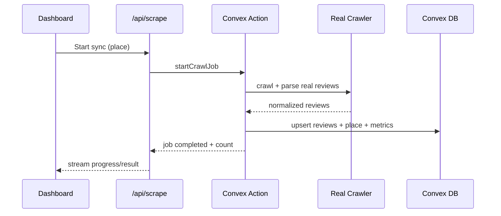

# I. Primer
## 1. TL;DR kiểu Feynman
- Bạn thấy `"[... ] Auto-captured review ..."` vì flow sync hiện tại đang chạy **mock generator**, không phải crawl thật.
- Mục tiêu fix: thay mock bằng crawler thật học từ code Python gốc (`google-review-craw/modules/scraper.py`) và xóa dữ liệu mock cũ.
- Sau fix: bấm Sync ở localhost phải ra review thật (text/author/rating/date thật), không còn chuỗi Auto-captured.
- Ta sẽ giữ Convex làm job orchestration, nhưng đổi nguồn dữ liệu trong `crawlerActions` từ mock -> real extractor.
- Trước khi bật lại UI, chạy cleanup để xóa toàn bộ reviews mock và metrics liên quan, rồi crawl lại từ đầu.

## 2. Elaboration & Self-Explanation
Hiện tại bạn đã seed places thành công, nhưng nội dung review bị giả vì code Convex action đang tự sinh dữ liệu giả theo hàm hash. Vì vậy giao diện local khác production web cũ.

Root của vấn đề không nằm ở UI render. UI chỉ hiển thị đúng những gì DB Convex đang có. DB có text giả nên UI ra text giả.

Hướng đúng là:
a) Bỏ hoàn toàn mock builder trong `convex/crawlerActions.ts`.
b) Viết crawler thật bằng JS/TS theo logic Python gốc (tab review, parse card, chuẩn hóa field).
c) Dọn dữ liệu mock cũ rồi crawl thật lại.

## 3. Concrete Examples & Analogies
- Evidence code hiện tại:
  - `online-reputation-management-system/convex/crawlerActions.ts` có `buildMockCrawl(...)` sinh text `"[${placeName}] Auto-captured review ${idx + 1}"`.
  - `src/lib/scraper.ts` gọi `crawlerActions:startCrawlJob` nên mỗi lần Sync đều bơm dữ liệu giả.
- Evidence UI từ screenshot:
  - Local hiển thị `"[LOTTE Cinema Cần Thơ Ninh Kiều] Auto-captured review 47"`.
  - Production cũ hiển thị text review thật, ngôn ngữ tự nhiên.

Analogy: hiện pipeline như “máy tập lái” (simulator), không phải “xe chạy thật”. Bạn muốn lên đường thật thì phải thay simulator bằng engine crawl thật.

# II. Audit Summary (Tóm tắt kiểm tra)
- Observation:
  - Screenshot local có chuỗi Auto-captured.
  - `convex/crawlerActions.ts` có generator mock và đang dùng trong `startCrawlJob`.
  - `convex/places.ts` seed chỉ bơm metadata place, không bơm review thật.
- Inference:
  - Root cause là mock data path đang active cho sync production path.
- Decision:
  - Refactor crawler action sang data thật, xóa mock dataset và recrawl.

# III. Root Cause & Counter-Hypothesis (Nguyên nhân gốc & Giả thuyết đối chứng)
## Root Cause Confidence (Độ tin cậy nguyên nhân gốc): High
1. Triệu chứng: Sync xong nhưng review là template Auto-captured.
2. Phạm vi: toàn bộ review feed + topic metrics + critical alerts tại local Convex stack.
3. Tái hiện: luôn tái hiện khi bấm Sync vì code path deterministic.
4. Mốc thay đổi: phase migration sang Convex đã thêm mock crawl để hoàn thiện flow job trước.
5. Dữ liệu thiếu: chưa có JS crawler thật đang chạy trong Convex action.
6. Giả thuyết thay thế:
   - UI mapping lỗi? Không, vì text đã lưu y nguyên từ mock.
   - Seed API trả text giả? Không, seed endpoint chỉ có summary places.
7. Rủi ro fix sai: giữ mock sẽ tiếp tục làm sai toàn bộ insight/analytics.
8. Tiêu chí pass: review text sau sync là nội dung thật từ Maps, không còn pattern Auto-captured.

```mermaid
flowchart TD
  A[Click Sync] --> B[/api/scrape]
  B --> C[crawlerActions:startCrawlJob]
  C --> D{Current source}
  D -->|mock| E[Auto-captured text]
  D -->|real crawler| F[Google review text thật]
  E --> G[Convex reviews]
  F --> G
  G --> H[UI Review Feed]
```

# IV. Proposal (Đề xuất)
## Option A (Recommend) — Confidence 90%
**Port crawler thật từ Python gốc sang JS/TS Convex Action + cleanup mock + recrawl**
- a) Trích logic parser cốt lõi từ `google-review-craw/modules/scraper.py`.
- b) Thay `buildMockCrawl` bằng real fetch/parse pipeline.
- c) Thêm mutation cleanup để xóa reviews/metrics mock cũ theo `placeId` hoặc all.
- d) Trigger sync lại toàn bộ Lotte sau cleanup.
- e) Bổ sung guard nếu parse fail thì job fail rõ ràng (không fallback tạo text giả).

Vì sao recommend:
- Bám đúng yêu cầu của bạn: “học từ code python gốc, dữ liệu thật”.
- Không duy trì debt mock ở production path.

## Option B — Confidence 55%
**Tạm bridge qua Python service cũ rồi mới port dần**
- Nhanh có dữ liệu thật nhưng đi ngược mục tiêu full JS/TS dài hạn.
- Chỉ phù hợp nếu cần chữa cháy tức thời.

# V. Files Impacted (Tệp bị ảnh hưởng)
## Convex crawler
- **Sửa:** `online-reputation-management-system/convex/crawlerActions.ts`
  - Vai trò hiện tại: chạy mock crawl job.
  - Thay đổi: bỏ mock, dùng crawler thật + parse card review thật.
- **Thêm:** `online-reputation-management-system/src/server/crawler/googleMapsSource.ts`
  - Vai trò: fetch + parse review thật theo pattern Python gốc.
- **Sửa:** `online-reputation-management-system/src/server/crawler/normalize.ts`
  - Vai trò: chuẩn hóa review.
  - Thay đổi: giữ dedupe + text normalize cho dữ liệu thật.

## Data ops
- **Thêm:** `online-reputation-management-system/convex/reviewsAdmin.ts`
  - Vai trò mới: mutation xóa reviews/metrics mock để reset dataset.
- **Sửa:** `online-reputation-management-system/convex/metrics.ts`
  - Vai trò hiện tại: upsert metrics.
  - Thay đổi: đảm bảo recompute từ dữ liệu thật sau recrawl.

## Sync surface
- **Sửa:** `online-reputation-management-system/src/lib/scraper.ts`
  - Vai trò hiện tại: trigger job.
  - Thay đổi: bỏ mọi assumption mock, log progress theo phase real crawl.

# VI. Execution Preview (Xem trước thực thi)
1. Đọc và trích skeleton parser từ Python `modules/scraper.py`.
2. Implement JS crawler source (không generate text giả).
3. Nối crawler source vào Convex `startCrawlJob`.
4. Thêm admin mutation cleanup dữ liệu mock.
5. Chạy cleanup all reviews + metrics, giữ places.
6. Trigger sync all và quan sát jobs -> completed.
7. Review tĩnh output shape và null-safety.

# VII. Verification Plan (Kế hoạch kiểm chứng)
- Bước 1: Chạy cleanup mutation, xác nhận reviews về 0.
- Bước 2: Chạy sync 1 rạp (Cần Thơ Ninh Kiều).
- Bước 3: Verify DB:
  - `reviews.text` không match regex `Auto-captured review`.
  - `authorName/rating/isoDate` có dữ liệu hợp lệ.
- Bước 4: Verify UI:
  - Review Feed hiển thị text tự nhiên thật, không placeholder.
- Bước 5: Sync all và check metrics/critical alert phân bố hợp lý.



# VIII. Todo
1. Port parser thật từ Python sang JS source module.
2. Gắn source thật vào `crawlerActions:startCrawlJob`.
3. Xóa hoàn toàn đường fallback tạo mock text.
4. Thêm mutation admin cleanup reviews/metrics.
5. Thực hiện cleanup mock all data và recrawl all Lotte.
6. Verify UI/DB không còn Auto-captured pattern.

# IX. Acceptance Criteria (Tiêu chí chấp nhận)
- Không còn bất kỳ review mới nào chứa `Auto-captured review`.
- Sync xong hiển thị review thật như production cũ.
- Jobs fail thì báo lỗi rõ, không tự sinh dữ liệu giả để “đỡ fail”.
- Topic analysis/critical alerts bám dữ liệu thật.

# X. Risk / Rollback (Rủi ro / Hoàn tác)
- Rủi ro:
  - JS parser đầu tiên có thể chưa bắt đủ selector đa ngôn ngữ.
  - Crawl thật có thể chậm hơn mock và dễ hit rate-limit.
- Rollback:
  - Giữ commit snapshot trước khi thay parser.
  - Nếu cần, tạm disable sync button trong UI thay vì fallback mock.
  - Có thể chạy lại seed places vì không đụng mất danh sách rạp.

# XI. Out of Scope (Ngoài phạm vi)
- Migrate dữ liệu lịch sử Mongo cũ sang Convex.
- Tối ưu UI/UX ngoài phạm vi lỗi dữ liệu giả.
- Tự động cron crawl định kỳ.

# XII. Open Questions (Câu hỏi mở)
- Không còn ambiguity cho hướng fix hiện tại: bạn đã chốt dùng dữ liệu thật theo Python gốc và xóa mock rồi crawl lại.