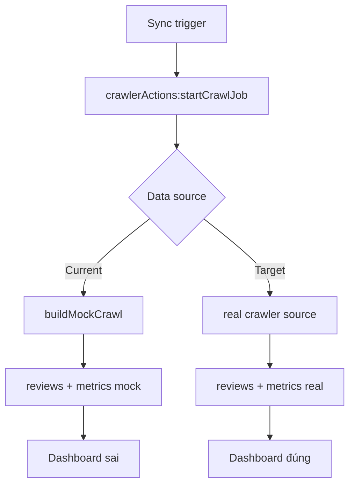
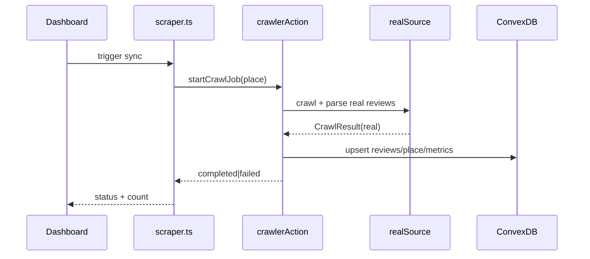

# I. Primer
## 1. TL;DR kiểu Feynman
- Hiện Sync đang lấy dữ liệu từ hàm mock nên review luôn có chuỗi `Auto-captured review ...`.
- Mục tiêu: thay đường mock bằng crawler thật (port logic từ `google-review-craw/modules/scraper.py`) và chỉ ghi dữ liệu review thật vào Convex.
- Trước khi crawl lại, cần dọn dữ liệu review/metrics đã bị nhiễm mock để tránh dashboard sai.
- Sau khi làm xong: bấm Sync sẽ tạo job crawl thật, review feed không còn text template.
- Không mở rộng scope sang cron/UI redesign/schema mới nếu chưa cần.

## 2. Elaboration & Self-Explanation
Vấn đề không nằm ở UI. UI đang hiển thị đúng dữ liệu từ Convex. Dữ liệu sai vì `convex/crawlerActions.ts` gọi `buildMockCrawl(...)` và tự sinh text giả.

Cách sửa đúng là chuyển "nguồn dữ liệu" trong action từ mock sang real extractor:
1) thu thập raw review thật từ Google Maps (theo logic Python gốc),
2) normalize + dedupe,
3) upsert vào `reviews`, `places`, `branchDailyMetrics`,
4) fail rõ ràng nếu crawl lỗi (không fallback mock).

## 3. Concrete Examples & Analogies
- Evidence 1: `online-reputation-management-system/convex/crawlerActions.ts` đang có `buildMockCrawl` và text `[${placeName}] Auto-captured review ${idx + 1}`.
- Evidence 2: `src/lib/scraper.ts` luôn gọi `crawlerActions:startCrawlJob`, nên mỗi sync đều chạy vào path mock hiện tại.
- Evidence 3: đã có `src/server/crawler/mockSource.ts` + `normalize.ts`, chứng tỏ pipeline crawler source có thể thay bằng source thật mà không đổi contract lưu DB.

Analogy: hiện tại hệ thống đang "diễn tập bằng dữ liệu giả"; task này là thay động cơ thật để dashboard phản ánh thực tế.

# II. Audit Summary (Tóm tắt kiểm tra)
- Observation:
  - Có literal `Auto-captured review` trong `convex/crawlerActions.ts` và `src/server/crawler/mockSource.ts`.
  - Chưa có real source trong `src/server/crawler/` (thư mục chỉ có `mockSource.ts`, `normalize.ts`).
  - `reviews:upsertManyForPlace` và `metrics:upsertForPlace` đã sẵn sàng nhận dữ liệu thật.
- Inference:
  - Root cause là active mock path ở action layer, không phải render layer.
- Decision:
  - Giữ kiến trúc Convex job orchestration hiện tại; chỉ thay data source + thêm cleanup mutation tối thiểu.

# III. Root Cause & Counter-Hypothesis (Nguyên nhân gốc & Giả thuyết đối chứng)
**Root Cause Confidence: High**
- #1 Triệu chứng: review text giả, lặp mẫu deterministic.
- #3 Tái hiện: 100% khi trigger sync.
- #6 Counter-hypothesis:
  - UI mapping lỗi: không phù hợp vì DB đã chứa text giả.
  - Seed places bơm review giả: không đúng, `places.ts` chủ yếu seed metadata place.
- #8 Pass/fail:
  - Pass khi review mới không còn pattern `Auto-captured review`, job fail thì trả lỗi thật.

# IV. Proposal (Đề xuất)
## Option A (Recommend) — Confidence 90%
**Port crawler thật vào JS/TS và loại bỏ mock khỏi production path**

a) Tạo module source thật:
- Thêm `src/server/crawler/realSource.ts` (hoặc tên tương đương) để:
  - fetch HTML/JSON endpoint liên quan review,
  - parse review cards,
  - map về shape `CrawlReview` hiện có.
- Ưu tiên tái sử dụng contract type của `mockSource` (hoặc tách type chung sang `types.ts`).

b) Wiring vào Convex action:
- Sửa `convex/crawlerActions.ts`:
  - bỏ `buildMockCrawl` khỏi flow chính,
  - gọi real source + `normalizeReviews`,
  - tính metrics từ dữ liệu thực tế.
- Nếu crawl/parse lỗi: set job `failed`, add event error, **không fallback mock**.

c) Cleanup dữ liệu mock cũ:
- Thêm mutation admin trong `convex/reviews.ts` hoặc file admin riêng (khuyến nghị `convex/reviewsAdmin.ts`) để:
  - xóa reviews theo `placeId` hoặc all,
  - xóa `branchDailyMetrics` theo `placeId` hoặc all.
- Dùng patch tối thiểu, không đụng `places` trừ khi cần cập nhật counters.

## Option B — Confidence 58%
**Tạm gọi Python crawler qua bridge service**
- Nhanh có dữ liệu thật nhưng tăng vận hành, lệch stack Convex/TS.
- Chỉ phù hợp nếu cần workaround rất gấp, không recommend cho đường dài.

# V. Files Impacted (Tệp bị ảnh hưởng)
- **Sửa:** `online-reputation-management-system/convex/crawlerActions.ts`
  - Vai trò hiện tại: orchestrate crawl job nhưng dùng mock generator.
  - Thay đổi: gọi real source, normalize, upsert review/metrics theo dữ liệu thật, fail-fast khi lỗi.

- **Thêm:** `online-reputation-management-system/src/server/crawler/realSource.ts`
  - Vai trò hiện tại: chưa có.
  - Thay đổi: implement extractor thật dựa trên logic từ `google-review-craw/modules/scraper.py`.

- **Sửa:** `online-reputation-management-system/src/server/crawler/normalize.ts`
  - Vai trò hiện tại: dedupe + normalize text.
  - Thay đổi: bổ sung normalize null-safety cho field từ crawler thật (date/likes/author/rating).

- **Sửa hoặc Thêm:** `online-reputation-management-system/src/server/crawler/mockSource.ts` / `types.ts`
  - Vai trò hiện tại: giữ type + mock generator.
  - Thay đổi: tách type dùng chung, mock chỉ còn phục vụ dev/test nội bộ (không đi production path).

- **Thêm:** `online-reputation-management-system/convex/reviewsAdmin.ts` (hoặc mở rộng `convex/reviews.ts`)
  - Vai trò mới: mutation cleanup review/metrics để reset dữ liệu mock.

- **Sửa (nếu cần):** `online-reputation-management-system/src/lib/scraper.ts`
  - Vai trò hiện tại: trigger job và đọc status.
  - Thay đổi: giữ contract, chỉ cập nhật message/progress nếu action bổ sung phase chi tiết.

# VI. Execution Preview (Xem trước thực thi)
1. Đọc và trích mapping field cốt lõi từ Python scraper (review id, author, rating, text, date, likes).
2. Tạo `realSource` trả về `CrawlResult` đúng shape hiện tại.
3. Refactor `startCrawlJob` bỏ hoàn toàn `buildMockCrawl` khỏi luồng chính.
4. Tính `starDistribution`, `sentimentScore`, `capturedReviews` từ review thật.
5. Thêm mutation cleanup (reviews + branchDailyMetrics) theo scope all/place.
6. Chạy quy trình data ops: đọc hiện trạng -> cleanup -> sync lại -> đọc verify.
7. Self-review tĩnh (typing, null safety, backward compatibility).

# VII. Verification Plan (Kế hoạch kiểm chứng)
Theo policy repo: **không tự chạy lint/unit test**. Verification tập trung evidence data/runtime:
- B1. Query trước cleanup: đếm số review match pattern `Auto-captured review`.
- B2. Gọi cleanup mutation theo scope đã chốt; query lại để xác nhận về 0.
- B3. Trigger sync 1 place; xác nhận job completed và có `reviewsSynced > 0`.
- B4. Query `reviews` place đó:
  - text không chứa `Auto-captured review`,
  - rating trong [1..5],
  - isoDate/rawDate hợp lệ nếu source có.
- B5. Query `branchDailyMetrics`: số liệu khớp dữ liệu vừa crawl.
- B6. Mở UI review feed để đối chiếu nội dung tự nhiên.

# VIII. Todo
1. Tạo `realSource` từ logic Python crawler gốc (parse review thật).
2. Refactor `crawlerActions:startCrawlJob` để bỏ mock path.
3. Chuẩn hóa normalize + metrics calculation cho dữ liệu thật.
4. Thêm mutation cleanup reviews/metrics bị nhiễm mock.
5. Thực thi quy trình data ops: read-before-write -> cleanup -> resync -> verify.
6. Ghi evidence bàn giao: function đã gọi, record đã chạm, before/after ngắn gọn.

# IX. Acceptance Criteria (Tiêu chí chấp nhận)
- Không còn review mới nào chứa chuỗi `Auto-captured review`.
- `startCrawlJob` không gọi bất kỳ mock generator nào trong production path.
- Job crawl lỗi phải trả `failed` + error rõ ràng, không tạo dữ liệu giả.
- Sau cleanup + resync, dashboard hiển thị review thật và metrics cập nhật tương ứng.

# X. Risk / Rollback (Rủi ro / Hoàn tác)
- Rủi ro:
  - Selector/format từ Google Maps thay đổi có thể làm parser rỗng.
  - Network/rate-limit gây job thất bại ngắt quãng.
- Rollback:
  - Revert commit parser/action về snapshot trước.
  - Giữ cleanup mutation idempotent để có thể re-run an toàn.
  - Nếu cần tạm thời, disable trigger sync ở UI thay vì fallback mock.

# XI. Out of Scope (Ngoài phạm vi)
- Không migrate lịch sử từ Mongo cũ sang Convex trong task này.
- Không làm scheduler/cron crawl định kỳ.
- Không redesign UI/dashboard.
- Không thay schema trừ khi phát sinh thiếu field bắt buộc cho dữ liệu thật.

# XII. Open Questions (Câu hỏi mở)
- Nếu crawler thật trả ít field hơn kỳ vọng (ví dụ thiếu likes/date ở một số place), ta sẽ:
  - giữ field optional như hiện tại,
  - hay bắt buộc fallback parser bổ sung từ nguồn phụ?

Đề xuất mặc định: giữ optional + fail rõ khi thiếu trường critical (reviewId/rating/text).