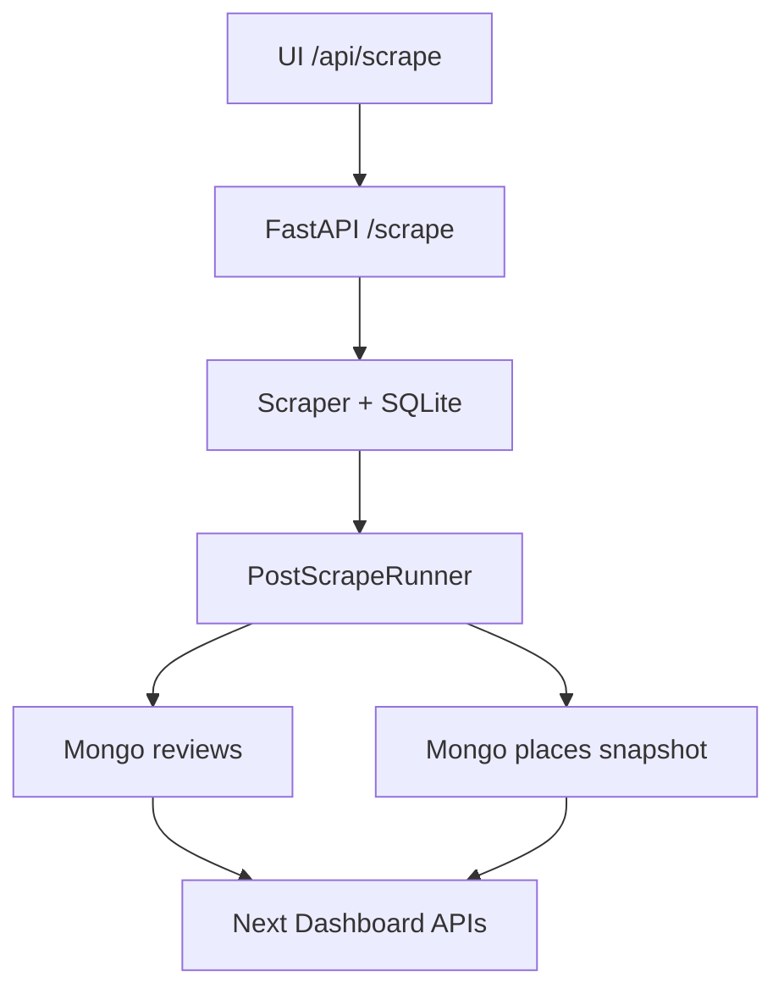
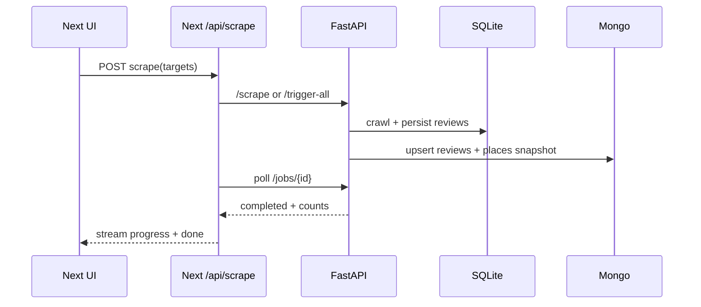

# I. Primer
## 1. TL;DR kiểu Feynman
- Hệ thống đang bị lệch vì **hợp đồng dữ liệu (data contract)** giữa scraper và dashboard chưa thống nhất: web coi `places.total_reviews/avg_rating` là số official từ Google, nhưng scraper hiện không đảm bảo ghi đúng semantics đó.
- Luồng hiện tại scrape xong chủ yếu đẩy **reviews**, còn **places snapshot** (official metrics theo rạp) chưa được đồng bộ chặt.
- Kết quả là có thể thấy: dashboard vẫn có dữ liệu review mới, nhưng tổng quan theo rạp/toàn mạng có lúc không khớp “Maps official”.
- Giải pháp bền vững: chuẩn hóa contract 2 lớp số liệu (`official_*` và `captured_*`), sync nguyên tử theo job, và thêm guardrails trạng thái sync.
- Làm xong sẽ ưu tiên mục tiêu bạn chọn: **dữ liệu mới lên dashboard ổn định**.

## 2. Elaboration & Self-Explanation
Hiện có 3 tầng: crawler Python, MongoDB, dashboard Next.js. Vấn đề không chỉ ở “crawl được hay không”, mà ở “crawl xong số nào được xem là official/captured” và “web đọc đúng field chưa”.

Quan sát code cho thấy web đang lấy `places.total_reviews` và `places.avg_rating` làm số headline. Nhưng phía crawler không có đường rõ ràng đảm bảo các field này luôn được cập nhật đúng ngữ nghĩa “official từ Maps” cho mọi job. Ngoài ra, `/api/scrape` có gửi `officialOnly`, nhưng backend Python không xử lý field này.

Nên hướng refactor sâu sẽ là: thống nhất contract dữ liệu + cập nhật pipeline sync để mỗi job ghi đầy đủ snapshot branch (official + captured + sync metadata), rồi dashboard chỉ đọc theo contract mới.

## 3. Concrete Examples & Analogies
- Ví dụ thực tế theo repo:
  - `online-reputation-management-system/src/app/api/places/official/route.ts` trả `totalReviews` từ `places.total_reviews` và coi là official.
  - Nhưng trong `google-review-craw/modules/review_db.py`, `places.total_reviews` đang được update theo số review lưu trong DB crawler (captured), không thấy cơ chế rõ cho official từ Maps.
  - `online-reputation-management-system/src/app/api/scrape/route.ts` gửi `officialOnly`, nhưng grep backend Python không có xử lý `official_only`.

- Analogy đời thường:
  - Giống bảng kho có 2 số: “tồn hệ thống ERP” và “đếm thực tế tại quầy”. Nếu chỉ có 1 cột mà lúc thì ghi ERP, lúc ghi kiểm đếm, dashboard sẽ lúc đúng lúc sai dù thao tác nhập/xuất vẫn chạy.

# II. Audit Summary (Tóm tắt kiểm tra)
- Observation:
  - Production URL `https://online-reputation-management-system.vercel.app/` đang live và có dữ liệu.
  - Web route scrape: `src/app/api/scrape/route.ts` trigger job + poll + aggregate metrics.
  - Scraper API: `google-review-craw/api_server.py` có `/scrape`, `/trigger-all`, `/jobs/{id}`.
  - Scraper pipeline (`modules/scraper.py` + `modules/pipeline.py`) sync reviews tốt, nhưng contract places/official chưa chặt.
  - `officialOnly` hiện truyền từ web nhưng backend không consume.
- Inference:
  - Lỗi chính thiên về data contract + sync semantics, không đơn thuần do UI.
- Decision:
  - Refactor sâu flow sync theo hướng “contract-first”, giữ thay đổi có thể rollback từng bước.

# III. Root Cause & Counter-Hypothesis (Nguyên nhân gốc & Giả thuyết đối chứng)
## Root Cause Confidence (Độ tin cậy nguyên nhân gốc): High
- Reason:
  - Evidence trực tiếp từ code cho thấy mismatch semantics giữa tầng crawler và web trong cách dùng `places.*`.

### Trả lời 8 câu audit (đủ điều kiện kết luận)
1. Triệu chứng observed (expected vs actual):
   - Expected: crawl xong, dashboard đồng bộ ổn định với Maps official + review mới.
   - Actual: có tình huống không khớp số liệu/không “đồng bộ được với maps” dù job chạy.
2. Phạm vi ảnh hưởng:
   - Ảnh hưởng toàn bộ dashboard network metrics + branch headline metrics + UX tin cậy dữ liệu.
3. Tái hiện ổn định?
   - Có thể tái hiện theo điều kiện: job thành công nhưng field places official không được cập nhật semantics nhất quán.
4. Mốc thay đổi gần nhất:
   - Hệ đã chuyển kiến trúc qua Python scraper + Next API bridge; README web còn mô tả cũ (Prisma/SerpAPI), dấu hiệu drift tài liệu so với code.
5. Dữ liệu còn thiếu:
   - Chưa có nhật ký so sánh before/after per job cho `places` trên Mongo ở môi trường production.
6. Giả thuyết thay thế chưa loại trừ:
   - a) API key/CORS khiến trigger thất bại ngầm.
   - b) Selector Google Maps thay đổi làm crawl thiếu dữ liệu.
   - c) Mongo collection mapping sai tên theo env.
7. Rủi ro fix sai nguyên nhân:
   - Có thể làm dashboard “trông ổn” tạm thời nhưng lệch dữ liệu dài hạn, gây mất niềm tin vận hành.
8. Tiêu chí pass/fail sau sửa:
   - Job scrape -> Mongo update -> dashboard refresh thể hiện số liệu ổn định theo contract đã định, không dao động sai nghĩa.

### Counter-hypothesis
- Có thể lỗi chính do crawler “không lấy được review” vì Google limited view.
- Đối chứng: production đang có review mới/critical feed hiển thị; vấn đề nổi bật là đồng bộ semantics giữa official/captured hơn là không crawl được gì.

# IV. Proposal (Đề xuất)
## Option A (Recommend) — Confidence 88%
**Refactor contract + sync pipeline end-to-end (ổn định lâu dài)**
- a) Chuẩn hóa schema Mongo `places`:
  - `official_avg_rating`, `official_total_reviews`, `captured_total_reviews`, `last_scraped_at`, `last_sync_status`, `last_sync_error`.
- b) Bổ sung bước sync places snapshot sau mỗi job scrape (cùng transaction logic theo job scope).
- c) Web APIs (`/api/places/official`, dashboard hooks, page server-side load) đọc field mới theo semantics rõ.
- d) `officialOnly` được xử lý thật: nếu bật thì chỉ refresh official snapshot (không full re-crawl), hoặc disable option này nếu chưa support backend.
- e) Thêm guardrails: sync status + retry nhẹ + clear log message cho UI.

Vì sao recommend:
- Giải quyết đúng gốc “không ổn định đồng bộ”, không chỉ vá UI.
- Hợp với yêu cầu của bạn: refactor sâu, chạy ngon dài hạn.

## Option B — Confidence 63%
**Hotfix web-side mapping only**
- Chỉ sửa web đọc số liệu theo captured hiện có và đổi nhãn hiển thị.
- Tradeoff: nhanh nhưng không xử gốc ở pipeline; dễ tái phát khi scale.

# V. Files Impacted (Tệp bị ảnh hưởng)
## server (Python scraper)
- **Sửa:** `google-review-craw/modules/review_db.py`
  - Vai trò hiện tại: quản lý SQLite places/reviews/session.
  - Thay đổi: bổ sung dữ liệu snapshot phục vụ sync official/captured rõ nghĩa.
- **Sửa:** `google-review-craw/modules/scraper.py`
  - Vai trò hiện tại: điều phối scrape và chạy PostScrapeRunner.
  - Thay đổi: thu thập + phát hành branch summary cho sync places.
- **Sửa:** `google-review-craw/modules/pipeline.py`
  - Vai trò hiện tại: chạy task post-scrape (Mongo/JSON/review artifacts).
  - Thay đổi: thêm task sync `places` snapshot và metadata trạng thái job.
- **Sửa:** `google-review-craw/modules/data_storage.py`
  - Vai trò hiện tại: writer Mongo/JSON cho reviews.
  - Thay đổi: bổ sung writer cho places snapshot (upsert theo `place_id`).
- **Sửa:** `google-review-craw/api_server.py`
  - Vai trò hiện tại: API trigger/poll jobs.
  - Thay đổi: xử lý rõ `official_only` (support thực sự hoặc reject rõ ràng).

## UI/API (Next.js)
- **Sửa:** `online-reputation-management-system/src/app/api/places/official/route.ts`
  - Vai trò hiện tại: trả official stats cho dashboard.
  - Thay đổi: đọc field contract mới + fallback an toàn.
- **Sửa:** `online-reputation-management-system/src/app/page.tsx`
  - Vai trò hiện tại: server-side assemble global metrics.
  - Thay đổi: tính metrics theo `official_*` + `captured_*` rõ ràng.
- **Sửa:** `online-reputation-management-system/src/components/dashboard/hooks/useDashboardData.ts`
  - Vai trò hiện tại: client aggregation và sync log.
  - Thay đổi: đồng bộ naming/semantic mới, xử lý state nhất quán.
- **Sửa:** `online-reputation-management-system/src/lib/metrics.ts`
  - Vai trò hiện tại: aggregate `branch_daily_metrics` sau scrape.
  - Thay đổi: dùng nguồn official/captured đúng contract mới.
- **Sửa:** `online-reputation-management-system/src/types/database.ts`
  - Vai trò hiện tại: định nghĩa type dashboard.
  - Thay đổi: bổ sung type cho official/captured/sync status.

# VI. Execution Preview (Xem trước thực thi)
1. Audit contract hiện tại giữa Python -> Mongo -> Next API.
2. Thiết kế field contract mới và điểm ghi dữ liệu trong pipeline.
3. Implement sync places snapshot trong scraper pipeline.
4. Update Next API + hooks + server page theo contract mới.
5. Thêm guardrails cho `officialOnly` và error surface.
6. Review tĩnh: null-safety, compatibility dữ liệu cũ, rollback path.

# VII. Verification Plan (Kế hoạch kiểm chứng)
- Vì rule repo cấm tự chạy lint/unit test, verification sẽ theo runtime checks + evidence logs:
  - a) Trigger 1 job scrape cho 1 rạp: xác nhận job completed.
  - b) Kiểm tra Mongo `places` record của rạp có đủ `official_*`, `captured_*`, `last_sync_status`.
  - c) Mở dashboard: branch đó hiển thị ổn định sau refresh (không lệch semantics).
  - d) Trigger all: xác nhận không fail dây chuyền, metrics cập nhật đồng nhất.
  - e) Trường hợp lỗi backend: UI nhận message rõ, không silent fail.

# VIII. Todo
1. Chốt contract field official/captured và fallback tương thích dữ liệu cũ.
2. Cài sync places snapshot trong Python pipeline.
3. Chuẩn hóa handling `officialOnly` xuyên suốt request path.
4. Refactor các Next API/hook/page dùng contract mới.
5. Thêm guardrails trạng thái sync và thông điệp lỗi.
6. Thu thập evidence before/after từ một lần sync thực tế.

# IX. Acceptance Criteria (Tiêu chí chấp nhận)
- Dashboard luôn hiển thị ổn định sau sync, không nhập nhằng official vs captured.
- Sau mỗi job thành công, Mongo có snapshot places cập nhật timestamp/status.
- Trigger selected/all đều phản ánh tiến trình và kết quả rõ ràng trên UI.
- Không còn trường hợp “job chạy xong nhưng số maps không đồng bộ” do mismatch semantics.

# X. Risk / Rollback (Rủi ro / Hoàn tác)
- Rủi ro:
  - Migration dữ liệu cũ có thể thiếu field mới -> cần fallback read.
  - Thay đổi pipeline có thể tăng thời gian job nhẹ.
  - Nếu support `officialOnly` không chuẩn có thể gây kỳ vọng sai.
- Rollback:
  - Giữ backward-compatible read (ưu tiên field mới, fallback field cũ).
  - Feature flag/guard để tắt places snapshot sync nếu phát sinh sự cố.
  - Revert commit theo từng cụm file (server/UI tách bạch).

# XI. Out of Scope (Ngoài phạm vi)
- Tối ưu hiệu năng scraping selector-level sâu cho mọi ngôn ngữ.
- Thay đổi kiến trúc deploy (Vercel/Cloud Run) hoặc thêm infra mới.
- Viết lại toàn bộ dashboard UI.

# XII. Open Questions (Câu hỏi mở)
- Không còn ambiguity lớn cho hướng triển khai; có thể bắt đầu implement theo Option A ngay sau khi bạn duyệt.