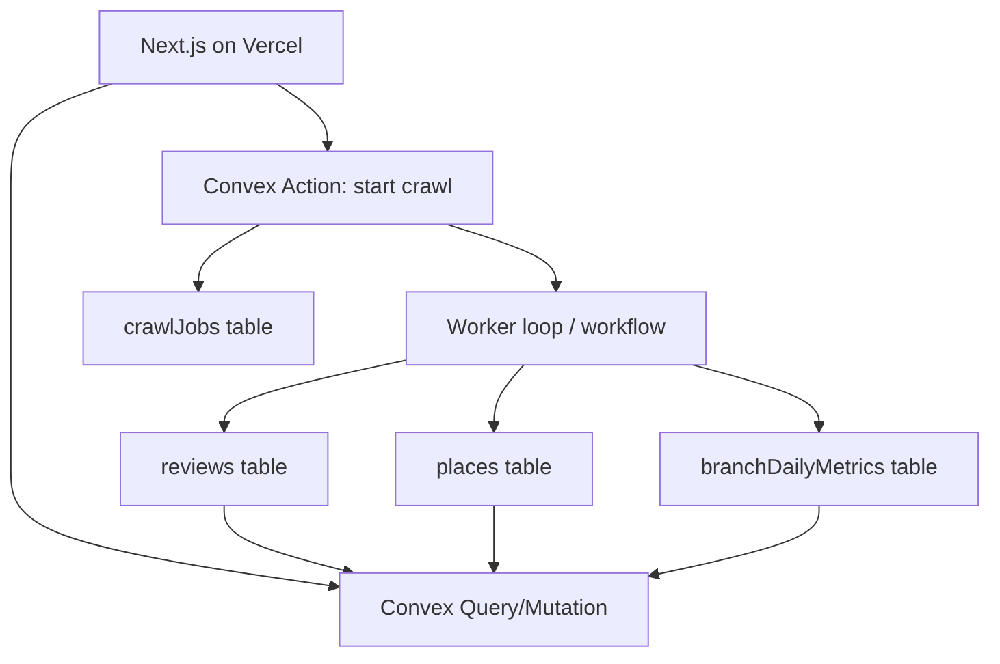
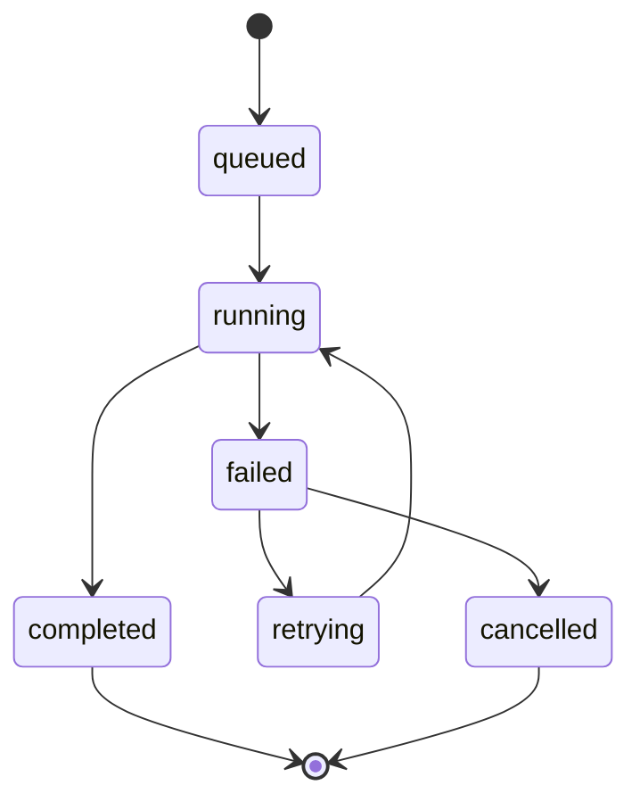

# I. Primer
## 1. TL;DR kiểu Feynman
- Có thể chuyển sang stack bạn quen: **Convex (BaaS) + Vercel Hobby + JS/TS full**.
- Vì bạn chọn **không migrate dữ liệu cũ**, ta làm “cut-over sạch”: từ ngày bật hệ mới, chỉ ingest dữ liệu mới.
- Điểm khó nhất không phải UI, mà là thay backend crawl Python hiện tại bằng **durable crawl jobs** trong JS/TS.
- Với Vercel Hobby, không nên để Vercel làm long-running crawl; dùng Convex Actions/Workflows làm job engine.
- Bản phase 1 ưu tiên realtime + sync ổn định: làm dashboard trigger thủ công + job state rõ ràng + retry/idempotency.

## 2. Elaboration & Self-Explanation
Hiện repo đang là: Next.js đọc Mongo, và sync qua FastAPI/Python crawler. Muốn full JS/TS thì cần thay cả lớp ingest (crawler orchestration), lớp persistence (Mongo -> Convex tables), và lớp read APIs (Next route handlers -> Convex queries/mutations/actions).

Do bạn ưu tiên dữ liệu realtime/sync ổn định nhất, kiến trúc nên dùng **Job Table Pattern**: mọi lần crawl tạo job record, job có state machine, checkpoint, retry. Dashboard không chờ request dài, chỉ poll/subscription trạng thái job từ Convex.

Bạn cũng chọn không migrate dữ liệu cũ, nên tránh khối migration nặng: chỉ seed cấu hình rạp (danh sách places) và bật ingest mới.

## 3. Concrete Examples & Analogies
- Ví dụ cụ thể theo repo:
  - Hiện `src/lib/mongodb.ts` + `src/app/api/*` đang đọc Mongo collections `places`, `reviews`, `branch_daily_metrics`.
  - Sau chuyển đổi: các route này sẽ đọc từ Convex query tương ứng, hoặc dùng Convex client trực tiếp từ Next.
  - `src/app/api/scrape/route.ts` hiện stream tiến trình từ FastAPI jobs; sau chuyển đổi sẽ stream/poll từ Convex `crawlJobs`.

- Analogy đời thường:
  - Trước đây bạn có “quầy điều phối (Next) + đội chạy ngoài (Python server) + kho Mongo”.
  - Sau chuyển: gom về một “trung tâm điều độ Convex”, nơi vừa lưu kho vừa điều phối job; quầy Next chỉ hiển thị/trigger.

# II. Audit Summary (Tóm tắt kiểm tra)
- Observation:
  - Web hiện phụ thuộc Mongo rõ ràng (`src/lib/mongodb.ts`, `src/app/page.tsx`, `src/app/api/places/official/route.ts`, `src/lib/metrics.ts`).
  - Sync hiện phụ thuộc Python FastAPI (`src/lib/scraper.ts`, `src/app/api/scrape/route.ts`).
  - Dữ liệu chính dùng các thực thể `places`, `reviews`, `branch_daily_metrics`.
- Observation (web research 2026):
  - Vercel Hobby cron bị giới hạn đáng kể cho automation dày đặc; phù hợp trigger nhẹ, không nên làm engine crawl dài.
  - Convex có scheduled functions/crons/workflow và pattern background jobs phù hợp orchestration.
- Inference:
  - Full JS/TS khả thi, nhưng phải thiết kế crawl engine bất đồng bộ (durable) ngay từ đầu.
- Decision:
  - Đề xuất migration theo hướng **Full JS/TS với Convex job engine**, deploy UI trên Vercel Hobby, trigger crawl thủ công từ dashboard (đúng yêu cầu của bạn).

# III. Root Cause & Counter-Hypothesis (Nguyên nhân gốc & Giả thuyết đối chứng)
## Root Cause Confidence (Độ tin cậy nguyên nhân gốc): High
- Nguyên nhân cản trở deploy “thuận lợi + sync dễ” hiện tại là kiến trúc chia tách nhiều runtime (Vercel + FastAPI + Mongo + SQLite), làm vận hành và consistency khó hơn stack Convex-first.

### 8 câu audit
1. Triệu chứng: deploy/sync phụ thuộc nhiều service; khó đơn giản hóa đường vận hành.
2. Phạm vi ảnh hưởng: ingest, metrics, dashboard realtime, troubleshooting.
3. Tái hiện: có, vì đây là vấn đề kiến trúc không phải lỗi ngẫu nhiên.
4. Mốc thay đổi: repo đã chuyển hướng so với mô tả README cũ -> có drift kiến trúc.
5. Dữ liệu thiếu: benchmark throughput crawl JS/TS theo số lượng rạp thật.
6. Giả thuyết thay thế: giữ Python + chỉ đổi DB vẫn chạy nhanh hơn trong ngắn hạn.
7. Rủi ro fix sai: rewrite lớn nhưng không đạt SLA crawl/sync sẽ tốn thời gian.
8. Tiêu chí pass: trigger thủ công ổn định, job observability rõ, dashboard cập nhật đúng.

### Counter-hypothesis
- Giữ Python + Mongo (hybrid) sẽ ít rủi ro hơn full rewrite.
- Đúng cho time-to-market ngắn, nhưng không phù hợp mục tiêu bạn đã chọn: full JS/TS + đồng nhất stack Convex.

# IV. Proposal (Đề xuất)
## Option A (Recommend) — Confidence 86%
**Full JS/TS cut-over theo 3 phase, không migrate dữ liệu cũ**
- Phase 1: Data model + read path Convex (places/reviews/metrics) + dashboard đọc Convex.
- Phase 2: Crawl job engine JS/TS (manual trigger, retry, checkpoint, idempotent upsert).
- Phase 3: Hardening (rate-limit, backoff, observability, dead-letter jobs).
- Phù hợp khi: muốn stack đồng nhất lâu dài, ưu tiên realtime và sync ổn định.
- Tradeoff: effort lớn hơn hotfix/hybrid.

## Option B — Confidence 62%
**Hybrid tạm thời: web đọc Convex nhưng crawler Python vẫn giữ**
- Ưu điểm: nhanh lên production.
- Tradeoff: vẫn còn 2 runtime/2 ngôn ngữ, chưa đạt mục tiêu bạn đặt ra.

# V. Files Impacted (Tệp bị ảnh hưởng)
## UI / Next.js
- **Sửa:** `online-reputation-management-system/package.json`
  - Vai trò hiện tại: dependencies Mongo-centric.
  - Thay đổi: thêm Convex client/tooling, giảm phụ thuộc Mongo khi cut-over hoàn tất.
- **Sửa:** `src/app/page.tsx`
  - Vai trò hiện tại: load dashboard từ Mongo.
  - Thay đổi: load từ Convex query layer.
- **Sửa:** `src/components/dashboard/hooks/useDashboardData.ts`
  - Vai trò hiện tại: gọi `/api/scrape`, `/api/places/official`.
  - Thay đổi: trigger/poll job qua Convex mutation/query.
- **Sửa:** `src/app/api/scrape/route.ts`, `src/app/api/places/official/route.ts`, `src/app/api/reviews/route.ts`, `src/app/api/metrics/route.ts`
  - Vai trò hiện tại: bridge Mongo/FastAPI.
  - Thay đổi: hoặc bỏ dần, hoặc chuyển thành thin proxy tới Convex.
- **Sửa:** `src/types/database.ts`, `src/lib/mappers.ts`, `src/lib/metrics.ts`
  - Vai trò hiện tại: schema Mongo.
  - Thay đổi: map schema Convex + contract realtime/job status.

## Backend mới (Convex)
- **Thêm:** `online-reputation-management-system/convex/schema.ts`
  - Tạo tables: `places`, `reviews`, `branchDailyMetrics`, `crawlJobs`, `crawlJobEvents`, `crawlCheckpoints`.
- **Thêm:** `online-reputation-management-system/convex/places.ts`
  - Query/mutation cho places.
- **Thêm:** `online-reputation-management-system/convex/reviews.ts`
  - Upsert + query paginated cho reviews.
- **Thêm:** `online-reputation-management-system/convex/metrics.ts`
  - Aggregate snapshot theo branch/network.
- **Thêm:** `online-reputation-management-system/convex/crawlJobs.ts`
  - Start/cancel/retry job + state transitions.
- **Thêm:** `online-reputation-management-system/convex/crawlerActions.ts`
  - Action chạy crawler JS/TS, parse, normalize, ghi Convex.

## Crawler JS/TS
- **Thêm:** `online-reputation-management-system/src/server/crawler/*`
  - Adapter lấy dữ liệu (official metrics + reviews), normalize + dedupe logic.

# VI. Execution Preview (Xem trước thực thi)
1. Thiết kế schema Convex + index theo query thực tế dashboard.
2. Viết read queries và đổi dashboard sang Convex read path.
3. Viết crawlJobs state machine và trigger thủ công từ UI.
4. Viết crawler action JS/TS + upsert idempotent vào reviews/places.
5. Viết metrics aggregation từ dữ liệu mới.
6. Cắt bỏ dần Mongo/FastAPI bridge, giữ fallback tạm trong thời gian chuyển đổi.

# VII. Verification Plan (Kế hoạch kiểm chứng)
- a) Trigger thủ công 1 rạp -> job chuyển trạng thái: `queued -> running -> completed`.
- b) Sau job completed:
  - `places` có official/captured updated,
  - `reviews` tăng đúng,
  - `branchDailyMetrics` có snapshot mới.
- c) Dashboard phản ánh dữ liệu mới không cần restart.
- d) Chạy 3 job liên tiếp cho cùng rạp: không duplicate review IDs (idempotent pass).
- e) Job lỗi giả lập (timeout/rate-limit): trạng thái failed + error log + retry được.

# VIII. Todo
1. Chốt schema Convex và index strategy cho query/pagination.
2. Chốt contract crawl job payload và state transitions.
3. Implement read-path Convex cho dashboard.
4. Implement crawl action JS/TS + upsert idempotent.
5. Implement metrics aggregation + network summary.
6. Triển khai cut-over không migrate dữ liệu cũ (fresh ingest).
7. Bật monitoring job failures + retry policy.

# IX. Acceptance Criteria (Tiêu chí chấp nhận)
- Deploy được trên Vercel Hobby + Convex mà không cần FastAPI/Mongo runtime.
- Dashboard trigger thủ công crawl và thấy tiến trình rõ ràng.
- Dữ liệu mới lên ổn định, không trùng review, số official/captured nhất quán.
- Có khả năng retry job thất bại và theo dõi lịch sử job.

# X. Risk / Rollback (Rủi ro / Hoàn tác)
- Rủi ro:
  - Crawl JS/TS có thể kém ổn định hơn Python ban đầu nếu selector thay đổi.
  - Vercel runtime không phù hợp long-running -> cần dồn execution sang Convex actions/workflows.
  - Thiếu dữ liệu lịch sử do quyết định không migrate cũ.
- Rollback:
  - Giữ nhánh legacy Mongo/FastAPI trong giai đoạn chuyển.
  - Feature flag để đổi nguồn read (Convex vs legacy) trong thời gian burn-in.
  - Nếu crawl JS gặp sự cố, fallback trigger về pipeline cũ tạm thời (nếu còn giữ).

# XI. Out of Scope (Ngoài phạm vi)
- Migrate toàn bộ dữ liệu Mongo cũ sang Convex.
- Tối ưu SEO/UI beyond data-flow migration.
- Tự động lịch crawl dày đặc theo cron trên Vercel Hobby (phase hiện tại là manual trigger).

# XII. Open Questions (Câu hỏi mở)
- Có dùng nguồn crawl nào trong JS/TS: provider API ổn định (khuyến nghị) hay headless browser tự vận hành?
- Mức SLA mong muốn cho một job crawl (ví dụ <2 phút/rạp) để chốt chiến lược retry/timeout.