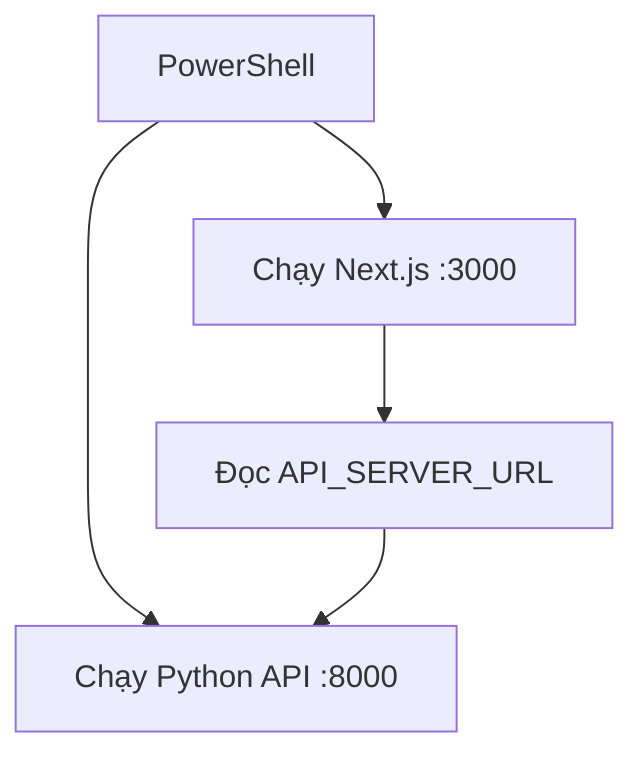

# I. Primer
## 1. TL;DR kiểu Feynman
- Repo này có **2 project độc lập**: một app Next.js và một scraper Python.
- Muốn chạy nhanh thì làm theo thứ tự: **cài runtime → cài dependency → tạo file config/env → chạy lệnh dev**.
- `online-reputation-management-system` chạy ở frontend/dashboard (Next.js), cần `.env` + npm.
- `google-review-craw` chạy scraper/API backend (Python), cần `config.yaml` + pip.
- Nếu muốn 2 bên nói chuyện với nhau, đặt `API_SERVER_URL=http://localhost:8000` ở app Next.js và chạy API Python trước.

## 2. Elaboration & Self-Explanation
Bạn đang hỏi cách chạy local “chuẩn chỉ” ở mức **minimum** trên **Windows PowerShell**. Với scope này, mình không setup tối ưu production, chỉ đảm bảo bạn có thể boot được hệ thống nhanh, đúng thứ tự, ít lỗi thường gặp.

Luồng đơn giản:
a) App Python (`google-review-craw`) có thể chạy API server tại cổng 8000.
b) App Next.js (`online-reputation-management-system`) đọc biến `API_SERVER_URL` để gọi backend scraper.
c) Chạy riêng từng app vẫn được; chạy cùng thì có full flow UI + backend local.

## 3. Concrete Examples & Analogies
**Ví dụ cụ thể theo repo này:**
- Terminal 1 chạy `google-review-craw` bằng `python api_server.py`.
- Terminal 2 chạy `online-reputation-management-system` bằng `npm run dev`.
- Mở `http://localhost:3000` để vào UI, UI gọi qua `http://localhost:8000`.

**Analogy đời thường:**
- Next.js giống “quầy điều khiển”, Python scraper giống “đội thu thập dữ liệu”.
- Chạy quầy mà không có đội thu thập thì vẫn mở được giao diện, nhưng thao tác lấy dữ liệu có thể thiếu backend.

# II. Audit Summary (Tóm tắt kiểm tra)
- Observation:
  - Có 2 thư mục chính: `online-reputation-management-system` và `google-review-craw`.
  - `online-reputation-management-system/package.json` có scripts: `dev`, `build`, `start`, `lint`.
  - `online-reputation-management-system/.env.example` yêu cầu các biến như `API_SERVER_URL`, `PYTHON_CMD`, `SCRAPER_DIR`.
  - `google-review-craw` có `requirements.txt`, `config.sample.yaml`, `start.py`, `api_server.py`.
- Inference:
  - Đây là setup kiểu frontend Next.js + backend scraper Python tách rời.
- Decision:
  - Soạn runbook local minimum cho **cả 2 project**, ưu tiên PowerShell, không mở rộng thêm CI/CD hay Docker.

# III. Root Cause & Counter-Hypothesis (Nguyên nhân gốc & Giả thuyết đối chứng)
## Root Cause Confidence (Độ tin cậy nguyên nhân gốc): High
- Nguyên nhân gây “khó chạy local” thường là:
  1) Chưa tách đúng 2 project độc lập.
  2) Thiếu file config (`.env`, `config.yaml`).
  3) Chạy sai thứ tự backend/frontend.
  4) Thiếu runtime đúng version (Node/Python).

### Counter-hypothesis
- Có thể app Next.js không cần backend Python để mở UI cơ bản.
- Đúng trong một số route, nhưng full flow có scraper/API vẫn cần backend chạy.

# IV. Proposal (Đề xuất)
## Option A (Recommend) — Confidence 90%
**Run song song 2 terminal theo quickstart minimum**
- B1: Setup và chạy `google-review-craw` trước.
- B2: Setup và chạy `online-reputation-management-system`.
- B3: Verify 2 cổng `8000` và `3000`.
- Vì sao recommend: ít bước, đúng kiến trúc tách service hiện tại, dễ debug khi service nào chết thì biết ngay.

## Option B — Confidence 65%
**Chạy Next.js trước, Python sau**
- Phù hợp khi chỉ cần kiểm tra UI tĩnh trước.
- Tradeoff: dễ gặp lỗi khi thao tác tính năng cần backend, gây hiểu nhầm app hỏng.

# V. Files Impacted (Tệp bị ảnh hưởng)
- **Không có thay đổi file trong spec này** (chỉ đề xuất quy trình chạy).
- Khi thực thi (nếu bạn duyệt), dự kiến dùng các file sau:
  - Sửa: `online-reputation-management-system/.env` (tạo từ `.env.example`) — chứa endpoint và config local.
  - Sửa: `google-review-craw/config.yaml` (tạo từ `config.sample.yaml`) — chứa URL doanh nghiệp và chế độ scrape.

# VI. Execution Preview (Xem trước thực thi)
1. Kiểm tra runtime có sẵn: Node/npm, Python/pip.
2. Project Python:
   - Tạo virtual env.
   - Cài `requirements.txt`.
   - Tạo `config.yaml` từ sample.
   - Chạy `python api_server.py` (hoặc `python start.py`).
3. Project Next.js:
   - `npm install`.
   - Tạo `.env` từ `.env.example`, set `API_SERVER_URL=http://localhost:8000`.
   - `npm run dev`.
4. Review tĩnh hướng dẫn + checklist verify local.

# VII. Verification Plan (Kế hoạch kiểm chứng)
- Với yêu cầu “chạy local minimum”, tiêu chí verify:
  - Python API lên được `http://localhost:8000`.
  - Next.js dev lên được `http://localhost:3000`.
  - Gọi thử endpoint health của backend từ browser/curl thành công.
  - UI load được mà không crash ngay lúc boot.
- Lưu ý theo rule repo: **không chạy lint/test/build tự động** trong luồng này.

# VIII. Todo
1. Hướng dẫn setup `google-review-craw` trên PowerShell.
2. Hướng dẫn setup `online-reputation-management-system` trên PowerShell.
3. Hướng dẫn ghép 2 service bằng env.
4. Checklist verify nhanh sau khi chạy.
5. Mục troubleshoot 3 lỗi thường gặp.

# IX. Acceptance Criteria (Tiêu chí chấp nhận)
- Có bộ lệnh copy/paste PowerShell cho từng project.
- User chạy theo và mở được ít nhất 1 endpoint backend + 1 frontend local.
- Không yêu cầu thêm tool ngoài scope minimum (trừ runtime cần thiết).

# X. Risk / Rollback (Rủi ro / Hoàn tác)
- Rủi ro:
  - Port 3000/8000 bị chiếm.
  - Python package native có thể lỗi build trên máy thiếu build tools.
  - Sai đường dẫn `SCRAPER_DIR` trong `.env`.
- Rollback:
  - Xóa `.venv`, cài lại dependencies.
  - Đổi cổng hoặc kill process chiếm cổng.
  - Khôi phục `.env`/`config.yaml` từ file sample.

# XI. Out of Scope (Ngoài phạm vi)
- Docker hóa toàn bộ stack.
- Hardening production, monitoring, autoscaling.
- Tối ưu hiệu năng scrape hoặc tuning database.

# XII. Open Questions (Câu hỏi mở)
- Không còn ambiguity cho scope hiện tại (cả hai project, minimum, PowerShell).