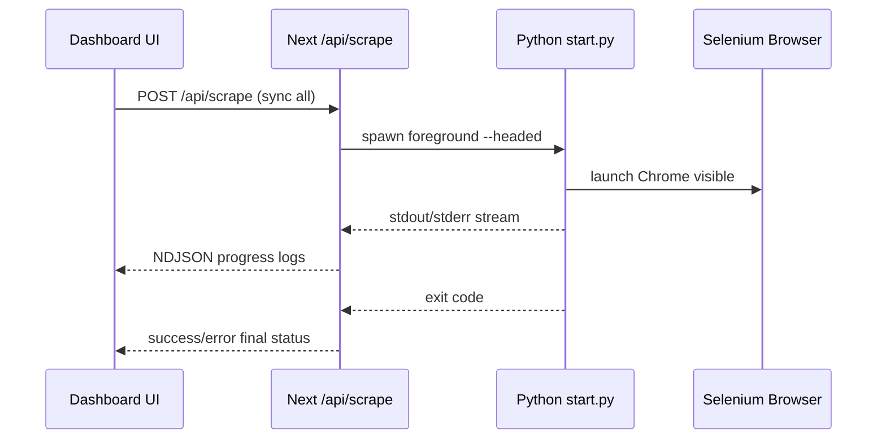

# I. Primer
## 1. TL;DR kiểu Feynman
- `Sync All` hiện đang chạy qua API nền (background), nên UI báo “working in background” là đúng theo thiết kế hiện tại.
- Muốn thấy browser bật lên thì scraper phải chạy `headless=false` và chạy foreground (blocking), không đi qua `JobManager`.
- Em sẽ đổi riêng nhánh `Sync All` sang spawn Python trực tiếp từ Next API, stream log realtime về UI.
- Nếu mở browser lỗi hoặc process lỗi, sẽ dừng toàn bộ sync ngay (theo lựa chọn của anh).
- Không mở rộng scope sang refactor toàn bộ pipeline; chỉ sửa tối thiểu đúng hành vi `Sync All`.

## 2. Elaboration & Self-Explanation
Hiện tại khi bấm `Sync All`, app không chạy lệnh scrape trực tiếp mà gọi HTTP sang Python API (`/trigger-all`), và phía Python dùng `ThreadPoolExecutor` để đẩy job nền. Vì là job nền + config mặc định `headless: true`, nên không có cửa sổ Chrome hiện ra.

Để đạt yêu cầu “không chạy ngầm, chạy mở browser luôn”, cần chuyển luồng `Sync All` sang chạy process Python foreground tại Next API và ép scraper chạy `headed` (`headless=false`). Khi đó browser Selenium sẽ hiện trực tiếp trên máy chạy app, đồng thời log process được đẩy về UI theo NDJSON để theo dõi.

## 3. Concrete Examples & Analogies
- Ví dụ cụ thể theo repo: thay vì gọi `bgTriggerAllCinemas()` (HTTP `/trigger-all`), route `/api/scrape` sẽ gọi `spawn(python, ["start.py", "scrape", "--headed"])` và đọc `stdout`/`stderr` để stream về Activity Drawer.
- Analogy đời thường: hiện tại giống “đặt xe qua tổng đài rồi ngồi chờ tin nhắn”; yêu cầu mới là “tự lái xe ngay trước mắt”, nên phải bỏ hàng đợi nền và chạy trực tiếp.

# II. Audit Summary (Tóm tắt kiểm tra)
- **Observation:**
  - `src/app/api/scrape/route.ts` đang trigger job qua `bgTriggerAllCinemas/bgTriggerCinema` và poll trạng thái.
  - `src/lib/scraper.ts` chỉ gọi HTTP FastAPI (`/trigger-all`, `/scrape`, `/jobs/:id`), không spawn local process.
  - `google-review-craw/api_server.py` + `modules/job_manager.py` chạy background qua `ThreadPoolExecutor`.
  - `google-review-craw/config.yaml` để `headless: true`; `modules/scraper.py` lấy mặc định này.
  - UI có text cố định “Scraper is working in background...” trong `ActivityDrawer.tsx`.
- **Inference:** không phải bug runtime ngẫu nhiên; đây là sai khác giữa yêu cầu mới và kiến trúc hiện tại.
- **Decision:** đổi nhánh `Sync All` sang foreground headed path, giữ patch nhỏ, rollback dễ.

Trả lời checklist nguyên nhân gốc (rút gọn):
1. Triệu chứng: bấm Sync All nhưng chạy ngầm, không mở browser (expected: mở browser).
2. Phạm vi: luồng dashboard sync (`/api/scrape`), Python crawler local.
3. Tái hiện: ổn định 100% vì code hiện tại luôn qua background API.
4. Mốc thay đổi gần nhất: các commit gần đây chuyển sang trigger local Python API/background.
5. Thiếu dữ liệu: không thiếu dữ liệu quan trọng để kết luận.
6. Giả thuyết thay thế: “do browser bị crash” đã bị loại vì flow chưa hề yêu cầu mở browser foreground.
7. Rủi ro fix sai nguyên nhân: sửa UI text/overlay nhưng không đổi execution path thì vẫn chạy ngầm.
8. Pass/fail: pass khi Sync All mở Chrome thật + log foreground; fail nếu còn qua `/trigger-all` background.

# III. Root Cause & Counter-Hypothesis (Nguyên nhân gốc & Giả thuyết đối chứng)
- **Root Cause (High):** `Sync All` đang thiết kế theo background jobs qua FastAPI + `headless=true`, nên không thể hiện browser.
- **Counter-hypothesis đã loại trừ:** lỗi do UI không render browser hoặc do polling chậm. Không đúng, vì backend không hề chạy foreground/browser-visible path.
- **Root Cause Confidence:** **High** — có evidence trực tiếp từ route, lib scraper, job manager và config headless.

# IV. Proposal (Đề xuất)
1. Đổi nhánh `Sync All` ở `/api/scrape` sang chạy Python foreground bằng `child_process.spawn` (không detached, không hidden).
2. Bổ sung cờ CLI `--headed` trong crawler để ép `headless=false` mà không phá backward compatibility.
3. Stream `stdout/stderr` từ process Python về NDJSON (log realtime cho UI).
4. Khi process trả mã lỗi hoặc không spawn được browser: trả lỗi ngay và **dừng toàn bộ sync**.
5. Cập nhật microcopy UI từ “working in background” sang trạng thái foreground phù hợp.

# V. Files Impacted (Tệp bị ảnh hưởng)
- **Sửa:** `E:\NextJS\persional_project\lotte_gg_map\online-reputation-management-system\src\app\api\scrape\route.ts`
  - Vai trò hiện tại: route stream tiến độ sync dựa trên job nền FastAPI.
  - Thay đổi: nhánh `Sync All` chạy foreground spawn Python + stream log process + fail-fast.

- **Sửa:** `E:\NextJS\persional_project\lotte_gg_map\google-review-craw\modules\cli.py`
  - Vai trò hiện tại: định nghĩa CLI args cho command `scrape`.
  - Thay đổi: thêm cờ `--headed` (đảo nghĩa headless) để cưỡng bức mở browser visible.

- **Sửa:** `E:\NextJS\persional_project\lotte_gg_map\google-review-craw\start.py`
  - Vai trò hiện tại: map CLI overrides vào config scraper.
  - Thay đổi: xử lý `--headed` ưu tiên set `config["headless"]=False`.

- **Sửa:** `E:\NextJS\persional_project\lotte_gg_map\online-reputation-management-system\src\components\dashboard\components\ActivityDrawer.tsx`
  - Vai trò hiện tại: hiển thị status/footer activity drawer.
  - Thay đổi: đổi text phản ánh foreground run (không còn “background”).

# VI. Execution Preview (Xem trước thực thi)
1. Đọc/chỉnh CLI Python (`cli.py`, `start.py`) để có `--headed` chuẩn.
2. Chỉnh route Next `/api/scrape` cho nhánh `Sync All` thành foreground spawn + stream.
3. Cập nhật copy UI Activity Drawer.
4. Tự review tĩnh: type/null-safety, xử lý exit code, cleanup listeners, edge cases spawn fail.
5. Commit local (không push).

# VII. Verification Plan (Kế hoạch kiểm chứng)
- **Static verification (agent):**
  - Soát type/flow cho route stream NDJSON, đảm bảo không memory leak listener.
  - Soát fail path: spawn error, non-zero exit, timeout/abort (nếu có).
- **Runtime verification (tester):**
  - Bấm `Sync All` từ dashboard.
  - Quan sát Chrome Selenium bật lên trực tiếp.
  - Quan sát Activity Drawer nhận log realtime.
  - Cố tình gây lỗi khởi tạo browser và xác nhận flow dừng toàn bộ + báo lỗi.
- Theo quy ước repo, em **không tự chạy lint/unit test**.

# VIII. Todo
1. [pending] Thêm `--headed` vào CLI scraper và apply override `headless=false`.
2. [pending] Refactor nhánh `Sync All` trong `/api/scrape` sang foreground process.
3. [pending] Stream log process về NDJSON và dừng toàn bộ khi lỗi.
4. [pending] Cập nhật text Activity Drawer cho foreground behavior.
5. [pending] Tự review tĩnh + commit local (kèm `.factory/docs` nếu có).

# IX. Acceptance Criteria (Tiêu chí chấp nhận)
- Bấm `Sync All` không còn đi qua background trigger-all path.
- Browser Chrome Selenium mở trực tiếp (headed) trong quá trình sync.
- UI hiển thị log tiến độ realtime từ process foreground.
- Nếu mở browser/process lỗi: sync dừng ngay và trả trạng thái lỗi rõ ràng.
- Không thay đổi hành vi ngoài phạm vi `Sync All` theo yêu cầu hiện tại.

# X. Risk / Rollback (Rủi ro / Hoàn tác)
- **Rủi ro:** route Next chạy ở môi trường không có GUI thì browser visible không thể mở; cần chạy local desktop session.
- **Rủi ro:** foreground block lâu hơn background, nhưng đúng theo yêu cầu hiện tại.
- **Rollback:** revert các file đã sửa về flow cũ (`bgTriggerAllCinemas` + polling jobs).

# XI. Out of Scope (Ngoài phạm vi)
- Không refactor toàn bộ Python API/job manager.
- Không tối ưu concurrency crawl nhiều rạp cùng lúc.
- Không thay đổi schema Convex hoặc pipeline metrics.

# XII. Open Questions (Câu hỏi mở)
- Không còn ambiguity chức năng cho scope hiện tại (đã chốt foreground + headed + fail-stop).