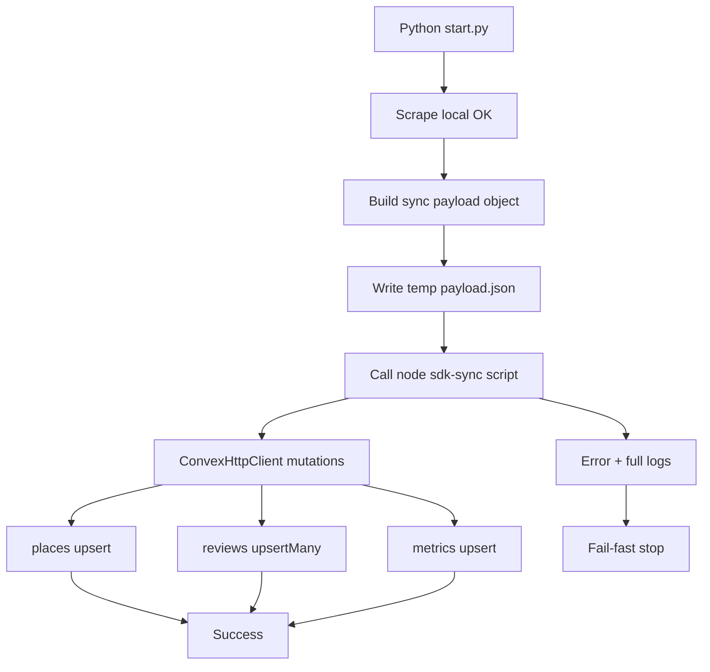

# I. Primer
## 1. TL;DR kiểu Feynman
- Scrape của bạn đã chạy xong; chỉ fail ở bước “đẩy dữ liệu sang Convex”.
- Lỗi gốc là cách gọi Convex CLI với JSON args trên Windows bị vỡ khi payload có URL chứa ký tự đặc biệt.
- Fix dứt điểm: bỏ đường `convex run ... <json>` hiện tại, chuyển sang Node SDK (`ConvexHttpClient`) đọc payload từ file.
- Python chỉ cần ghi 1 file payload rồi gọi Node script với đường dẫn file (không truyền JSON inline).
- Giữ đúng yêu cầu của bạn: fail-fast + in full log khi lỗi.

## 2. Elaboration & Self-Explanation
Hiện tại pipeline có 2 phần:
1) Crawl/Scrape local (đang pass hoàn toàn).
2) Sync Convex (đang fail ở `places:upsert`).

Phần fail không phải do dữ liệu scrape, mà do “đóng gói tham số command” khi gọi Convex CLI. Khi JSON có URL dài (có `&`, `?`, unicode), command-line parsing trên Windows rất dễ làm payload bị cắt/hỏng. Kể cả đã thử nhiều biến thể wrapper, điểm yếu nền tảng vẫn là “đưa JSON lớn qua command args cho CLI”.

Vì vậy hướng ổn định nhất là: không dùng CLI parse args nữa, mà dùng SDK Node gọi mutation trực tiếp bằng object JS đã parse từ file JSON.

## 3. Concrete Examples & Analogies
- Ví dụ bám log của bạn: lỗi luôn dừng ở `places:upsert (exit 1)` ngay sau khi scrape completed, chứng tỏ fail ở transport/invocation layer.
- Analogy: thay vì “nhét kiện hàng cồng kềnh qua khe hẹp command args”, ta “đặt kiện vào kho (payload file) rồi xe tải chuyên dụng (SDK) chở thẳng tới đích (Convex mutations)”.

# II. Audit Summary (Tóm tắt kiểm tra)
- Observation:
  - Scrape hoàn tất ổn định (dates/images/json đều completed).
  - Crash luôn xảy ra sau đó ở `_sync_place_to_convex` khi gọi mutation đầu tiên.
- Inference:
  - Vấn đề nằm ở cơ chế invocation Convex trên Windows, không nằm ở crawler logic.
- Decision:
  - Chuyển sang Option A bạn đã chọn: Node SDK + payload file, fail-fast, full logs.

# III. Root Cause & Counter-Hypothesis (Nguyên nhân gốc & Giả thuyết đối chứng)
## Root-cause checklist (đáp ứng bắt buộc)
a) Triệu chứng (expected vs actual)
- Expected: scrape xong sẽ upsert place/reviews/metrics vào Convex.
- Actual: scrape xong nhưng ném `RuntimeError: Sync Convex thất bại ở places:upsert (exit 1)`.

b) Phạm vi ảnh hưởng
- Ảnh hưởng bước sync Convex trong CLI `start.py scrape` trên Windows.
- Không ảnh hưởng trực tiếp bước crawl data local.

c) Điều kiện tái hiện
- Tái hiện ổn định khi chạy scrape 1 business có URL thật dài và chứa query params.

d) Mốc thay đổi gần nhất
- Đã có nhiều lần chỉnh wrapper CLI; lỗi vẫn lặp lại theo cùng pattern.

e) Dữ liệu còn thiếu
- Không thiếu dữ liệu để kết luận root cause ở mức implementation.

f) Giả thuyết thay thế hợp lý chưa loại trừ
- “Schema Convex sai”/“payload business sai”: khả năng thấp vì fail xuất hiện trước/đúng tầng invocation.

g) Rủi ro nếu fix sai nguyên nhân
- Tiếp tục loop sửa escape/shell nhưng vẫn fail ngẫu nhiên theo payload.

h) Tiêu chí pass/fail sau sửa
- Pass khi `start.py scrape` kết thúc với log sync thành công, không traceback.
- Fail nếu còn exit 1 ở `places:upsert` hoặc mutation sau.

## Root Cause Confidence (Độ tin cậy nguyên nhân gốc)
- **High**: dấu hiệu fail tập trung ở cơ chế gọi CLI với args JSON trên Windows; scrape/pipeline nội bộ pass ổn định.

# IV. Proposal (Đề xuất)
1. Thêm script Node mới dùng SDK Convex (không dùng `convex run`) để nhận payload từ file JSON rồi gọi:
   - `places:upsert`
   - `reviews:upsertManyForPlace`
   - `metrics:upsertForPlace`
2. Trong Python `start.py`, `_sync_place_to_convex` sẽ:
   - build object payload như hiện tại,
   - ghi payload ra file tạm,
   - gọi Node script mới bằng path file,
   - capture full stdout/stderr,
   - fail-fast nếu return code != 0.
3. Giữ nguyên business behavior hiện có (không đổi schema, không đổi crawler flow).

# V. Files Impacted (Tệp bị ảnh hưởng)
- **Sửa:** `google-review-craw/start.py`
  - Vai trò hiện tại: entrypoint scrape + trigger sync Convex.
  - Thay đổi: đổi cách gọi sync sang “node sdk script + payload file”, giữ fail-fast và full error context.

- **Thêm:** `online-reputation-management-system/scripts/convex-sync-place.cjs`
  - Vai trò hiện tại: chưa có.
  - Thay đổi: script SDK đọc payload file, gọi 3 mutations tuần tự, trả mã thoát rõ ràng.

- **Sửa:** `google-review-craw/tests/test_start_commands.py`
  - Vai trò hiện tại: test helper start/sync.
  - Thay đổi: cập nhật test path gọi script mới + assert fail-fast + assert capture log.

- **Sửa (nhẹ):** `online-reputation-management-system/scripts/convex-run.js`
  - Vai trò hiện tại: wrapper CLI cũ.
  - Thay đổi: giữ nguyên hoặc chỉ để backward compatibility; không còn là đường chính của sync từ crawler.

# VI. Execution Preview (Xem trước thực thi)
1. Đọc lại `start.py` để thay `_sync_place_to_convex` wiring.
2. Tạo script mới `convex-sync-place.cjs` bằng Convex SDK.
3. Nối Python -> Node script qua payload file path.
4. Cập nhật test helper tương ứng.
5. Rà static và chuẩn hóa lỗi full-log fail-fast.

# VII. Verification Plan (Kế hoạch kiểm chứng)
- Repro chính:
  - chạy lại lệnh scrape 1 business như bạn đang dùng.
- Pass khi:
  - không còn traceback ở `_sync_place_to_convex`,
  - có log success sync Convex,
  - frontend localhost refresh thấy dữ liệu thật từ Convex.
- Theo quy ước repo hiện tại:
  - không chạy lint/build/test suite tự động; kiểm chứng runtime theo luồng bạn đang chạy + review tĩnh.

# VIII. Todo
1. Tạo Node SDK sync script nhận payload file.
2. Chuyển `_sync_place_to_convex` sang gọi script mới thay vì CLI args JSON.
3. Bật full stdout/stderr khi lỗi và dừng ngay (fail-fast).
4. Cập nhật test helper cho cơ chế mới.
5. Commit gọn, dễ rollback.

# IX. Acceptance Criteria (Tiêu chí chấp nhận)
- `python start.py scrape --config config.yaml --headed` chạy xong không traceback ở sync Convex.
- Có thể sync thành công business có URL chứa query dài/ký tự đặc biệt.
- Vẫn giữ fail-fast: lỗi mutation nào dừng ngay.
- Khi fail có full log đủ để debug, không còn lỗi mơ hồ `exit 1` trống.
- Frontend localhost đọc được dữ liệu thật từ Convex sau refresh.

# X. Risk / Rollback (Rủi ro / Hoàn tác)
- Rủi ro: script mới cần đúng `.env.local` và dependency `convex` trong web app.
- Giảm thiểu: validate đầu vào (file/env/function path), in lỗi rõ.
- Rollback: revert commit script mới + revert thay đổi `_sync_place_to_convex`.

# XI. Out of Scope (Ngoài phạm vi)
- Không chỉnh schema Convex.
- Không refactor crawler Selenium/pipeline scrape.
- Không thay UX chọn business ngoài phần đã làm.

# XII. Open Questions (Câu hỏi mở)
- Không còn ambiguity quan trọng sau khi bạn chốt Option A + full logs + fail-fast.