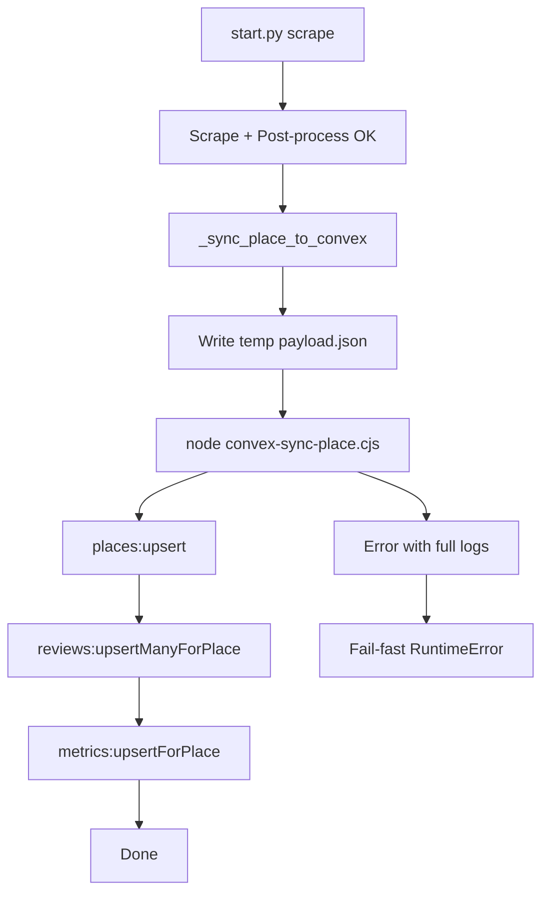

# I. Primer
## 1. TL;DR kiểu Feynman
- Scrape chạy xong, chỉ fail ở bước sync Convex (`places:upsert`).
- Nguyên nhân chính nằm ở tầng gọi Convex qua CLI trên Windows khi payload JSON phức tạp.
- Mình sẽ chuyển đường sync từ `convex run ... <json>` sang Node SDK đọc payload từ file, để tránh vỡ args.
- Giữ nguyên fail-fast: lỗi ở mutation nào dừng ngay mutation đó và ném lỗi rõ ràng.

## 2. Elaboration & Self-Explanation
- Hiện `_sync_place_to_convex` build payload đúng, nhưng cách invoke Convex qua subprocess + CLI dễ hỏng trên Windows với payload dài/chứa ký tự đặc biệt.
- Dù scrape thành công (480 reviews), bước transport payload sang Convex vẫn có thể trả `exit 1` mà không đủ ngữ cảnh.
- Giải pháp ổn định nhất là gọi Convex bằng SDK (`ConvexHttpClient`) với object JSON parse từ file tạm, không phụ thuộc shell/CLI parsing.

## 3. Concrete Examples & Analogies
- Ví dụ theo log: fail luôn sau `PostScrapeRunner` ở `places:upsert`, chứng tỏ vấn đề nằm ở lớp sync invocation, không phải crawler.
- Analogy: thay vì “nhét JSON qua khe command args”, ta “đặt payload vào file và chuyển thẳng bằng SDK”.

# II. Audit Summary (Tóm tắt kiểm tra)
- Observation: `start.py scrape` hoàn tất crawl/post-process rồi crash tại `_sync_place_to_convex`.
- Inference: lỗi thuộc lớp gọi Convex mutation từ môi trường Windows.
- Decision: thay luồng sync sang Node SDK + payload file để loại bỏ rủi ro parse args.

# III. Root Cause & Counter-Hypothesis (Nguyên nhân gốc & Giả thuyết đối chứng)
- Triệu chứng: expected = sync 3 mutations thành công; actual = fail ngay mutation đầu với `exit 1`.
- Phạm vi: chỉ ảnh hưởng bước sync Convex sau scrape.
- Tái hiện: ổn định với cùng lệnh scrape interactive.
- Mốc thay đổi gần đây: đã có wrapper CLI nhưng vẫn còn điểm lỗi ở invocation path.
- Dữ liệu còn thiếu: thông điệp lỗi chi tiết từ Convex function (sẽ bổ sung ở log path mới).
- Giả thuyết thay thế: schema/mutation invalid. Chưa loại trừ tuyệt đối nhưng thấp vì fail pattern tập trung ở invocation.
- Rủi ro fix sai: tiếp tục sửa escape CLI nhưng lỗi vẫn tái diễn ngẫu nhiên.
- Tiêu chí pass/fail: chạy lại lệnh scrape, không còn traceback ở `_sync_place_to_convex`, có log sync hoàn tất.

**Root Cause Confidence (Độ tin cậy nguyên nhân gốc): High** — bằng chứng từ log cho thấy scrape pass, chỉ fail tại boundary sync Convex.

# IV. Proposal (Đề xuất)
1. Thêm script mới: `online-reputation-management-system/scripts/convex-sync-place.cjs`
   - Đọc file payload JSON (chứa `place`, `reviews`, `metrics`).
   - Khởi tạo `ConvexHttpClient` bằng `NEXT_PUBLIC_CONVEX_URL` từ `.env.local`.
   - Gọi tuần tự: `places:upsert` → `reviews:upsertManyForPlace` → `metrics:upsertForPlace`.
   - Bắt lỗi, in function đang fail + stack/message, trả exit code != 0.
2. Sửa `google-review-craw/start.py` trong `_sync_place_to_convex`
   - Ghi payload tổng vào file tạm.
   - Gọi Node script mới (không gọi `convex run` trực tiếp).
   - Capture stdout/stderr đầy đủ; nếu non-zero thì raise RuntimeError có context rõ.
3. Cập nhật test `google-review-craw/tests/test_start_commands.py`
   - Mock subprocess theo script mới + assert call count/command path đúng.
   - Giữ test scope nhỏ, không đổi behavior business.

# V. Files Impacted (Tệp bị ảnh hưởng)
- **Sửa:** `google-review-craw/start.py`
  - Vai trò hiện tại: điều phối scrape + sync Convex.
  - Thay đổi: chuyển sync sang gọi Node SDK script qua payload file, tăng chất lượng error context.
- **Thêm:** `online-reputation-management-system/scripts/convex-sync-place.cjs`
  - Vai trò hiện tại: chưa có.
  - Thay đổi: script sync Convex bằng SDK, xử lý tuần tự 3 mutations.
- **Sửa:** `google-review-craw/tests/test_start_commands.py`
  - Vai trò hiện tại: test command helpers.
  - Thay đổi: cập nhật assertions theo sync mechanism mới.

# VI. Execution Preview (Xem trước thực thi)
1. Refactor `_sync_place_to_convex` để xuất payload file + gọi script mới.
2. Tạo `convex-sync-place.cjs` với `ConvexHttpClient` và error handling fail-fast.
3. Chỉnh unit test liên quan command invocation.
4. Static self-review (typing/null/edge-case), không chạy lint/unit test theo quy ước repo.

# VII. Verification Plan (Kế hoạch kiểm chứng)
- Repro thủ công bằng đúng lệnh bạn dùng:
  - `.\.venv\Scripts\python.exe start.py scrape --config config.yaml --headed`
- Chọn 1 business như đã làm.
- Pass nếu:
  - Không còn traceback `Sync Convex thất bại ở places:upsert`.
  - Log thể hiện sync 3 mutations hoàn tất.
  - Nếu fail, stderr/stdout nêu rõ function nào và lỗi gì.

# VIII. Todo
1. Viết Node SDK sync script mới.
2. Nối Python sync sang script mới bằng payload file.
3. Chuẩn hóa fail-fast + full error context.
4. Cập nhật test helper tương ứng.
5. Self-review tĩnh trước bàn giao.

# IX. Acceptance Criteria (Tiêu chí chấp nhận)
- Lệnh scrape chạy hết và không văng RuntimeError tại `_sync_place_to_convex`.
- Sync Convex ổn định với business có URL/query phức tạp trên Windows.
- Khi lỗi xảy ra, log đủ để xác định mutation lỗi ngay.
- Không đổi scope ngoài sync path (crawler logic giữ nguyên).

# X. Risk / Rollback (Rủi ro / Hoàn tác)
- Rủi ro: thiếu/không đúng `NEXT_PUBLIC_CONVEX_URL` trong `.env.local` của web app.
- Giảm thiểu: validate env ngay khi start script mới, báo lỗi rõ ràng.
- Rollback: revert 3 file thay đổi để quay về cơ chế cũ.

# XI. Out of Scope (Ngoài phạm vi)
- Không đổi schema Convex.
- Không tối ưu lại crawler Selenium.
- Không thêm retry/backoff batch sync (chỉ fail-fast đúng yêu cầu).

# XII. Open Questions (Câu hỏi mở)
- Không có ambiguity quan trọng; có thể triển khai ngay theo kế hoạch trên.