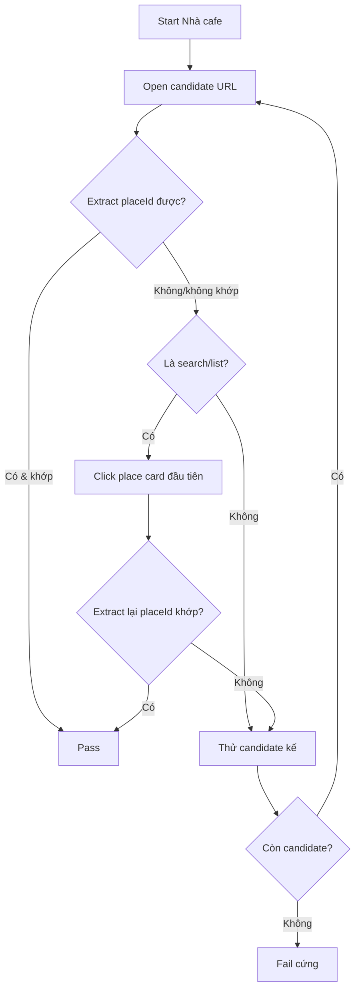

# I. Primer
## 1. TL;DR kiểu Feynman
- Hiện tại URL `query_place_id` của Nhà cafe thường mở ra **trang list**, không vào thẳng place.
- Khi ở trang list, scraper chưa có bước “pick đúng card place”, nên `extract_place_id` trả `<unknown>` và fail.
- Mình sẽ fix **chỉ riêng Nhà cafe**, không ảnh hưởng quán khác.
- Rule sẽ **strict tuyệt đối**: chỉ khi resolve được đúng `placeId` mới cho crawl.
- Nếu không xác định đúng placeId sau fallback: **fail cứng** business đó.

## 2. Elaboration & Self-Explanation
Vấn đề không nằm ở parse review, mà nằm ở bước điều hướng trước khi vào tab đánh giá. Với Nhà cafe, Google hay đưa về `maps/search/...` (list view). Ở view này URL chưa chứa token `!1s<placeId>`, nên check placeId fail dù kết quả đầu có thể là đúng quán.  
Cách xử lý triệt để theo yêu cầu: cho riêng `placeId` của Nhà cafe, thêm bước thao tác UI để click đúng card trong list rồi đọc lại URL đã resolve. Chỉ khi URL/resolve cho ra đúng `0x31a0890038ccfc4f:0x567ba2463308ff1d` mới đi tiếp qua reviews.

## 3. Concrete Examples & Analogies
- Ví dụ đúng case của bạn:
  1) Mở `search/?api=1&query=Nhà cafe&query_place_id=...` -> ra list.
  2) Click card đầu (hoặc card khớp) -> URL chuyển sang `/maps/place/...!1s0x31a0890038ccfc4f:0x567ba2463308ff1d...`.
  3) Validate placeId khớp -> mới click tab reviews và crawl.
- Analogy: giống check CCCD ở cổng — nhìn mặt giống chưa đủ, phải đúng số định danh mới cho vào.

# II. Audit Summary (Tóm tắt kiểm tra)
- Observation
  - Log runtime hiện tại cho thấy cả 3 candidate URL đều mismatch `actual=<unknown>`.
  - Playwright check xác nhận: initial là list; sau click place card thì URL mới có `!1s...placeId...`.
  - Sau click tab reviews, URL có `!9m1!1b1` đúng intent đánh giá.
- Inference
  - Thiếu bước “list -> chọn đúng place card” trong luồng validate placeId strict.
- Decision
  - Vá điểm điều hướng cho **duy nhất** Nhà cafe; giữ strict placeId và fail hard.

# III. Root Cause & Counter-Hypothesis (Nguyên nhân gốc & Giả thuyết đối chứng)
- Root cause
  - Luồng hiện tại validate placeId quá sớm khi URL còn ở search/list; chưa có bước tương tác để resolve sang place-detail URL chứa placeId.
- Counter-hypothesis
  - “Do không click được tab reviews” không phải nguyên nhân chính, vì lỗi xảy ra trước bước reviews-tab (fail ngay navigate/validate).
- Root Cause Confidence (Độ tin cậy nguyên nhân gốc): **High**
  - Lý do: có evidence runtime logs + kết quả Playwright tái hiện ổn định.

# IV. Proposal (Đề xuất)
- Mục tiêu
  - Fix nhanh cho riêng Nhà cafe, strict placeId, fail cứng nếu không match.
- Thay đổi logic (chỉ cho `SPECIAL_PLACEID_NHA_CAFE`):
  1) Giữ warm-up + candidate URLs như hiện tại.
  2) Nếu candidate mở ra list/search và chưa extract được placeId:
     - thử click card kết quả đầu tiên dạng `a[href*='/maps/place/']`.
     - chờ URL ổn định, extract placeId lại.
  3) Nếu placeId khớp -> pass navigate.
  4) Nếu vẫn không khớp -> thử candidate tiếp theo.
  5) Hết candidate vẫn không khớp -> raise RuntimeError (fail cứng).
- Không mở rộng
  - Không áp cho business/placeId khác.
  - Không dùng fallback mềm title/reviews cho case này (vì user chọn strict).

# V. Files Impacted (Tệp bị ảnh hưởng)
- **Sửa:** `google-review-craw/modules/scraper.py`
  - Vai trò hiện tại: điều hướng Maps + validate place + vào reviews.
  - Thay đổi: thêm nhánh chuyên biệt cho `SPECIAL_PLACEID_NHA_CAFE` để resolve từ list bằng click card rồi validate strict placeId.
- **Sửa (nếu cần, nhẹ):** `google-review-craw/tests/...` (ưu tiên test unit cho helper detect list + chọn card)
  - Vai trò hiện tại: test hành vi scraper.
  - Thay đổi: thêm case strict-only cho Nhà cafe.

# VI. Execution Preview (Xem trước thực thi)
1. Bổ sung helper detect list/search state và helper click place card đầu.
2. Nối helper vào `_navigate_and_validate_place_id` trong nhánh `SPECIAL_PLACEID_NHA_CAFE`.
3. Giữ nguyên strict gate: chỉ `actual_place_id == expected_place_id` mới return True.
4. Rà soát static: timeout, stale element, log rõ từng bước candidate/click/re-validate.

# VII. Verification Plan (Kế hoạch kiểm chứng)
- Theo quy định repo: không tự chạy lint/unit test.
- Checklist để bạn/tester chạy:
  1) Chạy 1 business Nhà cafe -> pass navigate, không còn `actual=<unknown>` ở nhánh thành công.
  2) Quan sát log có bước click card khi rơi vào list/search.
  3) Xác nhận chỉ crawl khi placeId đúng `0x31a0890038ccfc4f:0x567ba2463308ff1d`.
  4) Cố tình đổi placeId sai trong config -> fail cứng như mong muốn.

# VIII. Todo
- [ ] Thêm helper detect list/search + click place card đầu cho Nhà cafe.
- [ ] Tích hợp re-validate placeId sau click card.
- [ ] Đảm bảo strict gate và fail hard giữ nguyên.
- [ ] Static self-review và cung cấp lệnh test lại cho bạn.

# IX. Acceptance Criteria (Tiêu chí chấp nhận)
- Pass
  - Nhà cafe không fail sớm ở bước navigate khi URL ban đầu ra list.
  - Chỉ khi resolved placeId đúng mới bắt đầu crawl reviews.
  - Sai placeId thì fail cứng, không crawl nhầm.
- Fail
  - Vẫn fail do `actual=<unknown>` mà không thử resolve qua click card.
  - Có crawl dù placeId chưa match.

# X. Risk / Rollback (Rủi ro / Hoàn tác)
- Rủi ro
  - Selector card của Google có thể thay đổi theo UI region.
  - Headless/headed có thể lệch timing click.
- Rollback
  - Revert block nhánh `SPECIAL_PLACEID_NHA_CAFE` trong `scraper.py` (patch nhỏ, rollback nhanh).

# XI. Out of Scope (Ngoài phạm vi)
- Không tổng quát hóa cho tất cả quán tên chung.
- Không đổi schema DB/pipeline lưu trữ/API.

# XII. Open Questions (Câu hỏi mở)
- Không còn ambiguity; yêu cầu đã chốt: scope Nhà cafe + strict + fail hard.