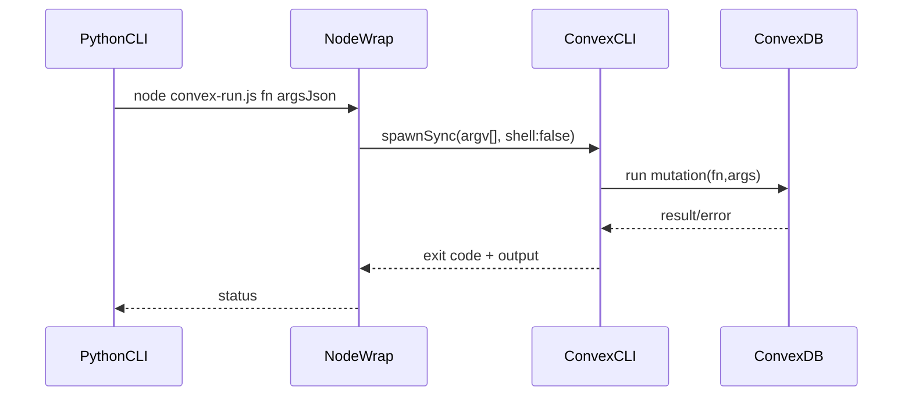

# I. Primer
## 1. TL;DR kiểu Feynman
- Scrape đã chạy xong, lỗi nằm ở bước "đẩy sang Convex".
- Payload JSON có URL chứa `&` bị shell Windows cắt thành nhiều lệnh con.
- Vì payload bị vỡ, `convex run` parse JSON thất bại ở `places:upsert`.
- Cách fix đã chốt: gọi Convex bằng Node `spawnSync` với mảng args + `shell: false` (không qua shell parsing).
- Giữ hành vi `fail-fast`: business nào sync Convex lỗi thì dừng ngay và trả lỗi.

## 2. Elaboration & Self-Explanation
Hiện flow Python sau scrape sẽ gọi subprocess để chạy Convex CLI, truyền JSON payload trực tiếp. Trên Windows, nếu lệnh đi qua shell hoặc không escape chặt, ký tự `&` trong URL (`...query=...&query_place_id=...`) bị coi là toán tử command separator. Kết quả: payload JSON chỉ còn nửa đầu, Convex báo `Failed to parse arguments as JSON`, rồi shell cố chạy phần còn lại như lệnh riêng (`query`, `query_place_id`, `g_ep`...).

Fix đúng bản chất là bỏ phụ thuộc shell parsing khi truyền JSON dài/phức tạp: dùng process-level argument array (argv) từ Node wrapper, `shell: false`, và Python gọi wrapper theo dạng `node <script> <fn> <jsonString>`.

## 3. Concrete Examples & Analogies
- Ví dụ cụ thể theo log của bạn:
  - JSON args bị cắt tại đoạn `"originalUrl": "https://.../?api=1"`.
  - Phần `&query=...` bị shell tách ra thành lệnh độc lập => sinh lỗi `'query' is not recognized...`.
- Analogy đời thường:
  - Giống gửi kiện hàng có dây buộc; nếu qua băng chuyền “tự cắt theo ký tự đặc biệt”, kiện bị bung ra thành nhiều mảnh. Ta cần gửi theo “container niêm phong” (argv array), không cho băng chuyền tự tách.

# II. Audit Summary (Tóm tắt kiểm tra)
- Observation:
  - Scrape + pipeline nội bộ thành công (dates/images/json đều completed).
  - Fail xuất hiện sau đó ở `places:upsert` với thông báo parse JSON + các lệnh rác từ `&`.
- Inference:
  - Lỗi thuộc lớp command invocation/escaping, không phải dữ liệu scrape hay schema Convex.
- Decision:
  - Áp dụng Option A đã được bạn chọn: Node `spawnSync` argv-array, `shell: false` end-to-end cho Convex sync path.

# III. Root Cause & Counter-Hypothesis (Nguyên nhân gốc & Giả thuyết đối chứng)
- Root cause chính:
  - JSON payload (có URL chứa `&`) bị shell Windows tách khi invoke Convex CLI.
- Counter-hypothesis đã loại trừ:
  - Schema/mutation Convex sai: không phù hợp vì lỗi dừng ở tầng parse args trước khi vào handler.
  - Scrape dữ liệu lỗi: không phù hợp vì pipeline scrape hoàn tất sạch.
- Root Cause Confidence (Độ tin cậy nguyên nhân gốc): **High**
  - Lý do: log có dấu hiệu điển hình của shell splitting (`query is not recognized`).

# IV. Proposal (Đề xuất)
- Áp dụng một đường gọi Convex duy nhất, an toàn ký tự đặc biệt:
  1) Python (`google-review-craw/start.py`) chỉ gọi Node wrapper với 3 tham số rõ ràng: function + argsJson.
  2) Node wrapper (`online-reputation-management-system/scripts/convex-run.js`) gọi `npx convex run ...` bằng `spawnSync([...], { shell: false })`.
  3) Bổ sung hardening nhỏ:
     - ép chọn executable phù hợp Windows (`npx.cmd` fallback `npx`),
     - in stderr/stdout rõ khi thất bại để debug nhanh,
     - giữ `fail-fast` theo yêu cầu.

# V. Files Impacted (Tệp bị ảnh hưởng)
- **Sửa:** `google-review-craw/start.py`
  - Vai trò hiện tại: entrypoint scrape + sync Convex sau scrape.
  - Thay đổi: chuẩn hoá cách gọi wrapper Convex, bảo toàn JSON nguyên vẹn, fail-fast + thông báo lỗi rõ hơn.
- **Sửa:** `online-reputation-management-system/scripts/convex-run.js`
  - Vai trò hiện tại: wrapper gọi `convex run`.
  - Thay đổi: đảm bảo `spawnSync` chạy `shell:false` và nhận args dạng mảng để không vỡ payload.
- **Sửa:** `google-review-craw/tests/test_start_commands.py`
  - Vai trò hiện tại: test helper/start command.
  - Thay đổi: bổ sung/điều chỉnh test cho đường gọi Convex an toàn args.

# VI. Execution Preview (Xem trước thực thi)
1. Đọc lại 2 điểm gọi process (Python caller + Node wrapper).
2. Chuẩn hoá invocation không qua shell parsing.
3. Bổ sung logging lỗi khi Convex mutation trả non-zero.
4. Cập nhật test liên quan helper sync.
5. Static review cuối: typing/null-safety/edge-case URL có `&`.

# VII. Verification Plan (Kế hoạch kiểm chứng)
- Repro chính (manual): chạy đúng lệnh scrape một business có URL chứa `&`.
- Pass khi:
  - không còn `Failed to parse arguments as JSON`,
  - không còn `'query' is not recognized`,
  - xuất hiện log `Đã sync Convex: ...`.
- Xác nhận frontend:
  - refresh localhost homepage, dữ liệu đọc từ Convex hiển thị đúng place vừa sync.
- Lưu ý theo quy ước repo:
  - không chạy lint/build/unit test tự động; chỉ kiểm tra tĩnh + repro runtime theo luồng user.

# VIII. Todo
1. Cố định invocation Convex qua argv-array, không dùng shell parsing.
2. Đảm bảo wrapper xử lý Windows executable (`npx.cmd`) ổn định.
3. Giữ fail-fast khi sync một mutation lỗi.
4. Bổ sung log chẩn đoán đủ ngắn-gọn-dễ đọc.
5. Cập nhật test helper liên quan sync path.

# IX. Acceptance Criteria (Tiêu chí chấp nhận)
- Chạy `start.py scrape --config config.yaml --headed` với chọn 1 business thành công tới bước sync Convex.
- Không xuất hiện lỗi parse JSON do payload vỡ.
- Mutation `places:upsert`, `reviews:upsertManyForPlace`, `metrics:upsertForPlace` chạy tuần tự; lỗi mutation nào thì dừng ngay (fail-fast).
- Frontend localhost phản ánh dữ liệu thật từ Convex sau refresh.

# X. Risk / Rollback (Rủi ro / Hoàn tác)
- Rủi ro:
  - Khác biệt môi trường Node/Convex CLI path theo máy.
- Giảm thiểu:
  - fallback executable + thông báo lỗi cụ thể.
- Rollback:
  - revert commit của 2 file call-wrapper để quay lại hành vi trước.

# XI. Out of Scope (Ngoài phạm vi)
- Không đổi schema Convex.
- Không đổi logic scrape Selenium/pipeline xử lý review.
- Không thêm cơ chế retry tự động (vì bạn chọn fail-fast).

# XII. Open Questions (Câu hỏi mở)
- Không còn ambiguity quan trọng sau khi bạn đã chốt Option A + fail-fast.