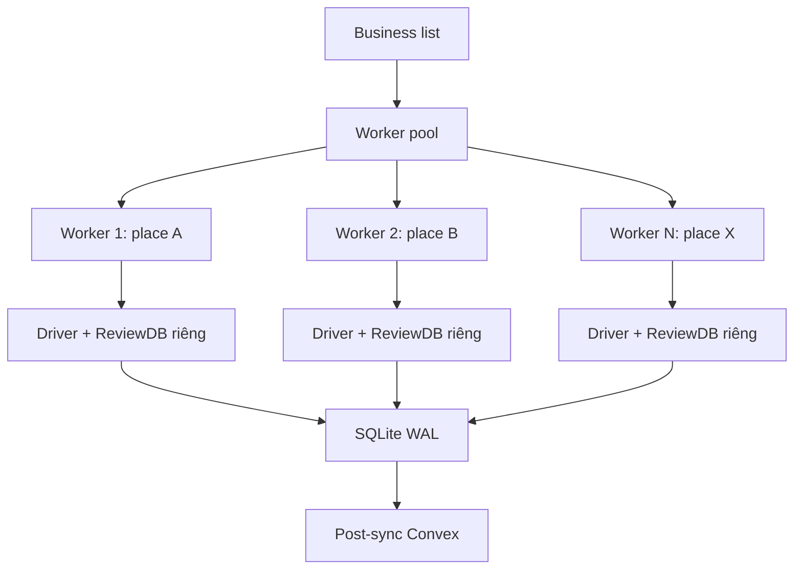
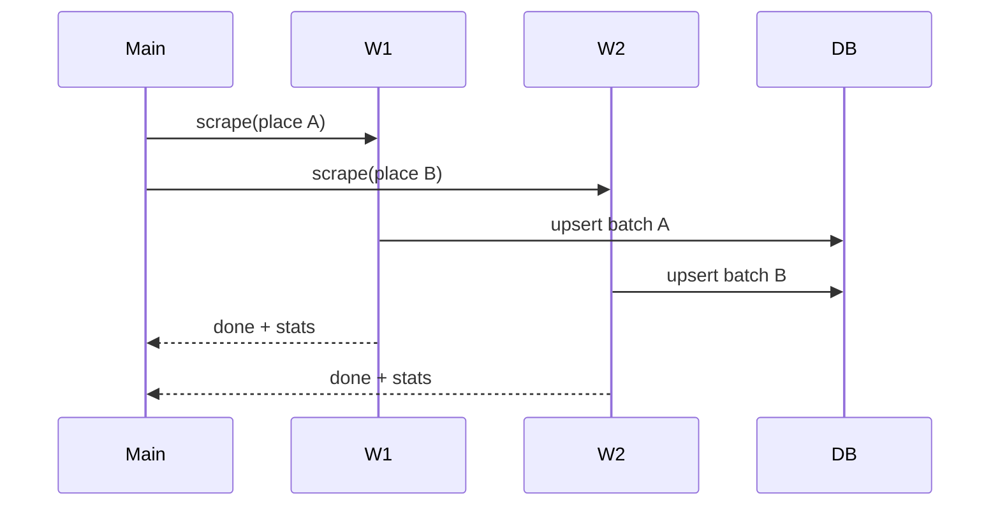

# I. Primer
## 1. TL;DR kiểu Feynman
- Có, **đa luồng được**.
- Nhưng hiệu quả nhất là **chạy song song nhiều business/place**, không phải “xé 1 place thành nhiều luồng scroll”.
- Với code hiện tại, 1 place đang bị chậm chủ yếu do nhiều `sleep` + click/scroll tuần tự + upsert từng review.
- Mục tiêu 10x có thể đạt khi kết hợp: parallel theo business + giảm bottleneck I/O/DB + tinh chỉnh wait.
- Không cần đổi provider/API nếu bạn muốn giữ Selenium thuần.

## 2. Elaboration & Self-Explanation
Luồng hiện tại cho mỗi place là: mở browser -> vào tab reviews -> scroll -> parse từng card -> `upsert_review` từng cái -> sleep -> lặp. Kiểu này gần như 1 lane duy nhất.

Đa luồng phù hợp nhất ở mức **N place chạy đồng thời**, vì mỗi place độc lập dữ liệu (`place_id`) và `ReviewDB` đã ghi rõ mỗi thread nên có connection riêng (WAL hỗ trợ nhiều reader + 1 writer).

Còn trong 1 place, Google Maps review panel là infinite scroll phụ thuộc trạng thái UI, nên chia nhiều luồng cùng thao tác 1 browser thường gây giẫm chân + stale element + dễ fail.

## 3. Concrete Examples & Analogies
- Ví dụ: 40 rạp, hiện tại chạy tuần tự 40 job, mỗi job 3 giờ => wall-clock rất dài.
- Nếu chạy song song 4 worker, thời gian tổng gần như giảm còn khoảng 1/4 (trừ overhead).
- Analogy: hiện tại bạn có 1 thu ngân xử lý 40 hàng; đa luồng theo business là mở 4 quầy thu ngân cùng lúc.

# II. Audit Summary (Tóm tắt kiểm tra)
- Observation:
  - `modules/scraper.py` có rất nhiều `time.sleep(...)` trong navigate/click/sort/scroll loop.
  - Vòng scrape xử lý tuần tự; `upsert_review` gọi theo từng review.
  - `config.yaml` đang `download_images: true` (tăng I/O).
- Evidence:
  - `modules/scraper.py` vùng `scrape()` có sleep 0.5/1/1.5/2/3s lặp nhiều lần.
  - `modules/review_db.py` có note thread-safety: mỗi thread dùng `ReviewDB` riêng, WAL mode.
- Inference:
  - Bottleneck là UI automation + wait time + DB write granularity, không phải Convex sync.

# III. Root Cause & Counter-Hypothesis (Nguyên nhân gốc & Giả thuyết đối chứng)
- Root cause (High): pipeline 1 place đang tuần tự nặng wait/I/O, chưa tận dụng parallel theo business.
- Counter-hypothesis:
  - “Convex làm chậm chính” -> Low, vì sync Convex diễn ra sau scrape, không phải phần 3 giờ/1000 reviews.
  - “DB lock là nguyên nhân chính” -> Medium-Low, có thể góp phần nhưng chưa phải nút cổ chai số 1.

# IV. Proposal (Đề xuất)
**Option A (Recommend) — Đa luồng theo business (Confidence 85%)**
- Chạy `ThreadPoolExecutor` ở mức orchestrator: mỗi worker tạo driver + `ReviewDB` riêng.
- Giới hạn `max_workers` theo tài nguyên (2–6 cho máy local).
- Thêm rate limit jitter per worker để giảm risk bị Google throttle.
- Giữ nguyên output/logic dữ liệu.

**Option B — Đa tiến trình theo business (Confidence 75%)**
- Dùng `ProcessPool` hoặc spawn command per business.
- Tách tài nguyên rõ hơn, ổn định hơn khi Selenium treo.
- Tradeoff: nặng RAM/CPU hơn thread, quản lý log/job phức tạp hơn.

# V. Files Impacted (Tệp bị ảnh hưởng)
- **Sửa:** `google-review-craw/start.py`
  - Vai trò hiện tại: chạy scrape tuần tự theo businesses.
  - Thay đổi: thêm scheduler song song theo business + giới hạn concurrency.
- **Sửa:** `google-review-craw/modules/scraper.py`
  - Vai trò hiện tại: scrape 1 place tuần tự.
  - Thay đổi: tối ưu wait/scroll loop, giảm sleep cứng, thêm adaptive wait nhẹ.
- **Sửa:** `google-review-craw/modules/review_db.py` (nhỏ)
  - Vai trò hiện tại: upsert từng review + commit nhiều lần.
  - Thay đổi: tối ưu batch transaction tại điểm flush để giảm commit overhead.
- **Sửa (nếu cần):** `google-review-craw/modules/job_manager.py`
  - Vai trò hiện tại: quản lý job.
  - Thay đổi: cập nhật state/progress cho multi-worker.

# VI. Execution Preview (Xem trước thực thi)
1. Thêm concurrency config (`scrape_workers`) ở runtime/config.
2. Refactor orchestrator để map mỗi business vào 1 worker độc lập.
3. Cứng hóa thread isolation: mỗi worker driver + DB instance riêng.
4. Tối ưu vòng scroll: giảm `sleep` tĩnh, dùng điều kiện DOM thay đổi.
5. Tối ưu DB write path (group commit).
6. Static review và rollout an toàn (workers nhỏ -> tăng dần).

# VII. Verification Plan (Kế hoạch kiểm chứng)
- Root Cause Confidence: **High** (đã thấy sleep loop + tuần tự + DB upsert per-item trong code).
- Benchmark trước/sau (cùng place, cùng điều kiện mạng):
  1) reviews/giờ,
  2) thời gian đạt mốc 500/1000 review,
  3) lỗi stale/timeout rate,
  4) CPU/RAM per worker.
- Tiêu chí thành công giai đoạn 1: đạt 3–5x ổn định với `workers=3`.
- Giai đoạn 2: đẩy tiếp lên 6–10x bằng tuning wait + batch commit + worker scaling.

# VIII. Todo
- [ ] Chốt Option A hay B.
- [ ] Thiết kế concurrency contract (worker lifecycle, retry, cancellation).
- [ ] Áp dụng refactor orchestrator + isolation DB/driver.
- [ ] Tối ưu wait/scroll và batch write.
- [ ] Chạy benchmark và so sánh before/after.

# IX. Acceptance Criteria (Tiêu chí chấp nhận)
- Có chạy song song nhiều business ổn định, không corrupt dữ liệu.
- Wall-clock giảm rõ rệt so với baseline tuần tự.
- Không giảm độ đầy đủ dữ liệu (text/rating/date/images theo yêu cầu hiện tại).
- Tỷ lệ lỗi scrape không tăng đột biến.

# X. Risk / Rollback (Rủi ro / Hoàn tác)
- Rủi ro: tăng xác suất bị throttle/challenge khi concurrency quá cao.
- Rủi ro: CPU/RAM local cạn nếu mở quá nhiều Chrome instances.
- Rollback: đưa `scrape_workers=1` để quay về tuần tự ngay, không đổi schema dữ liệu.

# XI. Out of Scope (Ngoài phạm vi)
- Không chuyển sang provider/API trả phí.
- Không giảm độ đầy đủ dữ liệu.
- Không đổi schema Convex/SQLite ở scope đầu.

Bạn hỏi “đa luồng được không?” -> **Được**, và tôi đề xuất đi ngay **Option A** trước để có tốc độ tăng mạnh mà vẫn giữ behavior hiện tại.