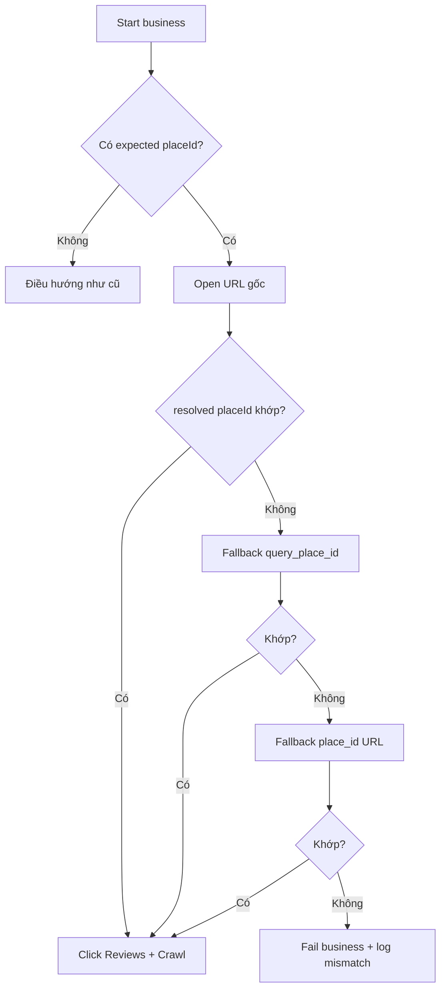

# I. Primer
## 1. TL;DR kiểu Feynman
- Vấn đề chính: tên quán chung chung ("Nhà cafe") dễ mở ra danh sách, không luôn vào đúng quán.
- Link `/place/...` tab đánh giá có thể chạy, nhưng dễ dính tham số tạm (`entry`, `g_ep`) và có lúc bị limited view.
- Cách chắc nhất: luôn dùng `custom_params.placeId` làm “chân lý”, rồi verify sau điều hướng.
- Nếu mở sai quán, tự fallback theo chuỗi ưu tiên và chỉ crawl khi `resolved_place_id` khớp.
- Không đổi schema, không mở rộng scope; chỉ vá nhỏ ở logic điều hướng trong scraper.

## 2. Elaboration & Self-Explanation
Bây giờ code đang có xu hướng lấy `place_name` rồi mở `maps/search/{place_name}` trước (xem `navigate_to_place`), cách này tốt với tên đặc thù nhưng không chắc với tên phổ biến. Với quán "Nhà cafe", search có thể ra list và chọn nhầm.  
Giải pháp là: nếu config đã có `custom_params.placeId`, thì scraper phải ưu tiên điều hướng/đối chiếu theo placeId thay vì tên quán. Sau mỗi lần mở URL, ta trích `resolved_place_id` từ `driver.current_url`; nếu chưa khớp thì fallback sang URL khác. Chỉ khi khớp mới bấm tab reviews và crawl.

## 3. Concrete Examples & Analogies
- Ví dụ bám task này:
  - Input business:
    - `url`: link `/place/...!9m1!1b1...`
    - `custom_params.placeId`: `0x31a0890038ccfc4f:0x567ba2463308ff1d`
  - Runtime:
    1) mở URL gốc,
    2) extract placeId từ `current_url`,
    3) nếu không khớp thì thử `search/?api=1&query_place_id=...`,
    4) vẫn không khớp thì thử `/place/?q=place_id:<id>` (hoặc direct `/reviews`),
    5) chỉ crawl khi khớp.
- Analogy đời thường: giống giao hàng theo “mã căn hộ” thay vì “tên tòa nhà” — tên có thể trùng, mã thì duy nhất.

# II. Audit Summary (Tóm tắt kiểm tra)
- Observation:
  - `scrape()` luôn gọi `navigate_to_place(...)` rồi mới `click_reviews_tab(...)` (`modules/scraper.py`, quanh dòng 1340–1385).
  - `navigate_to_place()` hiện ưu tiên search-based theo `place_name` (`modules/scraper.py`, quanh dòng 430+), có thể mơ hồ với tên chung.
  - `extract_place_id()` đã có, đủ để xác minh đúng quán (`modules/place_id.py`).
- Inference:
  - Điểm yếu không nằm ở bước crawl reviews, mà ở bước “đi đúng place trước khi crawl”.
- Decision:
  - Vá logic điều hướng + verify placeId, không thay đổi pipeline lưu dữ liệu.

# III. Root Cause & Counter-Hypothesis (Nguyên nhân gốc & Giả thuyết đối chứng)
- Root cause (High):
  - Điều hướng theo tên quán (`place_name`) gây ambiguity cho các tên phổ biến; không có hard-gate bắt buộc `resolved_place_id == expected_place_id` trước khi crawl.
- Counter-hypothesis:
  - “Do tab reviews không click được” là giả thuyết phụ. Nhưng code đã có nhiều chiến lược click tab (`is_reviews_tab`/`click_reviews_tab`), nên rủi ro lớn hơn vẫn là vào sai place từ đầu.
- Root Cause Confidence: **High** (evidence trực tiếp từ luồng `navigate_to_place` + phản hồi thực tế của bạn).

# IV. Proposal (Đề xuất)
- Mục tiêu: cho phép bạn cung cấp thẳng link tab đánh giá, nhưng crawler vẫn tự ổn định bằng placeId verification.
- Thay đổi logic:
  1) Đọc `expected_place_id` từ `custom_params.placeId` (nếu có).
  2) Trong `navigate_to_place`, ưu tiên mở URL user cung cấp trước.
  3) Sau mỗi lần điều hướng, extract `resolved_place_id` và so khớp expected.
  4) Nếu không khớp, fallback tuần tự (best-practice cho case limited/ambiguous):
     - a) URL gốc user nhập,
     - b) `search/?api=1&query_place_id=<expected>`,
     - c) `place/?q=place_id:<expected>` (hoặc direct `/reviews` nếu cần).
  5) Nếu hết fallback vẫn lệch: fail business đó với log rõ ràng (không crawl sai quán).
- Lợi ích:
  - Chặn nhầm place triệt để cho tên quán chung.
  - Giữ tương thích ngược cho các business không có `custom_params.placeId`.

# V. Files Impacted (Tệp bị ảnh hưởng)
- **Sửa:** `google-review-craw/modules/scraper.py`
  - Vai trò hiện tại: điều hướng Google Maps, mở tab reviews, scrape dữ liệu.
  - Thay đổi: thêm verify `expected_place_id` và chuỗi fallback điều hướng theo placeId.
- **Sửa (nhẹ):** `google-review-craw/modules/config.py` *(chỉ khi cần)*
  - Vai trò hiện tại: load/validate config.
  - Thay đổi: không bắt buộc; có thể chỉ bổ sung helper đọc `custom_params.placeId` an toàn nếu code hiện tại chưa truyền đủ.
- **Sửa (nhẹ):** test liên quan điều hướng/place matching trong `google-review-craw/tests/*` *(nếu đã có pattern test phù hợp)*
  - Vai trò hiện tại: đảm bảo hành vi scraper/config/place_id.
  - Thay đổi: thêm case cho tên quán chung + mismatch/fallback.

# VI. Execution Preview (Xem trước thực thi)
1. Đọc kỹ luồng parse business config -> scraper init -> navigate.
2. Cập nhật `navigate_to_place` nhận/đọc expected placeId.
3. Thêm hàm nhỏ verify placeId sau mỗi lần `driver.get(...)`.
4. Cài fallback order như đề xuất, giữ backward compatibility.
5. Static self-review: null-safety, timeout, log message rõ, không ảnh hưởng business khác.

# VII. Verification Plan (Kế hoạch kiểm chứng)
- Không chạy lint/unit test theo quy định repo.
- Kiểm chứng tĩnh + runtime checklist để tester chạy:
  1) Case `Nhà cafe` với `custom_params.placeId` đúng -> chỉ crawl đúng place.
  2) URL gốc mở list/limited -> fallback vẫn vào đúng place.
  3) Cố tình sai `custom_params.placeId` -> scraper fail business và log mismatch rõ.
  4) Business Vincom (placeId rõ) -> không đổi hành vi hiện tại.

# VIII. Todo
- [ ] Thêm expected placeId gating trong `navigate_to_place`.
- [ ] Thêm fallback chain theo placeId.
- [ ] Chặn crawl khi resolved placeId lệch expected.
- [ ] Bổ sung/điều chỉnh test case điều hướng cho tên quán chung.
- [ ] Self-review static trước bàn giao.

# IX. Acceptance Criteria (Tiêu chí chấp nhận)
- Pass:
  - Với business có `custom_params.placeId`, scraper chỉ crawl khi `resolved_place_id` khớp.
  - Case "Nhà cafe" không bị crawl nhầm quán dù URL đầu vào là link dễ mở list.
  - Khi mismatch không sửa được bằng fallback: fail rõ ràng, không ghi sai dữ liệu.
- Fail:
  - Vẫn có khả năng crawl nhầm place nhưng không phát hiện.
  - Fallback chạy nhưng không có log nguyên nhân/điểm dừng.

# X. Risk / Rollback (Rủi ro / Hoàn tác)
- Rủi ro:
  - Google đổi format URL khiến một fallback kém hiệu quả.
  - Tăng nhẹ thời gian điều hướng do thêm bước verify/fallback.
- Rollback:
  - Revert riêng commit sửa `navigate_to_place` để quay lại behavior cũ.
  - Vì patch nhỏ, rollback an toàn và nhanh.

# XI. Out of Scope (Ngoài phạm vi)
- Không thay đổi schema DB, Mongo/S3 pipeline, API server.
- Không thay đổi logic parse/canonicalize global ngoài nhu cầu verify placeId điều hướng.

# XII. Open Questions (Câu hỏi mở)
- Không còn ambiguity quan trọng; mình sẽ triển khai theo phương án tối ưu ở trên nếu bạn duyệt spec.