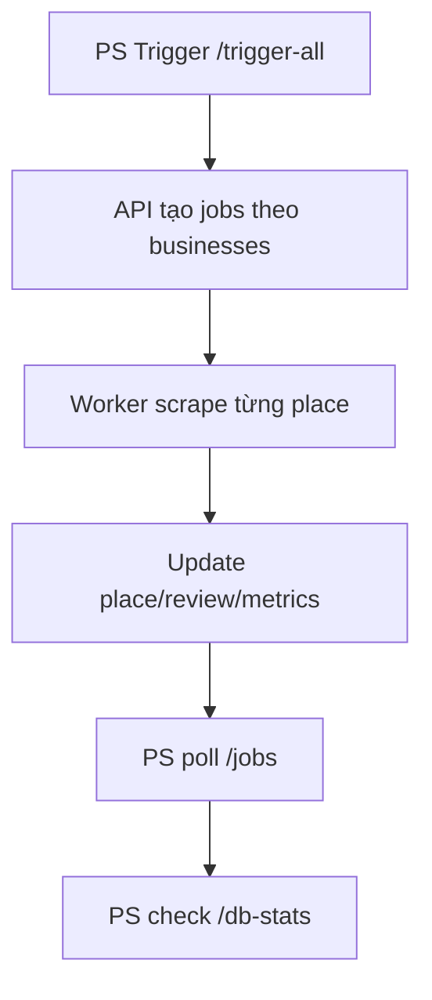

# I. Primer
## 1. TL;DR kiểu Feynman
- Bạn đã chạy đúng nền tảng: `api_server.py` đang live, và ORMS đang chạy `bunx convex dev` + `bun dev`.
- Mục tiêu giờ là **CLI-only**: 1 lệnh trigger tất cả địa điểm, rồi theo dõi tiến độ ngay trong terminal.
- Không cần sửa code: dùng endpoint có sẵn `/trigger-all`, `/jobs`, `/db-stats`.
- Sau khi jobs complete, Convex sẽ nhận dữ liệu qua pipeline hiện có.

## 2. Elaboration & Self-Explanation
Hiện hệ thống đã có “động cơ” rồi: Python API server nắm danh sách businesses trong `google-review-craw/config.yaml` (đang là full official list). Khi gọi `/trigger-all`, server tạo job cho từng địa điểm. Việc bạn muốn “đã hơn UI” thì hoàn toàn làm được: terminal sẽ vừa trigger, vừa poll trạng thái đến khi xong, vừa in summary completed/failed.

## 3. Concrete Examples & Analogies
- Ví dụ: gọi `GET http://127.0.0.1:8000/trigger-all` sẽ trả `total_triggered` và danh sách `job_id`.
- Analogy: giống chạy batch render video: 1 lệnh bắt đầu toàn bộ queue, rồi CLI hiển thị tiến độ đến 100%.

# II. Audit Summary (Tóm tắt kiểm tra)
- Observation: `api_server.py` có `/trigger-all`, `/jobs`, `/db-stats`.
- Observation: `config.yaml` trong `google-review-craw` đã chứa danh sách businesses official đầy đủ.
- Observation: bạn đã xác nhận runtime đang hoạt động (`api_server.py`, `bunx convex dev`, `bun dev`).
- Decision: chốt flow **CLI-only** bằng PowerShell command.

# III. Root Cause & Counter-Hypothesis (Nguyên nhân gốc & Giả thuyết đối chứng)
- Root cause (High): chưa có lệnh CLI “đóng gói” trigger + theo dõi tiến độ nên bạn phải nhìn qua UI.
- Counter-hypothesis a): thiếu endpoint trigger all → sai, endpoint đã có.
- Counter-hypothesis b): thiếu nơi xem progress bằng CLI → sai, có `/jobs` để poll.
- Confidence: High (evidence trực tiếp từ code + runtime log bạn gửi).

# IV. Proposal (Đề xuất)
## Lệnh 1: Trigger all (CLI)
```powershell
Invoke-RestMethod -Uri "http://127.0.0.1:8000/trigger-all" -Method GET
```

## Lệnh 2: Theo dõi tiến độ jobs realtime trên CLI (copy-paste 1 block)
```powershell
while ($true) {
  $jobs = Invoke-RestMethod -Uri "http://127.0.0.1:8000/jobs" -Method GET
  $running = @($jobs | Where-Object { $_.status -eq "running" }).Count
  $pending = @($jobs | Where-Object { $_.status -eq "pending" }).Count
  $completed = @($jobs | Where-Object { $_.status -eq "completed" }).Count
  $failed = @($jobs | Where-Object { $_.status -eq "failed" -or $_.status -eq "cancelled" }).Count

  Clear-Host
  "running=$running pending=$pending completed=$completed failed=$failed total=$($jobs.Count)"

  if (($running + $pending) -eq 0) {
    "DONE"
    break
  }

  Start-Sleep -Seconds 3
}
```

## Lệnh 3: Verify DB sau sync
```powershell
Invoke-RestMethod -Uri "http://127.0.0.1:8000/db-stats" -Method GET | ConvertTo-Json -Depth 8
```



# V. Files Impacted (Tệp bị ảnh hưởng)
- Sửa: Không có file nào cần sửa.
- Thêm: Không có file nào cần thêm.

# VI. Execution Preview (Xem trước thực thi)
1. Giữ terminal `api_server.py` đang chạy như hiện tại.
2. Mở terminal PowerShell mới, chạy lệnh trigger-all.
3. Chạy block poll `/jobs` để theo dõi đến DONE.
4. Chạy `/db-stats` để xác nhận kết quả.

# VII. Verification Plan (Kế hoạch kiểm chứng)
- Pass khi:
  - `/trigger-all` trả về danh sách jobs.
  - Poll thấy `pending/running` về 0.
  - `completed` tăng và `db-stats.places_count`/`reviews_count` phản ánh dữ liệu.
- Fail khi:
  - `/trigger-all` lỗi kết nối hoặc trả lỗi auth.
  - `failed/cancelled` tăng bất thường.

# VIII. Todo
1. [ ] Trigger all bằng CLI.
2. [ ] Poll jobs bằng CLI đến DONE.
3. [ ] Verify db-stats bằng CLI.

# IX. Acceptance Criteria (Tiêu chí chấp nhận)
- Toàn bộ quy trình sync-all được điều khiển từ PowerShell CLI, không cần UI.
- Có số liệu progress trong terminal (running/pending/completed/failed).
- Kết thúc có thể xác nhận trạng thái dữ liệu qua `/db-stats`.

# X. Risk / Rollback (Rủi ro / Hoàn tác)
- Rủi ro: crawl fail cục bộ do mạng/Google rate limit.
- Rollback vận hành: rerun `/trigger-all` hoặc retry theo lô sau khi hệ thống ổn định.

# XI. Out of Scope (Ngoài phạm vi)
- Không viết script mới vào repo.
- Không thay đổi pipeline Convex/UI.

# XII. Open Questions (Câu hỏi mở)
- Nếu bạn muốn, vòng sau mình sẽ đề xuất thêm **1 lệnh PowerShell duy nhất** (gộp trigger + poll + summary) để copy/paste một phát chạy hết.