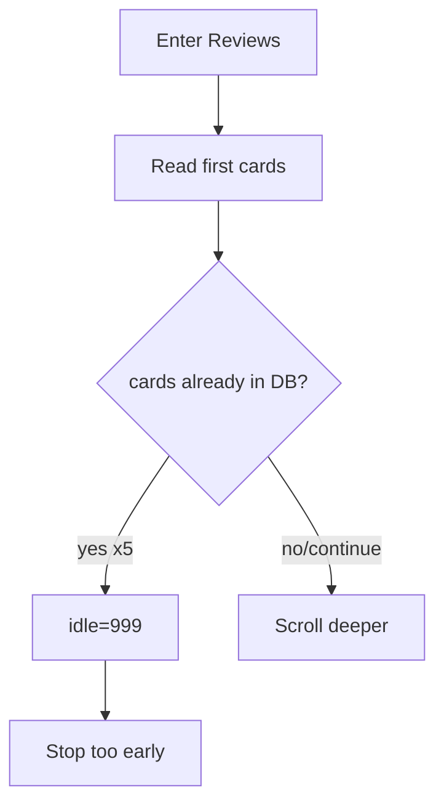

# I. Primer
## 1. TL;DR kiểu Feynman
- Bạn nói đúng: nó không lăn vì code tự set `idle = 999` ngay khi gặp 5 review cũ liên tiếp.
- Điều này xảy ra **trước khi** có một vòng scroll đầy đủ để đi sâu xuống list.
- Em sẽ bỏ hard-stop kiểu này ở giai đoạn pre-parse/post-batch, và chỉ dùng các stop-condition ổn định hơn (matched-batch + idle/attempts).
- Mục tiêu: vào đúng tab Reviews thì phải thực sự lăn, giống hành vi bạn mong đợi.

## 2. Elaboration & Self-Explanation
Log mới của bạn cho thấy chuỗi:
- `Stopping: Found 5 consecutive existing reviews (pre-parse)`
- `Found 0 new reviews this run`
- rồi mới tới các stop khác.

Nghĩa là scraper vừa nhìn thấy vài card đầu đều đã có trong DB là tự “đánh dấu dừng”, chưa kịp scroll sâu. Đây là lý do bạn cảm giác “không lăn tí nào”.

Bản chất fix là bỏ cơ chế stop quá sớm theo `consecutive_seen_items >= 5` (cả pre-parse và post-upsert), để vòng lặp có cơ hội scroll thật. Dừng sẽ dựa vào điều kiện tốt hơn: không có card nhiều vòng, matched-batch đủ ngưỡng, max attempts/idle.

## 3. Concrete Examples & Analogies
- Hiện tại:
  - 5 card đầu là review cũ => stop ngay.
- Sau fix:
  - 5 card đầu cũ vẫn tiếp tục scroll,
  - chỉ dừng khi thật sự “hết nội dung mới để load” theo idle/matched-batch.
- Analogy: giống lật trang sách, thấy 5 trang đầu đã đọc rồi không có nghĩa cả cuốn không có trang mới.

# II. Audit Summary (Tóm tắt kiểm tra)
- Observation:
  - `modules/scraper.py` có 2 điểm stop trực tiếp bằng `consecutive_seen_items >= 5`.
  - Cả hai đều đặt `idle = 999`, khiến vòng lặp kết thúc cực sớm.
- Inference:
  - Đây là nguyên nhân trực tiếp của hiện tượng “không lăn”.
- Decision:
  - Loại bỏ hard-stop theo consecutive existing; giữ stop theo idle/attempt/matched-batch.

# III. Root Cause & Counter-Hypothesis (Nguyên nhân gốc & Giả thuyết đối chứng)
- 1) Triệu chứng: vào reviews đúng nhưng gần như không scroll, dừng ở 40.
- 2) Phạm vi: loop scrape chung cho mọi place có dữ liệu cũ ở đầu list.
- 3) Tái hiện: cao, log đã lặp lại nhiều lần.
- 4) Mốc thay đổi: cơ chế early-stop consecutive existing.
- 5) Thiếu dữ liệu: không cần thêm để kết luận chính.
- 6) Giả thuyết thay thế: pane không scroll được; vẫn có thể đúng một phần, nhưng stop pre-parse đang chặn trước.
- 7) Rủi ro nếu fix sai: runtime dài hơn.
- 8) Pass/fail: không còn log stop ngay bởi `5 consecutive existing` ở đầu vòng.

**Root Cause Confidence (Độ tin cậy nguyên nhân gốc): High**
- Vì log khớp đúng nhánh code set `idle=999` trước khi scroll sâu.

# IV. Proposal (Đề xuất)
- Sửa `google-review-craw/modules/scraper.py`:
  1) Gỡ stop cứng ở pre-parse:
     - bỏ block `if consecutive_seen_items >= 5: idle = 999` trong đoạn scan cards.
  2) Gỡ stop cứng sau batch upsert:
     - bỏ block `if consecutive_seen_items >= 5: idle = 999` sau khi tính `session_seen_count`.
  3) Giữ và dựa vào các stop-condition hiện có:
     - `max_scroll_attempts`
     - `scroll_idle_limit`
     - `stop_threshold` matched-batch (nếu bật)
     - `max_reviews` theo session_seen_count.
  4) Log rõ hơn khi batch toàn existing nhưng vẫn tiếp tục scroll (để bạn thấy nó đang lăn thật).

# V. Files Impacted (Tệp bị ảnh hưởng)
- **Sửa:** `google-review-craw/modules/scraper.py`
  - Vai trò hiện tại: điều khiển vòng scrape/scroll và điều kiện dừng.
  - Thay đổi: bỏ early-stop quá gắt dựa trên existing consecutive.

# VI. Execution Preview (Xem trước thực thi)
1. Chỉnh đoạn pre-parse scan card: không set `idle=999` khi gặp existing liên tiếp.
2. Chỉnh đoạn sau upsert: bỏ stop tương tự.
3. Bổ sung log “existing batch, continue scrolling”.
4. Rà diff tĩnh để đảm bảo scope nhỏ.

# VII. Verification Plan (Kế hoạch kiểm chứng)
- Theo rule repo: không tự chạy lint/unit test.
- Bạn chạy lại đúng lệnh headed Nhà cafe.
- Kỳ vọng:
  - Không còn log `Stopping: Found 5 consecutive existing reviews (pre-parse)` ngay đầu.
  - Thấy nhiều vòng scroll thật (idle/attempt tăng dần hợp lý).
  - Có cơ hội vượt mốc 40 nếu Maps load thêm card.

# VIII. Todo
- [ ] Bỏ hard-stop `consecutive existing` ở pre-parse.
- [ ] Bỏ hard-stop `consecutive existing` sau batch.
- [ ] Bổ sung log cho batch existing nhưng vẫn tiếp tục scroll.
- [ ] Commit local (không push), kèm spec doc.

# IX. Acceptance Criteria (Tiêu chí chấp nhận)
- Sau khi vào reviews, scraper thực sự chạy scroll loop thay vì dừng tức thì vì existing.
- Không còn điều kiện dừng cứng chỉ vì 5 review cũ liên tiếp.
- Dừng bởi idle/attempt/matched-batch thay vì stop giả ở đầu list.

# X. Risk / Rollback (Rủi ro / Hoàn tác)
- Rủi ro: thời gian crawl có thể tăng.
- Rollback: revert commit nếu muốn lấy lại behavior stop nhanh cũ.

# XI. Out of Scope (Ngoài phạm vi)
- Không đổi thuật toán chọn tab/sort ở bước này.
- Không thêm fallback scroll mạnh.
- Không thay đổi schema DB/pipeline.