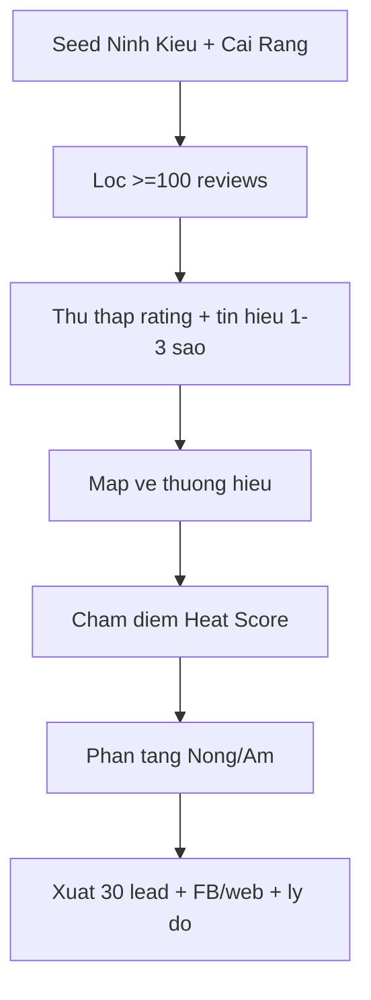

# I. Primer
## 1. TL;DR kiểu Feynman
- Mục tiêu: tìm **30 lead (nóng/ấm)** ở Ninh Kiều + Cái Răng, ưu tiên nơi **rất sợ review 1-2-3 sao** trên Google Maps.
- Tiêu chí cứng: doanh nghiệp có **>=100 review** (theo yêu cầu của bạn).
- Tiêu chí kinh doanh: ưu tiên ngành phụ thuộc social proof mạnh (spa/thẩm mỹ, nha khoa/phòng khám, khách sạn/resort, nhà hàng).
- Với thương hiệu nhiều cơ sở: **gom theo thương hiệu** và chỉ ra chi nhánh rủi ro nhất.
- Kết quả bàn giao: danh sách 30 lead chia nóng/ấm + link FB/web + lý do chốt sale ngắn.

## 2. Elaboration & Self-Explanation
- Bạn đang cần lead nào “sợ đánh giá xấu” chứ không phải chỉ “nhiều like”.
- Vì vậy, mình sẽ chấm điểm theo rủi ro review: số review đủ lớn (>=100), tín hiệu sao thấp/trung bình hoặc có nhiều phản hồi tiêu cực gần đây, và mức độ phụ thuộc vào quyết định trên Maps.
- “Nóng” là nhóm có rủi ro review ảnh hưởng doanh thu rõ và có động lực trả tiền nhanh; “Ấm” là nhóm có nhu cầu nhưng urgency thấp hơn.
- Cách gom thương hiệu giúp bạn bán gói lớn hơn (nhiều chi nhánh), đồng thời mở đường upsell quản trị toàn hệ thống.

## 3. Concrete Examples & Analogies
- Ví dụ cụ thể: một thương hiệu spa có 3 cơ sở ở Ninh Kiều/Cái Răng, tổng review rất cao, trong đó 1 cơ sở có nhiều đánh giá 1-3 sao gần đây → đây là lead nóng vì chỉ cần xử lý review xấu + phản hồi chuẩn là thấy hiệu quả ngay.
- Analogy đời thường: giống quán ăn đông khách nhưng vài review chê gần đây nằm ngay “mặt tiền” Maps; khách mới đi ngang thấy là quay xe. Tool của bạn là bộ “dọn mặt tiền + cảnh báo sớm”.

# II. Audit Summary (Tóm tắt kiểm tra)
- Observation (Quan sát): bạn xác nhận focus vào doanh nghiệp “sợ 1-2-3 sao”, cần deep research theo địa bàn Ninh Kiều/Cái Răng, output 30 lead nóng-ấm.
- Observation: bạn yêu cầu tối thiểu >100 review và gom theo thương hiệu khi có nhiều cơ sở.
- Inference (Suy luận): ICP (Ideal Customer Profile) phù hợp nhất là ngành dịch vụ địa phương có quyết định mua phụ thuộc review Maps.
- Decision (Quyết định): dùng bộ lọc 2 lớp (điều kiện cứng + chấm điểm rủi ro review) để ra danh sách có khả năng chốt cao hơn list đại trà.

# III. Root Cause & Counter-Hypothesis (Nguyên nhân gốc & Giả thuyết đối chứng)
- Root Cause (Nguyên nhân gốc): danh sách trước đó mới dừng ở “có mặt trên FB/web”, chưa đo đúng biến bạn quan tâm nhất là **độ nhạy với review 1-2-3 sao**.
- Root Cause Confidence (Độ tin cậy nguyên nhân gốc): **High** — vì yêu cầu mới của bạn nhấn mạnh rõ pain chính là rủi ro review xấu, không phải chỉ hiện diện online.
- Counter-Hypothesis (Giả thuyết đối chứng): có thể chỉ cần lead nhiều review là đủ.
  - Kết luận: giả thuyết này **không đủ**, vì nhiều review nhưng rating ổn định và ít áp lực cạnh tranh vẫn có urgency thấp.

# IV. Proposal (Đề xuất)
1. Khung chấm điểm lead (Lead Heat Score, 100 điểm)
   - a) Review volume (>=100) — 20 điểm.
   - b) Rating risk (ưu tiên vùng rủi ro/nhạy cảm với sao thấp) — 30 điểm.
   - c) 1-3 sao signal (tần suất/độ nổi bật phản hồi tiêu cực gần đây) — 25 điểm.
   - d) Multi-branch leverage (thương hiệu nhiều cơ sở) — 15 điểm.
   - e) Competition pressure tại Ninh Kiều/Cái Răng — 10 điểm.
2. Phân tầng kết quả
   - a) Nóng: >=75 điểm.
   - b) Ấm: 55-74 điểm.
3. Output đúng nhu cầu bán ngay
   - a) 30 lead (Nóng/Ấm).
   - b) Mỗi lead có: Tên thương hiệu, quận, link FB/web, ghi chú “vì sao sợ 1-2-3 sao”.
   - c) Với thương hiệu đa cơ sở: 1 dòng tổng + note chi nhánh đáng lo nhất.

# V. Files Impacted (Tệp bị ảnh hưởng)
- Sửa: Không có file code cần sửa.
- Thêm: Không bắt buộc; mặc định trả kết quả trực tiếp trong chat.
- (Nếu bạn muốn xuất file) Thêm: `.factory/docs/lead-research-ninh-kieu-cai-rang-YYYY-MM-DD.md` và/hoặc CSV để bạn import CRM.

# VI. Execution Preview (Xem trước thực thi)
1. Đọc và gom candidate theo ngành + địa bàn.
2. Lọc điều kiện cứng (>=100 review, đúng quận).
3. Ghi nhận tín hiệu rủi ro review 1-2-3 sao.
4. Gom theo thương hiệu, đánh dấu cơ sở rủi ro nhất.
5. Chấm điểm, chia nóng/ấm, chọn 30 lead tốt nhất để bán.
6. Tự review tĩnh chất lượng dữ liệu trước khi bàn giao.

# VII. Verification Plan (Kế hoạch kiểm chứng)
1. Kiểm chứng dữ liệu
   - a) Mỗi lead có ít nhất 1 link liên hệ (FB hoặc web).
   - b) Mỗi lead thỏa điều kiện >=100 review.
   - c) Mỗi lead có ghi chú rủi ro review (evidence ngắn).
2. Kiểm chứng cấu trúc output
   - a) Đủ 30 lead.
   - b) Có phân tầng Nóng/Ấm.
   - c) Có mục thương hiệu đa cơ sở theo đúng format gom thương hiệu.
3. Không chạy lint/test/build vì không thay đổi code.

# VIII. Todo
1. Thu thập candidate theo Ninh Kiều/Cái Răng và 4 ngách ưu tiên.
2. Lọc >=100 review + chuẩn hóa tên thương hiệu.
3. Chấm điểm rủi ro review 1-2-3 sao.
4. Chia 30 lead thành Nóng/Ấm.
5. Bàn giao danh sách tối ưu cho outbound sale.

# IX. Acceptance Criteria (Tiêu chí chấp nhận)
- Có đúng 30 lead theo 2 tầng Nóng/Ấm.
- Tất cả lead có >=100 review.
- Tất cả lead thuộc Ninh Kiều/Cái Răng.
- Có link FB/web và lý do ngắn “vì sao họ quan tâm mạnh review 1-2-3 sao”.
- Thương hiệu nhiều cơ sở được gom đúng theo yêu cầu.

# X. Risk / Rollback (Rủi ro / Hoàn tác)
- Rủi ro: một số nguồn web/Facebook không hiển thị đầy đủ rating hoặc dữ liệu cũ.
- Giảm thiểu: ưu tiên lead có bằng chứng rõ, gắn cờ confidence cho lead thiếu dữ liệu.
- Rollback: nếu thiếu độ tin cậy, loại lead đó khỏi top 30 và thay bằng candidate cùng ngành/quận có evidence mạnh hơn.

# XI. Out of Scope (Ngoài phạm vi)
- Không triển khai automation crawler mới/API mới trong vòng này.
- Không mở rộng ra quận khác ngoài Ninh Kiều và Cái Răng.
- Không viết kịch bản sales chi tiết theo từng lead (có thể làm vòng tiếp theo nếu bạn yêu cầu).