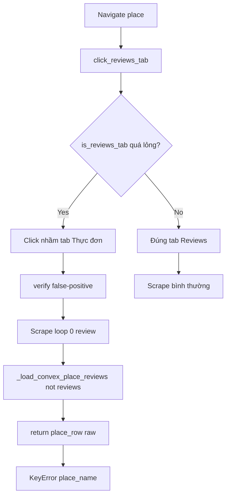

# I. Primer
## 1. TL;DR kiểu Feynman
- Hiện scraper click nhầm tab `Thực đơn` nhưng lại tưởng đã vào reviews, nên cào ra 0 review.
- Sau đó `start.py` bị `KeyError: 'place_name'` khi không có review vì trả về `place_row` thô (không có key chuẩn).
- Em đề xuất fix tối thiểu 2 điểm: siết điều kiện nhận diện tab Reviews và chuẩn hóa payload `place_snapshot` kể cả khi 0 review.
- Không đổi scope sang anti-bot hay refactor lớn.

## 2. Elaboration & Self-Explanation
Log của anh cho thấy dòng: `Found potential reviews tab (): 'Thực đơn'` rồi `Successfully clicked reviews tab...`, sau đó cảnh báo `URL doesn't contain 'review'` và liên tục `No review cards found`. Điều này chứng tỏ hàm `verify_reviews_tab_clicked()` đang quá lỏng: chỉ cần thấy container chung là coi như đã vào review.

Song song, traceback cuối run cho thấy `_scrape_single_business()` truy cập `place_snapshot["place_name"]` nhưng `_load_convex_place_reviews()` đang trả `place_row` raw khi `not reviews`, nên thiếu key chuẩn `place_name` -> crash.

## 3. Concrete Examples & Analogies
- Ví dụ lỗi tab:
  - Actual: click `Thực đơn` (menu tab) nhưng hàm verify vẫn pass.
  - Expected: chỉ pass khi có bằng chứng thuộc review context (review cards / text review / control sort thực sự).
- Ví dụ lỗi payload:
  - Actual: `not reviews` => `return place_row, []` (schema không ổn định).
  - Expected: luôn trả `place_snapshot` có `place_name` để caller không bị KeyError.
- Analogy: giống chọn nhầm “tab Món ăn” nhưng hệ thống lại đánh dấu “đã mở Đánh giá”, rồi báo cáo dữ liệu rỗng.

# II. Audit Summary (Tóm tắt kiểm tra)
- Observation:
  - Log runtime xác nhận click nhầm tab `Thực đơn`.
  - `verify_reviews_tab_clicked()` có selector quá generic (`div.m6QErb...`) dễ match tab khác.
  - `start.py::_load_convex_place_reviews()` trả `place_row` raw khi không có reviews.
- Inference:
  - Root cause chính gồm 2 lỗi độc lập: false-positive reviews-tab + contract trả dữ liệu không nhất quán.
- Decision:
  - Patch nhỏ, đúng điểm: tighten reviews detection + normalize return object.

# III. Root Cause & Counter-Hypothesis (Nguyên nhân gốc & Giả thuyết đối chứng)
- 1) Triệu chứng: click nhầm tab, scrape 0 review, rồi crash KeyError.
- 2) Phạm vi: flow scrape Google Maps (đặc biệt ngôn ngữ VI) + nhánh load Convex place reviews khi 0 review.
- 3) Tái hiện: ổn định theo log anh vừa cung cấp.
- 4) Mốc thay đổi: gần đây thêm logic direct-place refresh; lỗi tab và payload xuất hiện ở runtime sau đó.
- 5) Thiếu dữ liệu: chưa có HTML snapshot của tablist tại thời điểm click.
- 6) Giả thuyết thay thế: có thể Google chặn không tải review; nhưng click nhầm `Thực đơn` đã là evidence đủ mạnh.
- 7) Rủi ro nếu fix sai: vẫn cào 0 review hoặc còn crash ở bước summary.
- 8) Pass/fail: không còn log click `Thực đơn` như reviews; không còn KeyError khi 0 review.

**Root Cause Confidence (Độ tin cậy nguyên nhân gốc): High**
- Vì có evidence trực tiếp từ log + traceback vào đúng hàm liên quan.

# IV. Proposal (Đề xuất)
- A) `modules/scraper.py` (fix click nhầm tab)
  - Siết `is_reviews_tab()`:
    - Ưu tiên bằng chứng ngữ nghĩa review trong `text/aria-label/textContent`.
    - Loại trừ từ khóa tab không phải review như `thực đơn/menu/food/photos/overview/chỉ đường`.
    - Không chấp nhận match chỉ dựa vào class generic.
  - Siết `verify_reviews_tab_clicked()`:
    - Bỏ selector quá chung làm điều kiện pass.
    - Chỉ pass khi có tín hiệu mạnh hơn: review card (`data-review-id`), URL chứa review, hoặc control/element review-specific.
- B) `start.py` (fix KeyError)
  - Trong `_load_convex_place_reviews()`, kể cả `not reviews` vẫn trả `place_snapshot` chuẩn có `place_name` và các key đã dùng downstream.

# V. Files Impacted (Tệp bị ảnh hưởng)
- **Sửa:** `google-review-craw/modules/scraper.py`
  - Vai trò hiện tại: nhận diện/click tab reviews và verify context reviews.
  - Thay đổi: giảm false-positive khi tab không phải reviews.
- **Sửa:** `google-review-craw/start.py`
  - Vai trò hiện tại: tổng hợp snapshot place sau scrape.
  - Thay đổi: chuẩn hóa return schema khi 0 reviews để tránh `KeyError`.

# VI. Execution Preview (Xem trước thực thi)
1. Chỉnh heuristic `is_reviews_tab()` + danh sách từ loại trừ trong `scraper.py`.
2. Chỉnh `verify_reviews_tab_clicked()` để chỉ dùng tín hiệu review-specific.
3. Chỉnh `_load_convex_place_reviews()` để luôn trả snapshot có `place_name`.
4. Static review diff đảm bảo scope nhỏ, dễ rollback.

# VII. Verification Plan (Kế hoạch kiểm chứng)
- Theo rule repo: không tự chạy lint/unit test.
- Repro bằng lệnh anh đang dùng (headed, chọn Nhà cafe).
- Quan sát pass:
  - Không còn log `Found potential reviews tab ... 'Thực đơn'`.
  - Có thể click đúng tab Reviews hoặc fail rõ ràng (không false success).
  - Không còn crash `KeyError: 'place_name'` dù total review = 0.

# VIII. Todo
- [ ] Siết detect tab Reviews để tránh nhầm `Thực đơn`.
- [ ] Siết verify sau click để tránh false-positive review context.
- [ ] Chuẩn hóa `place_snapshot` khi 0 review để tránh KeyError.
- [ ] Commit local (không push), kèm spec doc.

# IX. Acceptance Criteria (Tiêu chí chấp nhận)
- Run headed không nhận nhầm tab `Thực đơn` là reviews.
- Nếu chưa vào reviews thật, log phải phản ánh đúng (không báo success giả).
- Không còn `KeyError: 'place_name'` ở cuối flow.

# X. Risk / Rollback (Rủi ro / Hoàn tác)
- Rủi ro: siết quá chặt có thể làm khó detect ở vài locale khác.
- Rollback: revert commit theo từng file (scraper/start) vì patch tách biệt.

# XI. Out of Scope (Ngoài phạm vi)
- Không chỉnh thuật toán scroll/sort tổng thể.
- Không thay đổi schema DB/Convex.
- Không tối ưu anti-bot hoặc chiến lược retry ngoài vấn đề tab detection hiện tại.