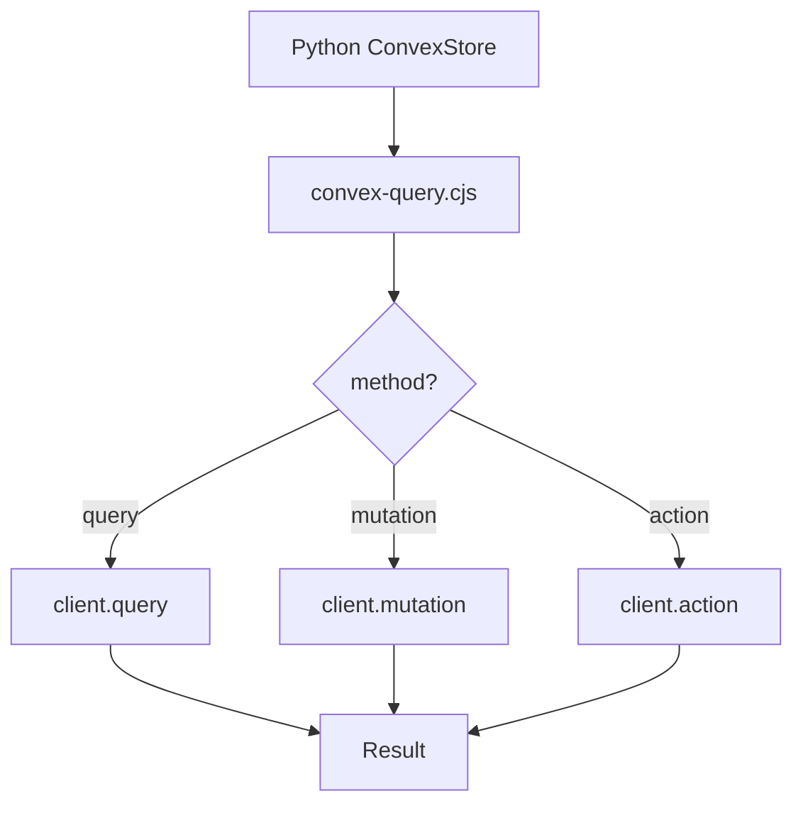

# I. Primer
## 1. TL;DR kiểu Feynman
- Lỗi hiện tại là do bridge Node đang **luôn gọi `client.query(...)`** cho mọi function Convex.
- Nhưng `places:upsert`, `reviews:upsertManyForPlace`, `crawlJobs:*` là **mutation**, không phải query.
- Vì gọi sai loại function nên crash với lỗi: `Trying to execute ... as Query, but it is defined as Mutation`.
- Fix triệt để: bridge phải chọn đúng method (`query`/`mutation`/`action`) theo function name hoặc prefix truyền từ Python.

## 2. Elaboration & Self-Explanation
Scraper Python gọi `ConvexReviewStore._run_convex(function_name, payload)`.
`_run_convex` gọi script `convex-query.cjs`.
Trong `convex-query.cjs` hiện tại:
- parse args xong,
- luôn chạy `client.query(functionName, args)`.

Vấn đề: Convex tách rõ query/mutation/action, nên gọi sai loại là fail ngay.
Do đó khi `register_place()` gọi `places:upsert` (mutation), bridge gọi query => nổ lỗi.

## 3. Concrete Examples & Analogies
- `places:getByPlaceId` -> query (đúng với query)
- `places:upsert` -> mutation (không thể gọi bằng query)
- Analogy: giống gọi API GET cho endpoint chỉ chấp nhận POST.

# II. Audit Summary (Tóm tắt kiểm tra)
- Observation:
  - `convex-query.cjs` đang hardcode `client.query(...)`.
  - `convex/places.ts`, `convex/reviews.ts`, `convex/crawlJobs.ts` có cả query và mutation.
- Inference:
  - Bridge thiếu routing theo function type là nguyên nhân gốc.
- Decision:
  - Chuẩn hóa contract gọi Convex theo method rõ ràng.

# III. Root Cause & Counter-Hypothesis
1) Triệu chứng: crash ở `places:upsert` ngay sau khi load place.
2) Phạm vi: mọi call mutation/action qua bridge.
3) Tái hiện: ổn định theo log bạn gửi.
4) Mốc thay đổi: sau khi chuyển sang bridge `convex-query.cjs`.
5) Thiếu dữ liệu: không thiếu, stacktrace đủ.
6) Giả thuyết thay thế: env/path sai; đã loại trừ vì query `getByPlaceId` đi được.
7) Rủi ro fix sai: vẫn fail ở các mutation khác.
8) Pass/Fail: scrape chạy qua register/update/session mà không lỗi type mismatch.

**Root Cause Confidence: High**

# IV. Proposal (Đề xuất)
## Option A (Recommend) — Confidence 95%
- Thêm tham số `method` vào `convex-query.cjs` (`query|mutation|action`).
- `ConvexReviewStore._run_convex` map method theo function:
  - Query: `places:getByPlaceId`, `reviews:paginatedByPlace`
  - Mutation: `places:upsert`, `reviews:upsertManyForPlace`, `crawlJobs:create|setStatus|addEvent`
- Nếu function không có mapping: fail fast với message rõ + danh sách method hỗ trợ.

## Option B — Confidence 70%
- Auto-detect theo tên function (`get/list/paginated` => query, còn lại mutation).
- Nhanh nhưng dễ sai khi naming không chuẩn.

# V. Files Impacted
- **Sửa:** `online-reputation-management-system/scripts/convex-query.cjs`
  - thêm chọn method động thay vì hardcode query.
- **Sửa:** `google-review-craw/modules/convex_store.py`
  - thêm bảng mapping function -> method và truyền method xuống bridge.
- **(Tuỳ chọn nhẹ)** `google-review-craw/modules/convex_store.py`
  - cải thiện lỗi khi mapping thiếu.

# VI. Execution Preview
1. Refactor `convex-query.cjs` nhận `method`.
2. Refactor `ConvexReviewStore._run_convex` truyền method đúng.
3. Add guard cho function chưa map.
4. Verify command scrape thực tế của bạn.

# VII. Verification Plan
- Chạy lại đúng command:
  - `.\.venv\Scripts\python.exe start.py scrape --config config.yaml --headed`
- Check pass:
  - qua `register_place` (`places:upsert` mutation) không crash.
  - gọi `crawlJobs:create/setStatus` không crash.
  - vòng scrape tiếp tục bình thường.
- Check regression:
  - `places:getByPlaceId` và `reviews:paginatedByPlace` vẫn chạy (query).

# VIII. Todo
1. Implement method routing ở bridge.
2. Implement mapping method ở Python store.
3. Add fail-fast diagnostics khi method thiếu.
4. Re-test command scrape của bạn.
5. Commit fix.

# IX. Acceptance Criteria
- Không còn lỗi `defined as Mutation but executed as Query`.
- Convex runtime hoạt động full cho 1 business.
- Lỗi mới (nếu có) phải rõ ràng, actionable.

# X. Risk / Rollback
- Rủi ro: thiếu mapping cho function mới trong tương lai.
- Giảm rủi ro: guard + error rõ để bổ sung mapping nhanh.
- Rollback: quay về bridge cũ tạm thời (không khuyến nghị).

# XI. Out of Scope
- Tối ưu tốc độ DOM scraping.
- Đổi schema Convex.

# XII. Open Questions
- Không còn ambiguity chính; có thể implement ngay theo Option A.