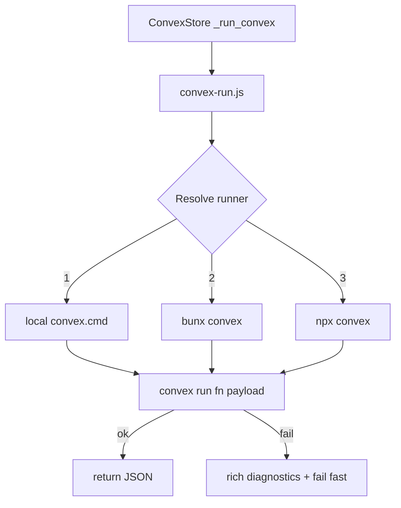

# I. Primer
## 1. TL;DR kiểu Feynman
- Lỗi mới không còn là sai path nữa; giờ là **wrapper gọi Convex bị fail im lặng**.
- Dấu hiệu: `Convex wrapper failed without stdout/stderr output` khi gọi `places:getByPlaceId`.
- Root cause khả dĩ cao: wrapper hiện phụ thuộc `npx.cmd` cứng trên Windows, không bám runtime bạn đang dùng (`bunx convex dev`), nên có case process con fail nhưng không trả output hữu ích.
- Hướng sửa triệt để: **runner resolution linh hoạt (ưu tiên local convex/bunx), fail-fast kèm diagnostics đầy đủ, không fallback SQLite**.

## 2. Elaboration & Self-Explanation
Hiện wrapper `scripts/convex-run.js` làm như sau:
- tạo file payload temp,
- spawn một Node process con,
- process con lại gọi `npx convex run ...`.

Cách này có 2 lớp process, nếu lớp trong fail do PATH/runtime mismatch thì lớp ngoài đôi khi chỉ thấy status code mà không có log rõ => sinh thông báo chung chung.

Bạn đang chạy `bunx convex dev` local, nên môi trường Convex thực tế của bạn gần với `bunx`/local binary hơn là ép cứng `npx.cmd`. Vì vậy wrapper cần tìm đúng runner tương thích để tránh fail mù.

## 3. Concrete Examples & Analogies
- Hiện tại giống việc gọi tài xế qua tổng đài A trong khi tài xế thật đang online ở app B; kết quả là “không tìm thấy chuyến” nhưng không rõ lý do.
- Sửa xong sẽ như sau: thử đúng app B trước (bunx/local convex), nếu fail thì báo rõ đã thử những gì và lỗi nào.

# II. Audit Summary (Tóm tắt kiểm tra)
- Observation:
  - `convex_store.py` gọi Node script `convex-run.js` để chạy `convex run`.
  - `convex-run.js` đang hardcode `npx.cmd` trên Windows.
  - Khi fail, đôi lúc chỉ ra message generic, thiếu diagnostics chi tiết.
- Inference:
  - Runtime mismatch (npx vs bunx/local convex) + wrapper 2 tầng là nguyên nhân chính gây fail khó debug.
- Decision:
  - Refactor runner theo hướng resolver đa nguồn + fail-fast chi tiết.

# III. Root Cause & Counter-Hypothesis (Nguyên nhân gốc & Giả thuyết đối chứng)
1. Triệu chứng: scrape chạy tới bước register place thì crash ở `places:getByPlaceId`.
2. Phạm vi: mọi business vì lỗi xảy ra ở bước init/upsert place chung.
3. Tái hiện: ổn định với command user đã đưa.
4. Mốc thay đổi: sau khi chuyển runtime sang Convex-only.
5. Dữ liệu thiếu: chưa có stderr chi tiết từ convex CLI trong case fail.
6. Giả thuyết thay thế:
   - Convex dev server chưa chạy,
   - `.env.local` thiếu URL,
   - nhưng wrapper hiện tại không cung cấp đủ evidence để phân biệt nhanh.
7. Rủi ro nếu fix sai: vẫn fail mù và mất khả năng vận hành all business.
8. Tiêu chí pass/fail: command scrape chạy qua `register_place` ổn, nếu fail thì log rõ runner + command + stderr.

**Root Cause Confidence:** High

# IV. Proposal (Đề xuất)
## Option A (Recommend) — Confidence 93%
**Refactor `convex-run.js` thành runner-resolver + diagnostics-first**
- a) Runner resolution theo thứ tự:
  1) `convex.runner` trong `config.yaml` (nếu có)
  2) local binary: `online-reputation-management-system/node_modules/.bin/convex.cmd`
  3) `bunx convex` (vì bạn đang dùng bunx dev)
  4) `npx convex`
- b) Bỏ pattern Node lồng Node không cần thiết; chạy trực tiếp spawn 1 tầng để giữ stderr/stdout nguyên bản.
- c) Khi fail, trả lỗi đầy đủ:
  - runner đã chọn,
  - full argv,
  - exit code/signal,
  - stdout/stderr tail,
  - danh sách runner đã thử.
- d) `convex_store.py` giữ fail-fast ngay theo yêu cầu user, nhưng surface lỗi gọn + actionable.

## Option B — Confidence 72%
**Giữ wrapper hiện tại, chỉ thêm retry + bắt stderr chi tiết**
- Nhanh hơn để patch nhưng vẫn giữ cấu trúc dễ fail mù ở vài edge case Windows.

# V. Files Impacted (Tệp bị ảnh hưởng)
- **Sửa:** `online-reputation-management-system/scripts/convex-run.js`
  - Vai trò hiện tại: wrapper gọi convex run.
  - Thay đổi: runner resolution đa nguồn + diagnostics đầy đủ + đơn giản hóa process call.
- **Sửa:** `google-review-craw/modules/convex_store.py`
  - Vai trò hiện tại: bridge Python -> Convex runner.
  - Thay đổi: parse lỗi tốt hơn, fail-fast message ngắn gọn nhưng đủ context.
- **Sửa:** `google-review-craw/modules/config.py`
  - Thêm key tùy chọn `convex.runner` (ví dụ: `bunx`, `npx`, hoặc path tuyệt đối).
- **Sửa:** `google-review-craw/config.yaml`
  - Thêm cấu hình runner mặc định phù hợp local của bạn (ưu tiên bunx/local binary).

# VI. Execution Preview (Xem trước thực thi)
1. Refactor `convex-run.js` để resolve runner và gọi trực tiếp `convex run`.
2. Chuẩn hóa output JSON/result + error text.
3. Cập nhật `convex_store.py` để surfacing diagnostics rõ.
4. Cập nhật config schema và `config.yaml`.
5. Verify bằng đúng command scrape của bạn.

# VII. Verification Plan (Kế hoạch kiểm chứng)
- Happy path:
  - `python start.py scrape --config config.yaml --headed`
  - Chạy qua bước `register_place` và vào luồng scrape reviews.
- Failure path (có kiểm soát):
  - cố tình set runner sai -> nhận được error đầy đủ runner/argv/stderr.
- Stability:
  - chạy 2 business liên tiếp, đảm bảo không còn fail generic wrapper.

# VIII. Todo
1. Refactor convex-run.js runner resolution + diagnostics.
2. Bổ sung config `convex.runner` trong loader + yaml.
3. Cập nhật convex_store.py đọc/lộ lỗi rõ hơn.
4. Re-run command scrape của user để verify.
5. Chốt commit fix.

# IX. Acceptance Criteria (Tiêu chí chấp nhận)
- Không còn lỗi generic `Convex wrapper failed without stdout/stderr output` trong path bình thường.
- Runtime vẫn Convex-only (không fallback SQLite).
- Nếu Convex call fail, thông báo phải đủ để xác định nguyên nhân ngay (runner/argv/stderr).
- Command scrape của user chạy ổn định qua bước register place.

# X. Risk / Rollback (Rủi ro / Hoàn tác)
- Rủi ro:
  - khác biệt môi trường máy khác (có/không bun) khiến ưu tiên runner chưa tối ưu.
- Giảm rủi ro:
  - có `convex.runner` override trong config.
- Rollback:
  - giữ nhánh fallback `npx` + local binary, không lock cứng 1 runner.

# XI. Out of Scope (Ngoài phạm vi)
- Tối ưu tốc độ scraping DOM.
- Thay đổi logic parse review.
- Refactor schema Convex.

# XII. Open Questions (Câu hỏi mở)
- Không còn ambiguity chính: đã chốt fail-fast + diagnostics đầy đủ và runtime Convex full.