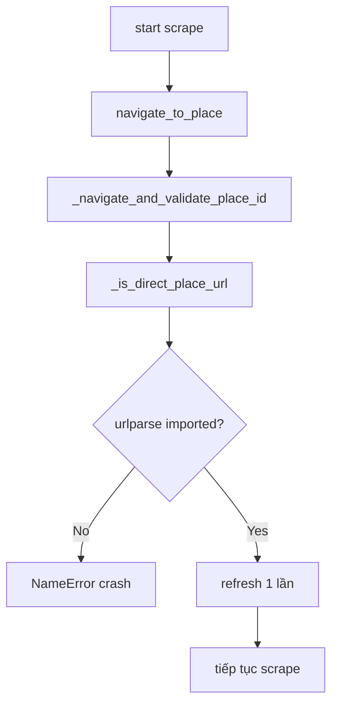

# I. Primer
## 1. TL;DR kiểu Feynman
- Lỗi hiện tại không phải do logic F5, mà do thiếu import `urlparse` trong `scraper.py`.
- Hàm mới `_is_direct_place_url()` gọi `urlparse(...)` nhưng file chỉ import `quote, unquote`.
- Fix tối thiểu: thêm `urlparse` vào import từ `urllib.parse`.
- Không cần đổi thuật toán scrape hay config nữa.

## 2. Elaboration & Self-Explanation
Anh đã chạy đúng flow headed và crash ngay ở đoạn `_is_direct_place_url(candidate_url)` với lỗi `NameError: name 'urlparse' is not defined`. Stack trace chỉ rõ đường đi: `navigate_to_place()` -> `_navigate_and_validate_place_id()` -> `_is_direct_place_url()`.

Đây là lỗi compile/runtime cơ bản do missing symbol, không phải lỗi hành vi Google Maps. Vì vậy hướng an toàn nhất là sửa một dòng import để runtime nhận diện được `urlparse`, giữ nguyên toàn bộ logic đã chốt (direct URL + refresh 1 lần).

## 3. Concrete Examples & Analogies
- Trước fix:
  - `from urllib.parse import quote, unquote`
  - `_is_direct_place_url()` gọi `urlparse(...)` -> văng NameError.
- Sau fix:
  - `from urllib.parse import quote, unquote, urlparse`
  - Hàm chạy bình thường, tiếp tục refresh + scrape.
- Analogy: giống gọi hàm trong file mà quên `include` thư viện tương ứng.

# II. Audit Summary (Tóm tắt kiểm tra)
- Observation:
  - Log lỗi xác nhận `NameError: urlparse` tại `modules/scraper.py` line hàm `_is_direct_place_url`.
  - Đầu file chưa import `urlparse`.
- Inference:
  - Đây là root cause trực tiếp, deterministic, tái hiện 100% khi đi vào nhánh direct URL.
- Decision:
  - Sửa đúng 1 dòng import; không mở rộng scope.

# III. Root Cause & Counter-Hypothesis (Nguyên nhân gốc & Giả thuyết đối chứng)
- 1) Triệu chứng: scrape dừng ngay sau log “Trying navigation candidate …” với NameError.
- 2) Phạm vi ảnh hưởng: mọi run đi qua `_is_direct_place_url()`.
- 3) Tái hiện: ổn định, vì symbol thiếu cố định.
- 4) Mốc thay đổi: thêm helper `_is_direct_place_url()` gần đây.
- 5) Dữ liệu thiếu: không thiếu cho kết luận này.
- 6) Giả thuyết thay thế: có thể nghĩ do Selenium/Google, nhưng stack trace loại trừ vì fail trước khi thao tác sâu.
- 7) Rủi ro nếu fix sai: run vẫn crash, không vào scrape.
- 8) Pass/fail: không còn NameError và flow đi tiếp sau đoạn detect direct URL.

**Root Cause Confidence (Độ tin cậy nguyên nhân gốc): High**
- Lý do: stack trace chỉ đích danh symbol thiếu và vị trí code tương ứng.

# IV. Proposal (Đề xuất)
- Sửa `google-review-craw/modules/scraper.py`:
  - Update import: `from urllib.parse import quote, unquote, urlparse`.
- Giữ nguyên:
  - logic refresh 1 lần cho direct maps/place.
  - config Nhà cafe direct URL.

# V. Files Impacted (Tệp bị ảnh hưởng)
- **Sửa:** `google-review-craw/modules/scraper.py`
  - Vai trò hiện tại: luồng scrape/navigate Google Maps.
  - Thay đổi: thêm import `urlparse` để helper direct-place hoạt động.

# VI. Execution Preview (Xem trước thực thi)
1. Mở `scraper.py` và chỉnh dòng import urllib.parse.
2. Static review nhanh để chắc không lỗi tên biến/import.
3. Rà diff xác nhận chỉ thay đổi tối thiểu.
4. Commit local (không push).

# VII. Verification Plan (Kế hoạch kiểm chứng)
- Theo rule repo: không tự chạy lint/unit test.
- Verify runtime bằng lệnh anh vừa chạy:
  - `.\.venv\Scripts\python.exe start.py scrape --config config.yaml --headed`
- Tiêu chí quan sát:
  - Không còn `NameError: urlparse`.
  - Log đi tiếp qua bước refresh/direct navigation và vào scraping loop.

# VIII. Todo
- [ ] Thêm import `urlparse` trong `modules/scraper.py`.
- [ ] Rà diff để chắc chỉ fix lỗi missing import.
- [ ] Commit local (không push), kèm file spec nếu phát sinh.

# IX. Acceptance Criteria (Tiêu chí chấp nhận)
- Chạy headed không còn crash `NameError: urlparse`.
- Flow direct-place tiếp tục sau bước detect URL + refresh 1 lần.
- Không thay đổi hành vi ngoài bugfix import.

# X. Risk / Rollback (Rủi ro / Hoàn tác)
- Rủi ro: gần như không đáng kể (chỉ bổ sung import).
- Rollback: revert 1 commit nếu cần.

# XI. Out of Scope (Ngoài phạm vi)
- Không chỉnh thêm thuật toán sort/scroll/click tab.
- Không chỉnh các module test/DB/UI khác.