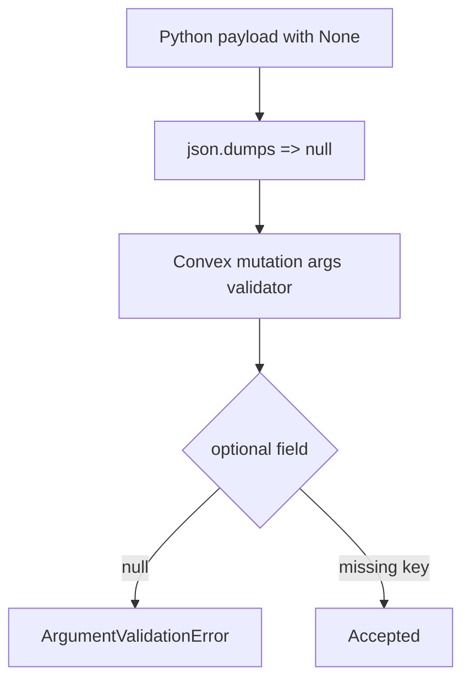

# I. Primer
## 1. TL;DR kiểu Feynman
- Lỗi hiện tại không nằm ở Selenium, mà ở payload gửi sang Convex.
- Convex `v.optional(v.string())` chấp nhận `undefined` hoặc có string, **không chấp nhận `null`**.
- Python đang gửi `None` => serialize thành `null` cho các field optional (`lastScrapedAt`, có thể cả `latitude`, `longitude`, `lastSyncError`…), nên mutation `places:upsert` bị reject.
- Fix đúng: trước khi gọi Convex, **lọc bỏ toàn bộ key có value `None`** khỏi payload mutation/query.

## 2. Elaboration & Self-Explanation
Ở Python:
- `None` khi `json.dumps` thành `null`.

Ở Convex validator:
- `v.optional(v.string())` nghĩa là:
  - hoặc key không tồn tại,
  - hoặc key tồn tại với kiểu `string`.
- Nếu key tồn tại và là `null` => sai kiểu.

Nên bridge cần đổi từ kiểu “gửi key = None” sang “không gửi key đó”.

## 3. Concrete Examples & Analogies
- Ví dụ lỗi hiện tại:
  - Payload có `lastScrapedAt: null`
  - Validator yêu cầu `v.string()` khi key tồn tại
  - Kết quả: `ArgumentValidationError`.
- Analogy:
  - Form có ô “không bắt buộc”: để trống thì hợp lệ, còn nhập ký tự sai định dạng thì bị từ chối. `null` ở đây giống “nhập sai định dạng”.

# II. Audit Summary (Tóm tắt kiểm tra)
- Observation:
  - Traceback chỉ rõ `Path: .lastScrapedAt`, `Value: null`, `Validator: v.string()`.
  - `places.ts` đang dùng `v.optional(v.string())` cho `lastScrapedAt`.
- Inference:
  - Root cause là mismatch quy ước optional giữa Python (`None`) và Convex (`undefined`/missing key).
- Decision:
  - Chuẩn hóa payload ở Python store: strip `None` trước khi gửi.

# III. Root Cause & Counter-Hypothesis (Nguyên nhân gốc & Giả thuyết đối chứng)
1. Triệu chứng: crash tại `places:upsert` trước vòng scrape reviews.
2. Phạm vi: mọi payload có optional field nhận `None`.
3. Tái hiện: ổn định theo log bạn cung cấp.
4. Mốc thay đổi gần nhất: runtime Convex-only bridge mới.
5. Dữ liệu thiếu: không thiếu, error đã chỉ rõ field và validator.
6. Giả thuyết thay thế: schema Convex sai; không đúng vì schema hợp lệ với `optional`, chỉ payload sai format.
7. Rủi ro nếu fix sai nguyên nhân: vẫn crash ở field optional khác sau khi qua `lastScrapedAt`.
8. Pass/fail: command scrape chạy qua `register_place` và `update_place_snapshot` mà không nổ validation null.

**Root Cause Confidence:** High

# IV. Proposal (Đề xuất)
- Option A (Recommend) — Confidence 95%
  - Thêm helper trong `ConvexReviewStore`, ví dụ `_drop_none(obj)`:
    - loại key có value `None` ở dict payload trước khi gọi `_run_convex`.
    - giữ nguyên `0`, `False`, `""`.
  - Áp dụng cho tất cả calls mutation/query trong store để tránh lỗi tương tự về sau.

- Option B — Confidence 70%
  - Chỉ sửa thủ công từng payload (`register_place`, `update_place_snapshot`) cho `lastScrapedAt`.
  - Nhanh nhưng dễ sót field khác (lat/lng/lastSyncError).

# V. Files Impacted (Tệp bị ảnh hưởng)
- **Sửa:** `google-review-craw/modules/convex_store.py`
  - Vai trò hiện tại: build payload và gọi Convex bridge.
  - Thay đổi: thêm normalize payload (drop `None`) trước khi gửi.

- **(Không bắt buộc) Sửa:** `online-reputation-management-system/scripts/convex-query.cjs`
  - Vai trò hiện tại: bridge Node -> Convex client.
  - Thay đổi: không cần bắt buộc cho lỗi này; có thể giữ nguyên.

# VI. Execution Preview (Xem trước thực thi)
1. Thêm helper drop-None vào `ConvexReviewStore`.
2. Dùng helper ở `_run_convex` hoặc tại tất cả điểm build payload.
3. Review tĩnh để chắc không loại nhầm giá trị hợp lệ.
4. Re-test command scrape của bạn.

# VII. Verification Plan (Kế hoạch kiểm chứng)
- Chạy lại lệnh y hệt user:
  - `./.venv/Scripts/python.exe start.py scrape --config config.yaml --headed`
- Tiêu chí kỹ thuật:
  - không còn `ArgumentValidationError` cho `.lastScrapedAt`.
  - mutation `places:upsert` chạy qua.
  - job tiến tới bước click tab/review loop.
- Kiểm tra hồi quy:
  - query `places:getByPlaceId` vẫn hoạt động.

# VIII. Todo
1. Thêm helper normalize payload (drop None).
2. Áp dụng normalize cho Convex calls trong store.
3. Verify bằng command scrape thực tế.
4. Commit fix.

# IX. Acceptance Criteria (Tiêu chí chấp nhận)
- Không còn lỗi `Value: null` cho field optional Convex.
- Runtime scrape Convex-only chạy qua giai đoạn register/update place.
- Không làm thay đổi logic scrape hiện tại.

# X. Risk / Rollback (Rủi ro / Hoàn tác)
- Rủi ro: nếu strip quá tay có thể bỏ key mà business logic cần.
- Giảm rủi ro: chỉ strip đúng `None` (không strip `0/False/""`).
- Rollback: revert một file `convex_store.py`.

# XI. Out of Scope (Ngoài phạm vi)
- Tối ưu tốc độ scrape.
- Thay đổi schema Convex.

# XII. Open Questions (Câu hỏi mở)
- Không còn ambiguity chính; có thể implement ngay theo Option A.