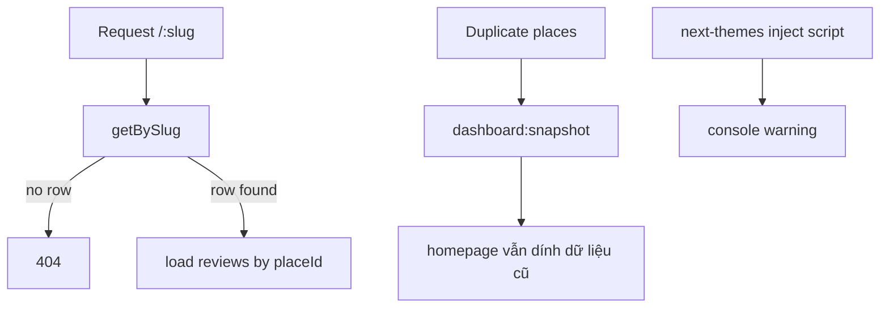

# I. Primer
## 1. TL;DR kiểu Feynman
- 404 route `/:slug` là do dữ liệu cũ chưa có `places.slug` chuẩn và luồng migrate trước đó đang lỗi (`action` dùng `ctx.db` sai chuẩn Convex).
- Trang chủ còn “dính Cà Mau” vì dataset đang còn duplicate place (khác `placeId`/khác tên), và dashboard render toàn bộ `places` nên xóa 1 nhánh chưa đủ.
- Cảnh báo `Encountered a script tag while rendering React component` trỏ vào `ThemeProvider` (next-themes); đây là script injection của thư viện, với Next 16/Turbopack dễ nổi warning.
- Hướng fix triệt để: chuẩn hóa slug-only trong DB + migrate/dedupe đúng chuẩn Convex + thay next-themes bằng provider không script injection.

## 2. Elaboration & Self-Explanation
Hiện route detail đã đổi sang slug-only ở UI, nhưng data layer chưa hoàn tất migrate. Kết quả là URL đúng format nhưng lookup theo slug không ra record -> 404. Song song đó, dữ liệu duplicate chưa dọn sạch nên trang chủ vẫn hiện nhánh “cũ”.

Về lỗi console, code app không tự viết `<script>`, nhưng `next-themes` tạo script runtime để set theme sớm. Trên stack hiện tại warning này gây nhiễu và làm bạn khó debug, nên xử lý dứt điểm bằng cách bỏ phụ thuộc script-injection.

## 3. Concrete Examples & Analogies
- Trường hợp thực tế: vào `/lotte-cinema-ca-mau-vincom` 404 dù có data, vì row đó có `placeId` nhưng chưa có `slug` (hoặc slug chưa canonical).
- Dọn duplicate: nếu 3 bản ghi cùng slug, giữ 1 canonical, dồn reviews/metrics/jobs/checkpoints về canonical rồi xóa 2 bản trùng.
- Analogy: đổi biển số nhà (route) mà sổ hộ khẩu (DB key) chưa cập nhật đồng bộ thì tìm nhà không ra.

# II. Audit Summary (Tóm tắt kiểm tra)
- `src/app/[slug]/page.tsx` đã query `places:getBySlug`, và chặn slug legacy `--`.
- `convex/places.ts` có `migrateToCanonicalSlugs` nhưng đang sai kiến trúc Convex (`actionGeneric` dùng `ctx.db`) -> gây lỗi typecheck và không chạy migrate được.
- `src/lib/slug.ts` đã chuyển sang name-only, nhưng data backfill slug cho record cũ chưa được thực thi an toàn.
- Dashboard đọc toàn bộ places từ `dashboard:snapshot`, nên duplicate chưa dọn sẽ còn hiển thị.
- `Providers.tsx` dùng `next-themes` -> nguồn warning script tag trong client render path.

# III. Root Cause & Counter-Hypothesis (Nguyên nhân gốc & Giả thuyết đối chứng)
- Root Cause Confidence: **High**
1. Triệu chứng: slug-only 404 + dữ liệu cũ còn dính + warning script.
2. Phạm vi: routing + Convex migration + provider theme.
3. Tái hiện: ổn định theo log/lỗi bạn gửi.
4. Mốc thay đổi: đã đổi route frontend trước khi hoàn tất data migration.
5. Thiếu dữ liệu: chưa có báo cáo duplicate groups từ migration dry-run thành công.
6. Giả thuyết thay thế: 404 do không có record thật. (Đã loại trừ vì bạn xác nhận dữ liệu tồn tại.)
7. Rủi ro fix sai: route tiếp tục 404 hoặc merge nhầm dữ liệu.
8. Tiêu chí pass/fail: slug-only vào được, duplicate biến mất, warning script hết.

# IV. Proposal (Đề xuất)
1. **Fix Convex migration đúng chuẩn**
   - Tách thành `query/mutation` (dùng `ctx.db`) + `action` orchestration (dùng `ctx.runQuery/runMutation`), không dùng `ctx.db` trong action.
   - Thêm 2 pha:
     a) `dryRunSlugDedupe`: trả report duplicate groups, canonical đề xuất.
     b) `applySlugDedupe`: re-link child tables + delete duplicates + backfill `places.slug`.
2. **Chuẩn hóa slug-only end-to-end**
   - Giữ route name-only, bỏ route legacy theo yêu cầu.
   - Đảm bảo `places:upsert` luôn set `slug` khi ghi mới.
   - Detail page chỉ query theo slug, sau đó reviews theo `place.placeId`.
3. **Dọn dữ liệu “dính” trên trang chủ triệt để**
   - Sau migration apply: snapshot không còn duplicate slug.
   - Nếu có record orphan đặc biệt, thêm cleanup mutation có scope rõ ràng theo slug group report.
4. **Bỏ warning script ở Providers**
   - Thay `next-themes` bằng ThemeProvider nội bộ (class toggle + localStorage, không render script tag).
   - Giữ API `useTheme` tương thích tối thiểu cho `GlobalView`, `BranchView`, `DashboardHeader`.

# V. Files Impacted (Tệp bị ảnh hưởng)
- Sửa: `online-reputation-management-system/convex/places.ts`
  - Vai trò hiện tại: place queries/mutations + migrate draft lỗi.
  - Thay đổi: refactor migration thành pipeline hợp lệ Convex (dry-run/apply).
- Sửa: `online-reputation-management-system/convex/schema.ts`
  - Vai trò hiện tại: schema/index.
  - Thay đổi: giữ `slug` + index `by_slug` chuẩn hóa.
- Sửa: `online-reputation-management-system/src/app/[slug]/page.tsx`
  - Vai trò hiện tại: resolve detail theo slug.
  - Thay đổi: đơn giản hóa query path, bỏ nhánh tạm không cần thiết.
- Sửa: `online-reputation-management-system/src/components/Providers.tsx`
  - Vai trò hiện tại: wrap next-themes.
  - Thay đổi: provider không inject script.
- Sửa: `online-reputation-management-system/src/components/dashboard/views/GlobalView.tsx`
- Sửa: `online-reputation-management-system/src/components/dashboard/views/BranchView.tsx`
- Sửa: `online-reputation-management-system/src/components/dashboard/layout/DashboardHeader.tsx`
  - Vai trò: dùng `useTheme`.
  - Thay đổi: nối vào theme provider mới tương thích.

# VI. Execution Preview (Xem trước thực thi)
1. Refactor Convex migrate API (dry-run/apply) hợp chuẩn.
2. Chạy dry-run lấy report duplicate groups.
3. Chạy apply migration để backfill slug + dedupe toàn bộ.
4. Chỉnh provider theme để bỏ warning script.
5. Rà route/detail/dashboard sau migrate.
6. `bunx tsc --noEmit` để verify TypeScript.

# VII. Verification Plan (Kế hoạch kiểm chứng)
- Data:
  - `dryRun` có report groups.
  - `apply` xong: không còn group slug trùng.
- Routing:
  - `/:slug-name-only` mở đúng page (không 404) cho các place đã migrate.
  - route legacy `--placeId` trả 404 đúng yêu cầu.
- UI:
  - warning script ở `Providers` biến mất.
  - homepage không còn bản ghi duplicate “dính”.
- Type safety:
  - `bunx tsc --noEmit` pass.

# VIII. Todo
1. Sửa migration Convex theo mô hình dry-run/apply đúng chuẩn.
2. Chạy migrate dữ liệu slug + dedupe.
3. Thay provider theme không script injection.
4. Kiểm tra route slug-only + homepage snapshot.
5. Chạy typecheck và chuẩn bị commit.

# IX. Acceptance Criteria (Tiêu chí chấp nhận)
- Route name-only vào được cho dữ liệu đã có.
- Không còn duplicate branch trên homepage do dữ liệu cũ.
- Không còn console warning script từ `Providers`.
- Typecheck pass.

# X. Risk / Rollback (Rủi ro / Hoàn tác)
- Rủi ro: merge nhầm nếu slug trùng tên thật khác chi nhánh.
- Giảm rủi ro: bắt buộc dry-run report trước apply.
- Rollback: snapshot dữ liệu trước migrate + revert commit nếu cần.

# XI. Out of Scope (Ngoài phạm vi)
- Không tối ưu tốc độ crawler trong đợt fix này.
- Không làm redirect route cũ (theo yêu cầu bỏ hẳn).

# XII. Open Questions (Câu hỏi mở)
- Không còn ambiguity blocker; có thể triển khai ngay theo plan.