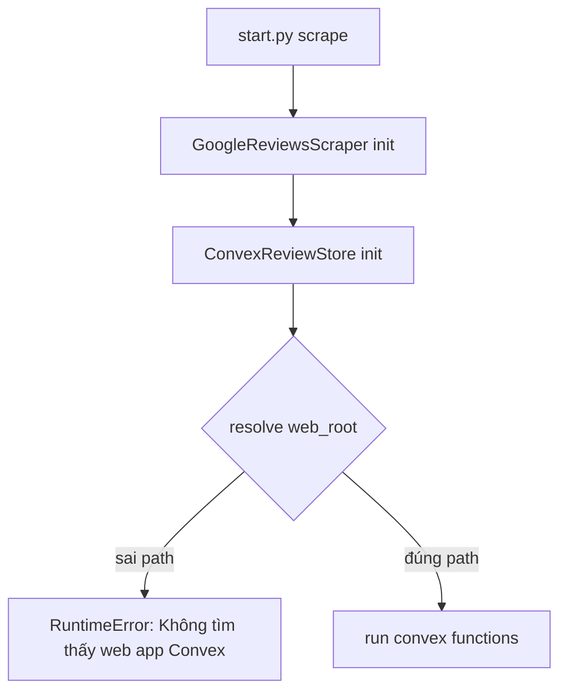

# I. Primer
## 1. TL;DR kiểu Feynman
- Lỗi này không phải do cào review, mà do code đang trỏ sai thư mục web app Convex.
- Hiện tại `convex_store.py` tự tính path thành `E:\NextJS\persional_project\online-reputation-management-system` (thiếu `lotte_gg_map`).
- Vì vậy runtime không tìm thấy `scripts/convex-run.js` và `.env.local`, nên chết ngay từ lúc khởi tạo store.
- Fix triệt để: đưa path Convex vào `config.yaml` + thêm auto-detect fallback an toàn + fail-fast message rõ.

## 2. Elaboration & Self-Explanation
Bạn chạy đúng lệnh scrape, nhưng trước khi vào bước scrape thực tế, app cần khởi tạo `ConvexReviewStore`.
`ConvexReviewStore` lại cần biết web root của app Next/Convex.

Trong code hiện tại, web root bị tính bằng công thức cứng:
- lấy thư mục gốc của `google-review-craw`
- rồi `parent` thêm 1 cấp
- dẫn tới đi lệch ra ngoài workspace.

Nên job fail ngay, dù config business và Selenium đều ổn.

## 3. Concrete Examples & Analogies
- Traceback báo rõ:
  - Expected: `E:\NextJS\persional_project\lotte_gg_map\online-reputation-management-system`
  - Actual code dùng: `E:\NextJS\persional_project\online-reputation-management-system`
- Analogy: giống shipper lấy sai địa chỉ kho (thiếu tên tòa nhà), nên chưa giao hàng đã quay đầu vì “không tìm thấy kho”.

# II. Audit Summary (Tóm tắt kiểm tra)
- Observation:
  - `modules/convex_store.py` đang set:
    - `self.project_root = Path(__file__).resolve().parents[2]`
    - `self.web_root = self.project_root.parent / "online-reputation-management-system"`
  - Cách tính này làm lệch path trong cấu trúc repo hiện tại.
- Inference:
  - Root cause là path resolution cứng và không configurable từ `config.yaml`.
- Decision:
  - Sửa theo hướng config-first + auto-detect + fail-fast rõ ràng.

# III. Root Cause & Counter-Hypothesis (Nguyên nhân gốc & Giả thuyết đối chứng)
1. Triệu chứng: crash ngay khi chọn business, chưa vào scrape loop.
2. Phạm vi: mọi lệnh scrape dùng Convex backend.
3. Tái hiện: ổn định 100% với path hiện tại.
4. Mốc thay đổi: sau khi chuyển runtime sang Convex-only.
5. Dữ liệu thiếu: không thiếu, traceback đã đủ chỉ điểm.
6. Giả thuyết thay thế:
   - thiếu Node hoặc thiếu `.env.local` cũng có thể fail,
   - nhưng ở case này fail trước vì sai `web_root`.
7. Rủi ro fix sai: vẫn crash khi chạy all businesses.
8. Pass/fail: pass khi chạy lệnh scrape vào được bước “Starting scraper…” thay vì crash ở init.

**Root Cause Confidence:** High

# IV. Proposal (Đề xuất)
## Option A (Recommend) — Confidence 92%
**Config-first path resolution + fallback candidates**
- Bổ sung trong `config.yaml`:
  - `convex.web_root: "../online-reputation-management-system"` (relative từ `google-review-craw`)
- Trong `ConvexReviewStore.__init__`:
  1) ưu tiên `config["convex"]["web_root"]`
  2) nếu không có, thử danh sách candidate chuẩn:
     - `<crawler_root>/../online-reputation-management-system`
     - `<crawler_root>/online-reputation-management-system` (phòng khi monorepo khác layout)
  3) chọn candidate đầu tiên có đủ cả `.env.local` và `scripts/convex-run.js`
- Fail-fast message phải liệt kê:
  - path đã thử,
  - path thiếu file nào,
  - gợi ý sửa trực tiếp trong `config.yaml`.

## Option B — Confidence 68%
**Chỉ hardcode lại path đúng hiện tại**
- Nhanh nhưng giòn, đổi layout repo là hỏng lại.

# V. Files Impacted (Tệp bị ảnh hưởng)
- **Sửa:** `google-review-craw/modules/convex_store.py`
  - Vai trò hiện tại: Convex runtime bridge.
  - Thay đổi: resolve `web_root` qua config + fallback candidates + error message rõ.
- **Sửa:** `google-review-craw/config.yaml`
  - Vai trò hiện tại: cấu hình runtime.
  - Thay đổi: thêm block `convex.web_root` để cố định đường dẫn.
- **Sửa (nhẹ):** `google-review-craw/modules/config.py`
  - Vai trò hiện tại: default config loader.
  - Thay đổi: thêm default key `convex.web_root` (có thể để `None` và để resolver xử lý).

# VI. Execution Preview (Xem trước thực thi)
1. Bổ sung schema config `convex.web_root`.
2. Refactor resolver path trong `ConvexReviewStore`.
3. Nâng cấp `_validate_runtime()` để báo lỗi có ngữ cảnh.
4. Static review tránh ảnh hưởng luồng scrape/Convex calls hiện tại.

# VII. Verification Plan (Kế hoạch kiểm chứng)
- Repro đúng lệnh bạn dùng:
  - `python start.py scrape --config config.yaml --headed`
- Kiểm tra pass:
  - không còn crash ở `ConvexReviewStore.__init__`
  - vào được bước scrape thực tế.
- Kiểm tra negative case:
  - cố tình set sai `convex.web_root` => fail-fast message phải chỉ rõ cách sửa.

# VIII. Todo
1. Thêm `convex.web_root` vào config loader/default.
2. Cập nhật `config.yaml` với path chuẩn repo hiện tại.
3. Refactor `ConvexReviewStore` path resolution.
4. Cải thiện fail-fast diagnostics.
5. Verify lại bằng chính command user đang chạy.

# IX. Acceptance Criteria (Tiêu chí chấp nhận)
- Lệnh scrape của bạn không còn lỗi “Không tìm thấy web app Convex”.
- Runtime vẫn chạy Convex full, không fallback SQLite.
- Cấu hình path nằm trong `config.yaml` và dùng ổn cho all businesses.

# X. Risk / Rollback (Rủi ro / Hoàn tác)
- Rủi ro: path config sai tay ở môi trường khác.
- Giảm rủi ro: có fallback candidates + diagnostics rõ.
- Rollback: bỏ `convex.web_root`, dùng candidate auto-detect.

# XI. Out of Scope (Ngoài phạm vi)
- Tối ưu tốc độ scrape/DOM scan.
- Thay đổi logic parsing review.
- Thay đổi schema Convex.

# XII. Open Questions (Câu hỏi mở)
- Không còn ambiguity chính; bạn đã chốt dùng Convex full và muốn cấu hình qua `config.yaml`.