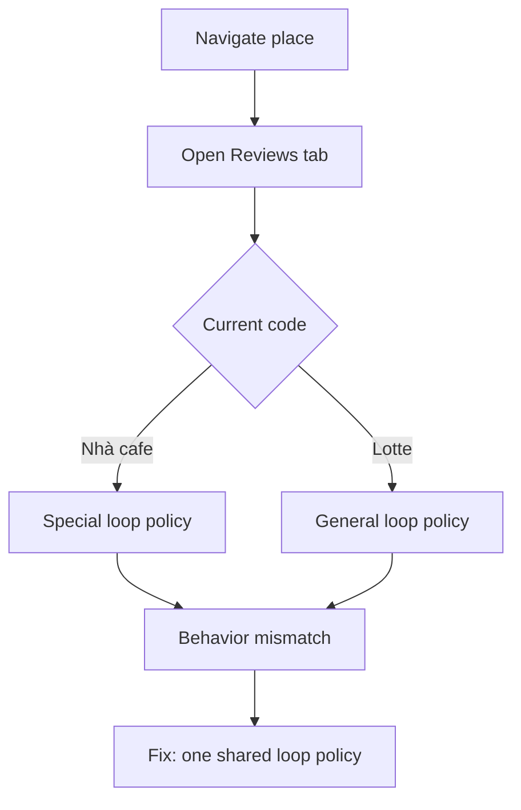

# I. Primer
## 1. TL;DR kiểu Feynman
- Bạn đúng: khi đã vào đúng tab Reviews thì logic phải chạy y hệt Lotte, không tách riêng Nhà cafe nữa.
- Hiện code vẫn còn nhánh đặc biệt cho Nhà cafe trong **vòng scroll** (disable early-stop, hard-cap 100, tắt adaptive riêng), làm flow lệch.
- Em sẽ bỏ special-case trong pha scrape reviews để đồng nhất 1 flow chung.
- Giữ phần direct URL + refresh ở pha navigate (trước reviews), còn sau đó dùng đúng pipeline chung.

## 2. Elaboration & Self-Explanation
Phần bạn phản ánh “không lăn tí nào” là hợp lý với symptom hiện tại: code có nhiều guard stop trong loop, cộng thêm nhánh đặc biệt Nhà cafe đang can thiệp vào ngưỡng dừng. Điều này làm hành vi sau khi vào reviews không còn giống Lotte.

Để đúng yêu cầu của bạn, em không “chế logic riêng direct” nữa ở pha scrape. Cách làm chuẩn là tách ranh giới rõ:
- Trước reviews: có thể xử lý đặc thù direct URL để vào đúng place.
- Sau reviews: 100% dùng cùng stop/scroll policy như Lotte.

## 3. Concrete Examples & Analogies
- Hiện tại (lệch):
  - Nhà cafe: `stop_threshold=0`, `special_target_reviews=100`, adaptive khác Lotte.
- Sau sửa (đồng nhất):
  - Nhà cafe và Lotte đều dùng chung `stop_threshold`, `max_reviews`, `max_scroll_attempts`, `scroll_idle_limit` từ config.
- Analogy: cùng đã vào “cùng 1 phòng reviews” thì dùng cùng 1 quy trình quét, không chia nhánh VIP nữa.

# II. Audit Summary (Tóm tắt kiểm tra)
- Observation:
  - `modules/scraper.py` còn block đặc thù Nhà cafe trong giai đoạn scrape reviews (`special_target_reviews`, override stop/idle).
  - adaptive target hiện cũng bị điều kiện hóa theo `place_id != SPECIAL_PLACEID_NHA_CAFE`.
- Inference:
  - Sau khi vào reviews, flow đang không đồng nhất với Lotte như bạn yêu cầu.
- Decision:
  - Bỏ toàn bộ special-case của Nhà cafe trong loop scrape reviews, giữ 1 flow chung.

# III. Root Cause & Counter-Hypothesis (Nguyên nhân gốc & Giả thuyết đối chứng)
- 1) Triệu chứng: cùng reviews tab nhưng hành vi scroll khác kỳ vọng “giống Lotte”.
- 2) Phạm vi: chỉ pha scrape reviews (không phải pha navigate).
- 3) Tái hiện: có thể thấy trực tiếp qua log “Nhà cafe detected: ... hard cap ...”.
- 4) Mốc thay đổi: thêm các guard đặc thù cho Nhà cafe trước đó.
- 5) Dữ liệu thiếu: chưa cần thêm để kết luận vì evidence nằm ngay trong code/log.
- 6) Giả thuyết thay thế: UI Maps không scroll; nhưng dù vậy vẫn cần loại bỏ chênh lệch logic trước.
- 7) Rủi ro nếu fix sai: có thể crawl lâu hơn hoặc ngắn hơn tùy config, nhưng sẽ nhất quán.
- 8) Pass/fail: không còn log/nhánh đặc thù Nhà cafe trong scrape loop.

**Root Cause Confidence (Độ tin cậy nguyên nhân gốc): High**
- Vì mismatch policy nằm trực tiếp trong code điều kiện theo `SPECIAL_PLACEID_NHA_CAFE`.

# IV. Proposal (Đề xuất)
- Sửa `google-review-craw/modules/scraper.py`:
  1) Xóa block special-case Nhà cafe trong pha reviews loop:
     - bỏ override `stop_threshold = 0`
     - bỏ `scroll_idle_limit = max(..., 40)`
     - bỏ `special_target_reviews = 100` và điều kiện stop theo biến này
  2) Bỏ điều kiện loại trừ Nhà cafe ở adaptive targets trong loop (nếu vẫn giữ adaptive thì áp dụng đồng nhất).
  3) Giữ nguyên special-case ở **navigate** (direct-place resolve/refresh) vì đó là trước khi vào reviews.

# V. Files Impacted (Tệp bị ảnh hưởng)
- **Sửa:** `google-review-craw/modules/scraper.py`
  - Vai trò hiện tại: navigation + click tab + loop scrape.
  - Thay đổi: đồng nhất stop/scroll policy sau khi vào reviews cho mọi place.

# VI. Execution Preview (Xem trước thực thi)
1. Gỡ nhánh `Nhà cafe detected...` trong loop scrape.
2. Gỡ stop condition dùng `special_target_reviews`.
3. Chuẩn hóa adaptive/stop về flow chung.
4. Rà diff để đảm bảo chỉ tác động pha reviews.

# VII. Verification Plan (Kế hoạch kiểm chứng)
- Theo rule repo: không tự chạy lint/unit test.
- Bạn chạy lại lệnh headed như cũ với Nhà cafe.
- Kỳ vọng log:
  - Không còn log `Nhà cafe detected: disabling early-stop...`.
  - Không còn nhánh stop hard-cap riêng Nhà cafe.
  - Trình tự sau khi vào reviews vận hành cùng kiểu với Lotte.

# VIII. Todo
- [ ] Bỏ special-case Nhà cafe trong scrape reviews loop.
- [ ] Đồng nhất adaptive/stop policy với flow chung.
- [ ] Rà diff tĩnh, giữ thay đổi đúng 1 file chính.
- [ ] Commit local (không push), kèm file spec.

# IX. Acceptance Criteria (Tiêu chí chấp nhận)
- Sau khi vào reviews, Nhà cafe dùng cùng logic loop như Lotte.
- Không còn điều kiện stop/hard-cap riêng cho Nhà cafe trong loop.
- Hành vi log sau reviews nhất quán giữa hai nhóm.

# X. Risk / Rollback (Rủi ro / Hoàn tác)
- Rủi ro: thay đổi thời gian crawl do bỏ hard-cap riêng.
- Rollback: revert 1 commit nếu cần khôi phục nhánh đặc thù.

# XI. Out of Scope (Ngoài phạm vi)
- Không đổi thuật toán chọn tab/sort ở vòng này.
- Không đổi schema DB/pipeline sync.
- Không tối ưu anti-bot/network ngoài logic đồng nhất flow reviews.