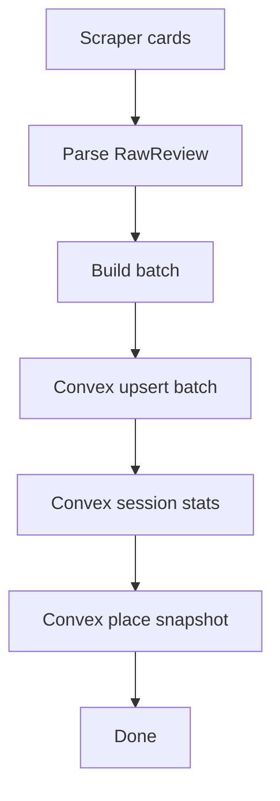

# I. Primer
## 1. TL;DR kiểu Feynman
- Nếu mục tiêu của bạn là **chỉ cần dữ liệu ở Convex**, thì **không bắt buộc giữ SQLite**.
- Nhưng code hiện tại đang phụ thuộc SQLite làm lõi (dedupe, session stats, history, stop logic), nên bỏ SQLite cần refactor có kiểm soát.
- SQLite đang gây một phần slowdown do I/O local dày; Convex-only sẽ bỏ phần đó, đổi lại tăng phụ thuộc network write.
- Theo yêu cầu của bạn: chốt hướng **Convex-only realtime**.

## 2. Elaboration & Self-Explanation
Nói đơn giản:
- Hiện giờ scraper giống người ghi sổ tay (SQLite) trước, rồi mới gửi bản sao đi nơi khác.
- Bạn muốn bỏ sổ tay, ghi thẳng lên hệ thống trung tâm (Convex).
- Việc này hợp lý nếu bạn chỉ dùng Convex, nhưng phải thay các chỗ đang “đọc/ghi/so sánh dữ liệu cũ” từ SQLite sang Convex query/mutation tương đương.

=> Trả lời thẳng câu hỏi của bạn: **Không cần SQLite nữa nếu bạn chấp nhận kiến trúc Convex-only và refactor đúng các điểm phụ thuộc.**

## 3. Concrete Examples & Analogies
- Ví dụ trong repo:
  - `scraper.py` gọi `ReviewDB` để lấy `seen`, upsert batch, session, snapshot.
  - Muốn bỏ SQLite thì các tác vụ này phải chuyển sang Convex functions.
- Analogy:
  - Trước: ghi hóa đơn vào sổ nội bộ rồi nhập ERP.
  - Sau: nhập thẳng ERP, không có sổ nội bộ nữa.

# II. Audit Summary (Tóm tắt kiểm tra)
- Observation:
  - Luồng scrape hiện tại phụ thuộc mạnh vào `modules/review_db.py` (SQLite).
  - Bottleneck tốc độ hiện tại chủ yếu ở DB local write path.
- Inference:
  - Convex-only có thể giảm local I/O bottleneck, nhưng cần thay toàn bộ contract dữ liệu nội bộ.
- Decision:
  - Chuyển sang Convex-only theo yêu cầu user, không duy trì SQLite song song.

# III. Root Cause & Counter-Hypothesis (Nguyên nhân gốc & Giả thuyết đối chứng)
1. Triệu chứng: scrape chậm dần khi số review lớn.
2. Phạm vi: các business nhiều review.
3. Tái hiện: phù hợp với code path SQLite hiện tại.
4. Mốc thay đổi: chưa cần pin commit để quyết định kiến trúc.
5. Dữ liệu thiếu: chưa có benchmark Convex-only thực tế trên cùng tập review.
6. Giả thuyết thay thế: chậm do Selenium/Google render; đúng một phần nhưng không phủ định bottleneck local DB.
7. Rủi ro fix sai: bỏ SQLite nhưng Convex contract chưa đủ -> sai dedupe/update semantics.
8. Pass/Fail: Convex-only chạy ổn, dữ liệu đúng, tốc độ đạt mục tiêu.

**Root Cause Confidence:** Medium-High
- High: SQLite I/O đang là điểm nghẽn hiện tại.
- Medium: mức tăng tốc khi Convex-only còn phụ thuộc độ trễ mạng/throughput Convex.

# IV. Proposal (Đề xuất)
## Option A (Recommend) — Confidence 85%
**Cutover Convex-only có compatibility layer mỏng (an toàn hơn)**
- Tạo `ReviewStore` interface (get_seen_ids, upsert_batch, start/end_session, update_place_snapshot).
- Cài `ConvexReviewStore` và chuyển `scraper.py` dùng abstraction này.
- Tạm giữ file SQLite code nhưng không gọi runtime (để rollback nhanh nếu cần).
- Sau khi ổn định mới xóa hẳn SQLite module.

## Option B — Confidence 65%
**Big-bang bỏ SQLite ngay**
- Sửa thẳng `scraper.py` gọi Convex API trực tiếp, bỏ `ReviewDB` path luôn.
- Nhanh về thời gian code ban đầu nhưng rủi ro regression cao hơn.

**Khuyến nghị:** Option A vì phù hợp tiêu chí “nhanh nhưng không gây lỗi”.

# V. Files Impacted (Tệp bị ảnh hưởng)
- **Sửa:** `google-review-craw/modules/scraper.py`
  - Vai trò hiện tại: orchestration scrape + phụ thuộc `ReviewDB`.
  - Thay đổi: chuyển sang gọi `ReviewStore` (Convex implementation).
- **Thêm:** `google-review-craw/modules/review_store.py`
  - Vai trò mới: contract storage backend trung lập.
- **Thêm:** `google-review-craw/modules/convex_store.py`
  - Vai trò mới: triển khai upsert/session/snapshot qua Convex functions.
- **Sửa:** `google-review-craw/scripts/sync_to_convex.py` (hoặc thay bằng runtime calls dùng chung)
  - Vai trò hiện tại: sync sau scrape.
  - Thay đổi: tái sử dụng logic call Convex cho realtime path.
- **Sửa:** `google-review-craw/config.yaml`
  - Thêm/chuẩn hóa flags Convex-only (`storage_backend: convex`, endpoint/deployment).

# VI. Execution Preview (Xem trước thực thi)
1. Tách interface storage khỏi `ReviewDB` trong scraper.
2. Implement Convex store cho các operation đang dùng trong scrape loop.
3. Chuyển call sites trong `scraper.py` sang Convex store.
4. Tắt đường SQLite trong config runtime.
5. Static review đảm bảo semantics new/updated/unchanged không lệch.

# VII. Verification Plan (Kế hoạch kiểm chứng)
- Repro 1 business nhiều review:
  - So sánh số review ingest giữa before/after.
  - So sánh phân loại new/updated/unchanged.
- Kiểm chứng Convex data integrity:
  - Không duplicate review_id theo placeId.
  - Session stats/place snapshot cập nhật đúng.
- Hiệu năng:
  - Đo tổng runtime; mục tiêu không chậm hơn baseline và kỳ vọng cải thiện vùng >600 reviews.

# VIII. Todo
1. Thiết kế `ReviewStore` abstraction và map method từ `ReviewDB`.
2. Implement `ConvexReviewStore` (batch upsert + session + snapshot).
3. Refactor `scraper.py` dùng `ReviewStore`.
4. Bật config Convex-only, vô hiệu SQLite path.
5. Kiểm chứng dữ liệu và benchmark runtime.

# IX. Acceptance Criteria (Tiêu chí chấp nhận)
- Runtime scrape hoạt động **không dùng SQLite**.
- Dữ liệu review chỉ ghi ở Convex, không mismatch số lượng.
- Không lỗi runtime trong luồng scrape chuẩn.
- Semantics new/updated/unchanged và session/snapshot đúng.

# X. Risk / Rollback (Rủi ro / Hoàn tác)
- Rủi ro:
  - Thiếu parity logic giữa SQLite và Convex (đặc biệt dedupe/update/history).
- Rollback:
  - Nếu lỗi dữ liệu, chuyển config về backend cũ (SQLite) qua abstraction mà không phải revert toàn bộ.

# XI. Out of Scope (Ngoài phạm vi)
- Tối ưu DOM scan Selenium sâu.
- Tái thiết kế schema Convex vượt quá field hiện có.
- Viết thêm dashboard/reporting mới.

# XII. Open Questions (Câu hỏi mở)
- Bạn muốn **giữ review_history/session history ở Convex ở mức đầy đủ như SQLite hiện tại**, hay chỉ cần dữ liệu review cuối cùng + snapshot?