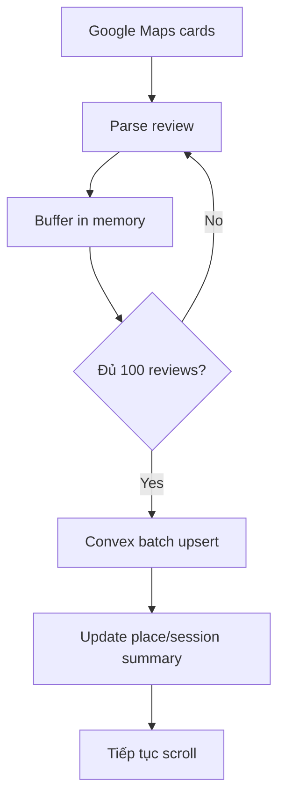

# I. Primer
## 1. TL;DR kiểu Feynman
- Nếu mục tiêu là nhanh nhất và dữ liệu chỉ cần nằm ở Convex, thì **không nên tiếp tục để scraper ghi SQLite trong runtime chính**.
- Vì hiện tại logic cào ổn, điểm chậm lớn nhất không nằm ở parse/card nữa mà nằm ở lớp lưu dữ liệu local.
- Hướng nhanh nhất bây giờ là: **scrape như cũ, nhưng thay nơi ghi từ SQLite sang Convex batch 100 reviews/lần**.
- SQLite sẽ **không chạy trong runtime chính**, nhưng **giữ code lại** để rollback nhanh nếu cần.
- Nói ngắn gọn: thay vì “cào xong ghi sổ tay rồi mới đẩy đi”, ta đổi sang “gom 100 review rồi gửi thẳng kho trung tâm Convex”.

## 2. Elaboration & Self-Explanation
Hiện tại hệ thống của bạn có 2 phần:
- Phần 1: đi cào review từ Google Maps bằng Selenium.
- Phần 2: lưu dữ liệu đã cào.

Bạn nói logic cào hiện tại ổn rồi. Vậy ta không nên đụng nhiều vào phần 1.
Ta chỉ đụng vào phần 2.

Vấn đề của SQLite không phải vì SQLite “xấu”, mà vì trong code hiện tại nó đang bị dùng theo cách tốn I/O:
- đọc review cũ,
- ghi review,
- ghi history,
- commit,
- lặp lại rất nhiều lần.

Khi số review tăng lên, tổng số lần đọc/ghi này tăng mạnh nên thấy chậm.

Nếu chuyển sang Convex-only:
- scraper vẫn cào như cũ,
- nhưng thay vì ghi local DB liên tục,
- ta gom 100 review thành 1 lô,
- gửi 1 request batch lên Convex,
- Convex tự xử lý insert/update ở phía server.

Cách này nhanh hơn vì:
- ít lần chạm disk local hơn,
- ít transaction lặt vặt hơn,
- ít round-trip hơn nếu Convex có batch mutation tốt.

## 3. Concrete Examples & Analogies
- Cách cũ:
  - Cào được review nào, hệ thống gần như phải kiểm tra sổ cũ và ghi sổ lại liên tục.
- Cách mới:
  - Cào đủ 100 review rồi đóng thành 1 thùng, gửi thẳng lên Convex.

Analogy đời thường:
- Cách cũ giống shipper đi giao từng gói một.
- Cách mới giống gom 100 gói lên xe tải rồi giao một chuyến.
- Nếu mục tiêu là tốc độ tổng, xe tải gần như luôn thắng.

# II. Audit Summary (Tóm tắt kiểm tra)
- Observation (Quan sát)
  - Luồng Selenium scrape hiện tại đã chạy ổn theo mô tả của bạn.
  - Bottleneck lớn nằm ở storage path hiện tại dùng SQLite.
  - SQLite hiện giữ nhiều trách nhiệm: dedupe, session, history, snapshot.
- Inference (Suy luận)
  - Nếu ưu tiên tốc độ ingest, nên bỏ SQLite khỏi runtime chính.
  - Convex-only hợp lý nếu ta giữ scope gọn: tối ưu ingest trước, parity đầy đủ tính sau.
- Decision (Quyết định)
  - Chốt kiến trúc mới: **Convex-only runtime**, **batch 100 reviews**, **giữ SQLite code để rollback**.

# III. Root Cause & Counter-Hypothesis (Nguyên nhân gốc & Giả thuyết đối chứng)
1. Triệu chứng quan sát được là gì?
- Ban đầu scrape nhanh, sau khoảng vài trăm review thì chậm rõ.
- Expected: tốc độ tương đối ổn định.
- Actual: càng nhiều review, throughput càng giảm.

2. Phạm vi ảnh hưởng?
- Các business có nhiều review.
- Ảnh hưởng chủ yếu tới tổng thời gian ingest.

3. Có tái hiện ổn định không?
- Có cơ sở cao từ log bạn cung cấp và code path hiện tại.

4. Mốc thay đổi gần nhất?
- Chưa cần xác định commit cụ thể để đưa ra quyết định kiến trúc này.

5. Dữ liệu nào còn thiếu?
- Chưa có benchmark Convex-only thực tế trên cùng một business.

6. Có giả thuyết thay thế hợp lý nào chưa bị loại trừ?
- Có: Google Maps render chậm, DOM phình to, Selenium scan chậm hơn khi scroll sâu.
- Nhưng kể cả vậy, storage path hiện tại vẫn là bottleneck rõ và dễ tối ưu nhất.

7. Rủi ro nếu fix sai nguyên nhân là gì?
- Refactor storage xong mà tổng tốc độ không tăng như kỳ vọng nếu bottleneck còn nằm ở DOM/network.

8. Tiêu chí pass/fail sau khi sửa?
- Runtime không dùng SQLite.
- Ghi Convex theo batch 100 hoạt động ổn.
- Tổng thời gian scrape giảm rõ rệt so với hiện tại.

**Root Cause Confidence (Độ tin cậy nguyên nhân gốc): Medium-High**
- High: local storage path hiện tại là bottleneck đáng kể.
- Medium: mức lợi tuyệt đối sau cutover còn phụ thuộc throughput Convex và network.

# IV. Proposal (Đề xuất)
## Phương án chốt (Recommend) — Confidence 88%
**Convex-only ingest path, batch 100, SQLite retained for rollback**

### a) Thay runtime storage abstraction
- Tạo một lớp storage trung gian như `ReviewStore` để `scraper.py` không phụ thuộc trực tiếp `ReviewDB`.
- Runtime chính sẽ dùng `ConvexReviewStore`.
- `SQLiteReviewStore` hoặc code `ReviewDB` cũ vẫn giữ lại nhưng không active mặc định.

### b) Chuyển các tác vụ runtime tối thiểu sang Convex
Scraper hiện cần mấy việc chính:
- biết review nào đã tồn tại,
- upsert batch review,
- cập nhật place snapshot,
- ghi session stats cơ bản.

Để nhanh nhất, pha này chỉ nên giữ các chức năng thật sự cần cho ingest:
- review final state,
- place snapshot,
- session stats cơ bản.

Không ưu tiên parity đầy đủ kiểu history dày như SQLite ở pha đầu.

### c) Batch 100 reviews
- Buffer 100 review trong memory.
- Gọi 1 Convex mutation batch.
- Mutation phía Convex tự phân loại `new / updated / unchanged` nếu cần.
- Trả về summary gọn để scraper cập nhật progress.

### d) Tối ưu số lần đọc Convex
- Không query từng review một.
- Ưu tiên query theo batch reviewIds hoặc để mutation tự upsert hàng loạt.
- Nếu cần early-stop, dùng chiến lược dựa trên batch summary thay vì per-item DB round-trip.

### e) Giữ rollback path
- Không xóa `modules/review_db.py` và code SQLite liên quan.
- Chỉ tách runtime path để có thể đổi backend nhanh nếu cần quay lại.

# V. Files Impacted (Tệp bị ảnh hưởng)
- **Sửa:** `google-review-craw/modules/scraper.py`
  - Vai trò hiện tại: scrape orchestration và gọi trực tiếp `ReviewDB`.
  - Thay đổi: chuyển sang dùng storage abstraction; flush theo batch 100 lên Convex.

- **Thêm:** `google-review-craw/modules/review_store.py`
  - Vai trò hiện tại: chưa có.
  - Thay đổi: định nghĩa contract chung cho storage backend.

- **Thêm:** `google-review-craw/modules/convex_store.py`
  - Vai trò hiện tại: chưa có.
  - Thay đổi: triển khai logic read/write tối thiểu với Convex cho runtime scrape.

- **Sửa:** `google-review-craw/scripts/sync_to_convex.py`
  - Vai trò hiện tại: sync riêng từ local data lên Convex.
  - Thay đổi: tái sử dụng client/helper call Convex để tránh lặp logic giao tiếp.

- **Sửa:** `google-review-craw/config.yaml`
  - Vai trò hiện tại: config scraper + SQLite/Mongo/S3.
  - Thay đổi: thêm/chuẩn hóa cấu hình Convex-only runtime và batch size.

- **Giữ nguyên để rollback:** `google-review-craw/modules/review_db.py`
  - Vai trò hiện tại: SQLite backend cũ.
  - Thay đổi: không dùng trong runtime chính, nhưng chưa xóa.

# VI. Execution Preview (Xem trước thực thi)
1. Đọc lại code Convex hiện có trong repo để bám đúng API/client pattern.
2. Thiết kế `ReviewStore` với các method tối thiểu scraper đang cần.
3. Implement `ConvexReviewStore` với batch upsert 100 review.
4. Refactor `scraper.py` chuyển từ `ReviewDB` sang `ReviewStore`.
5. Điều chỉnh config để backend mặc định là Convex-only.
6. Static self-review để chắc semantics ingest không lệch.

# VII. Verification Plan (Kế hoạch kiểm chứng)
- Kiểm tra đúng dữ liệu:
  - Số review ingest lên Convex đúng.
  - Không duplicate theo `review_id + placeId`.
  - `place snapshot` cập nhật đúng total/captured.
  - `session stats` cơ bản cập nhật đúng.

- Kiểm tra hiệu năng:
  - So sánh tổng runtime trước/sau trên cùng 1 business.
  - So sánh đoạn scrape sâu (ví dụ vùng sau 500 review).
  - Quan sát số lần request storage giảm mạnh so với path cũ.

- Kiểm tra rollback:
  - Đảm bảo còn khả năng chuyển backend về SQLite nếu Convex path phát sinh lỗi.

# VIII. Todo
1. Audit code Convex hiện có để dùng lại client/pattern chuẩn.
2. Tạo `ReviewStore` abstraction với scope tối thiểu cho ingest nhanh.
3. Implement `ConvexReviewStore` hỗ trợ batch upsert 100 review.
4. Refactor `scraper.py` sang runtime Convex-only.
5. Chuẩn hóa config cho Convex backend mặc định.
6. Review tĩnh logic `new/updated/unchanged`, snapshot, session stats.

# IX. Acceptance Criteria (Tiêu chí chấp nhận)
- Runtime scrape chính không còn phụ thuộc SQLite.
- Review được ghi trực tiếp lên Convex theo batch 100.
- Tổng thời gian scrape giảm đáng kể so với hiện tại.
- Không phát sinh lỗi runtime mới trong luồng scrape chuẩn.
- Có thể rollback nhanh sang code SQLite cũ nếu cần.

# X. Risk / Rollback (Rủi ro / Hoàn tác)
- Rủi ro
  - Convex mutation chưa tối ưu batch sẽ làm network trở thành bottleneck mới.
  - Semantics `unchanged/updated` có thể lệch nếu server-side compare chưa đúng.
  - Early-stop có thể cần chỉnh lại nếu trước đó đang dựa mạnh vào DB local state.

- Rollback
  - Giữ nguyên code SQLite hiện tại.
  - Chỉ đổi storage backend qua abstraction/config.
  - Nếu Convex path lỗi, chuyển runtime về backend cũ nhanh mà không phải viết lại scraper.

# XI. Out of Scope (Ngoài phạm vi)
- Tối ưu sâu Selenium DOM scan.
- Xóa hoàn toàn code SQLite khỏi repo.
- Mô phỏng hoặc thay đổi logic cào review hiện tại.
- Mở rộng thêm dashboard/report/history beyond ingest essentials.

# XII. Open Questions (Câu hỏi mở)
- Với định hướng “nhanh nhất có thể”, pha này mình mặc định **không làm full history parity như SQLite**. Nếu bạn vẫn muốn history đầy đủ trên Convex, mình sẽ phải mở rộng scope sau đó.