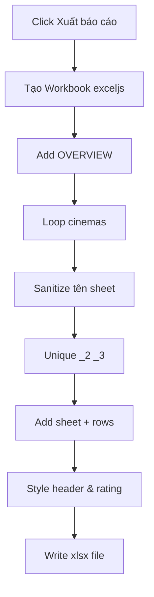

# I. Primer
## 1. TL;DR kiểu Feynman
- Lỗi hiện tại do Excel không cho phép 2 sheet trùng tên, mà code đang append theo `place_name` nên bị đụng.
- Em sẽ đổi từ `xlsx` sang `exceljs` để vừa kiểm soát tên sheet tốt hơn, vừa hỗ trợ style màu chuẩn.
- Giữ đúng cấu trúc bạn muốn: `OVERVIEW` + mỗi chi nhánh 1 sheet.
- Tên sheet sẽ được chuẩn hóa theo chuẩn Excel: bỏ ký tự cấm, cắt 31 ký tự, và tự thêm hậu tố `_2`, `_3` nếu trùng.
- Thêm màu theo rating: `>=4` xanh, `<3` đỏ (và trung tính cho phần còn lại).
- Không mở rộng scope ngoài export report ở trang chủ.

## 2. Elaboration & Self-Explanation
Hiện tại `book_append_sheet` bị crash vì tên sheet phải unique trong workbook, nhưng logic chỉ sanitize ký tự và cắt 31 ký tự, chưa xử lý trùng tên sau sanitize/cắt. Ví dụ 2 tên khác nhau ban đầu có thể thành cùng 1 chuỗi sau khi loại ký tự cấm và truncate. Khi migrate sang `exceljs`, mình sẽ chủ động tạo hàm `buildUniqueSheetName()` để đảm bảo tên cuối cùng luôn hợp lệ và không trùng.

Về “xuất chuẩn chỉ có màu”: em áp dụng style ở mức dữ liệu quan trọng, không over-design:
- Header: nền đậm + chữ trắng + bold + căn giữa + freeze pane.
- Rating cells: tô màu theo ngưỡng bạn chọn (`>=4` xanh, `<3` đỏ, còn lại vàng/neutral).
- Giữ dữ liệu thô và thứ tự cột hiện có để không phá workflow đang dùng.

## 3. Concrete Examples & Analogies
Ví dụ thực tế theo lỗi bạn gặp:
- `LOTTE Cinema Cantavil` và một biến thể tên khác sau sanitize/truncate đều thành `LOTTE Cinema Cantavil`.
- Hàm mới sẽ tạo lần lượt: `LOTTE Cinema Cantavil`, `LOTTE Cinema Cantavil_2`, `LOTTE Cinema Cantavil_3`.

Analogy đời thường:
- Giống đặt tên file trong cùng 1 thư mục: không thể có 2 file cùng tên, nên hệ thống tự thêm `(2)`, `(3)` để tránh đè/chạm.

# II. Audit Summary (Tóm tắt kiểm tra)
- Observation:
  - Runtime error tại `DashboardSidebar.tsx:49` khi `XLSX.utils.book_append_sheet(wb, wsCinema, safeName)`.
  - Stacktrace chỉ rõ lỗi: `Worksheet with name |LOTTE Cinema Cantavil| already exists!`.
- Evidence:
  - File: `src/components/dashboard/layout/DashboardSidebar.tsx`.
  - Import hiện tại: `import * as XLSX from 'xlsx';`.
  - Tên sheet hiện tại: `(c.place_name || 'Unknown').replace(...).substring(0,31)` (chưa unique).
- Inference:
  - Root cause chính là va chạm tên sheet sau normalize/truncate.

# III. Root Cause & Counter-Hypothesis (Nguyên nhân gốc & Giả thuyết đối chứng)
- Root Cause (High confidence):
  1. Triệu chứng: crash khi append sheet chi nhánh.
  2. Phạm vi: chỉ luồng export Excel dashboard.
  3. Tái hiện: ổn định khi có >=2 chi nhánh tạo cùng safe name.
  4. Mốc thay đổi: logic export hiện tại dùng `xlsx` + safeName đơn giản.
  5. Data thiếu: không cần thêm để kết luận nguyên nhân chính.
  6. Counter-hypothesis: lỗi từ dữ liệu review rỗng/format ngày không đúng -> không khớp stacktrace vì nổ đúng ở append_sheet.
  7. Rủi ro nếu fix sai: vẫn crash hoặc tạo file lỗi format.
  8. Pass/fail: export thành công với dữ liệu có tên chi nhánh trùng normalize.

# IV. Proposal (Đề xuất)
- Bước 1: Cài `exceljs` dependency và migrate toàn bộ `exportToExcel` từ `xlsx` -> `exceljs`.
- Bước 2: Thêm helper nội bộ trong `DashboardSidebar.tsx`:
  - `sanitizeSheetName(name)` → loại ký tự cấm `[]:*?/\`, trim, fallback `Unknown`, max 31.
  - `buildUniqueSheetName(base, usedNames)` → sinh tên unique với hậu tố `_2`, `_3`.
- Bước 3: Giữ cấu trúc workbook:
  - Sheet `OVERVIEW`.
  - Mỗi cinema 1 sheet riêng (tên unique).
- Bước 4: Style màu:
  - Header tất cả sheet: fill + font bold + alignment + border nhẹ.
  - Cột rating: `>=4` xanh, `<3` đỏ, còn lại vàng nhạt.
- Bước 5: Xuất file bằng `exceljs` theo date hiện tại giống cũ `ORMS_Audit_YYYY-MM-DD.xlsx`.
- Bước 6: Dọn dependency cũ `xlsx` nếu không còn dùng nơi nào khác.

# V. Files Impacted (Tệp bị ảnh hưởng)
- Sửa: `online-reputation-management-system/src/components/dashboard/layout/DashboardSidebar.tsx`
  - Vai trò hiện tại: render sidebar + xử lý export Excel bằng `xlsx`.
  - Thay đổi: migrate `exportToExcel` sang `exceljs`, thêm xử lý unique sheet name + style màu theo rating.
- Sửa: `online-reputation-management-system/package.json`
  - Vai trò hiện tại: quản lý dependencies.
  - Thay đổi: thêm `exceljs`; có thể bỏ `xlsx` nếu không còn import.

# VI. Execution Preview (Xem trước thực thi)
1. Đọc lại `DashboardSidebar.tsx` để giữ đúng style code hiện hữu.
2. Cập nhật import và logic export sang `exceljs`.
3. Cài helper sanitize + unique naming.
4. Thêm style header/rating theo rule bạn chốt.
5. Rà soát tĩnh TypeScript/null-safety.
6. Chuẩn bị commit local (không push).

# VII. Verification Plan (Kế hoạch kiểm chứng)
- Theo rule repo, không tự chạy lint/unit/integration.
- Chỉ kiểm chứng tĩnh:
  - Soát type và API usage của `exceljs` trong code.
  - Soát path chạy runtime theo stacktrace cũ để đảm bảo không còn điểm crash do duplicate name.
  - Soát các edge cases: tên rỗng, ký tự cấm, dài >31, trùng nhiều lần.

# VIII. Todo
1. Thay `xlsx` bằng `exceljs` trong `exportToExcel`.
2. Thêm cơ chế tên sheet unique `_2`, `_3`.
3. Áp style màu header + rating threshold.
4. Kiểm tra tĩnh và commit local.

# IX. Acceptance Criteria (Tiêu chí chấp nhận)
- Bấm “Xuất báo cáo” không còn runtime error `Worksheet ... already exists`.
- Workbook giữ đúng cấu trúc: 1 sheet `OVERVIEW` + mỗi chi nhánh 1 sheet.
- Khi tên chi nhánh trùng sau sanitize/truncate, sheet tự thành `_2`, `_3`.
- Header có màu; cột rating tô màu đúng ngưỡng (`>=4` xanh, `<3` đỏ).
- Tên sheet luôn hợp lệ chuẩn Excel (không ký tự cấm, <=31).

# X. Risk / Rollback (Rủi ro / Hoàn tác)
- Rủi ro:
  - Khác biệt API giữa `xlsx` và `exceljs` có thể ảnh hưởng định dạng dữ liệu ngày/số.
  - Bundle tăng nhẹ do dependency mới.
- Rollback:
  - Revert commit migrate `exceljs` để quay lại `xlsx`.
  - Giữ helper unique để backport cho `xlsx` nếu cần phương án tạm.

# XI. Out of Scope (Ngoài phạm vi)
- Không thay đổi UI sidebar ngoài nút xuất.
- Không đổi schema/data Convex.
- Không thêm filter/sort mới cho report.

# XII. Open Questions (Câu hỏi mở)
- Không còn ambiguity: đã chốt đầy đủ theo lựa chọn của bạn (suffix `_2/_3`, giữ nhiều sheet, style màu theo rating, xử lý chuẩn Excel đầy đủ).