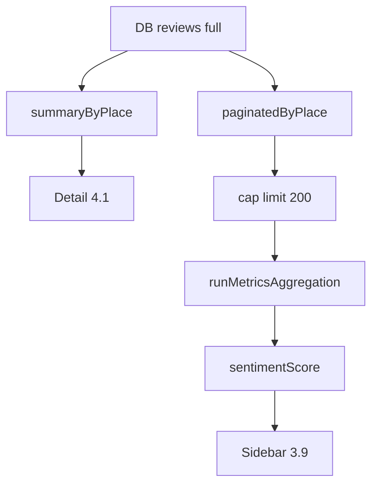

# I. Primer
## 1. TL;DR kiểu Feynman
- Ảnh anh gửi xác nhận lệch thật: trang chi tiết `4.1`, sidebar `3.9`.
- Nguyên nhân gốc không chỉ là UI: 2 nơi đang dùng **2 nguồn/cách tính khác nhau**.
- Đặc biệt có bug ngầm: pipeline tổng hợp metrics chỉ tính tối đa **200 review** vì bị cap trong query phân trang.
- Vì vậy `sentimentScore` ở sidebar có thể thấp hơn/khác `capturedAvgRating` ở trang chi tiết (tính trên toàn bộ reviews).
- Em đề xuất fix 2 lớp: (1) đồng bộ nguồn hiển thị điểm, (2) sửa pipeline metrics để không bị sample 200.

## 2. Elaboration & Self-Explanation
Từ screenshot:
- Detail page của `the-80-s-nguyen-van-linh` hiển thị `Điểm trung bình 4.1`.
- Sidebar item cùng chi nhánh hiển thị `3.9`.

Em đối chiếu code:
1) Trang chi tiết dùng `reviews.summaryByPlace` để tính `capturedAvgRating` bằng cách `collect()` toàn bộ review theo `placeId` (full data).
2) Sidebar dùng `currentAverageRating` từ `useDashboardData`, ưu tiên `sentimentScore` từ snapshot/metrics.
3) `sentimentScore` đó được tạo qua `runMetricsAggregation`, nhưng hàm này gọi `reviews:paginatedByPlace` với `limit: 500`.
4) Trong `reviews:paginatedByPlace` lại có hard cap `limit = Math.min(200, ...)` => thực tế metrics chỉ dựa trên tối đa 200 review.

=> Đây là root cause chính làm lệch 4.1 vs 3.9, nhất là nơi có nhiều review hơn 200.

## 3. Concrete Examples & Analogies
- Ví dụ đúng case anh gửi:
  - Detail: tính trung bình từ toàn bộ DB reviews => 4.1
  - Sidebar: lấy sentimentScore từ metrics build từ sample <= 200 => 3.9
- Analogy: giống tính điểm lớp bằng 200 bài đầu thay vì toàn bộ bài; kết quả có thể lệch thấy rõ.

# II. Audit Summary (Tóm tắt kiểm tra)
- Observation (evidence):
  - `src/components/dashboard/views/PlaceDetailView.tsx` dùng `api.reviews.summaryByPlace`.
  - `convex/reviews.ts::summaryByPlace` dùng `.collect()` full theo `placeId`.
  - `src/lib/metrics.ts` gọi `reviews:paginatedByPlace` với `limit: 500`.
  - `convex/reviews.ts::paginatedByPlace` ép `limit <= 200`.
  - `src/components/dashboard/hooks/useDashboardData.ts` dùng `sentimentScore`/aggregate cho `currentAverageRating`.
- Inference:
  - Sidebar và detail khác method tính điểm.
  - Metrics pipeline hiện tại bị sampling ngoài ý muốn.
- Decision:
  - Đồng bộ source hiển thị điểm + bỏ sampling 200 trong pipeline metrics.

# III. Root Cause & Counter-Hypothesis (Nguyên nhân gốc & Giả thuyết đối chứng)
1. Triệu chứng: cùng 1 chi nhánh nhưng điểm sidebar thấp hơn detail (3.9 vs 4.1).
2. Phạm vi: homepage sidebar, metrics aggregation, reviews query layer.
3. Tái hiện: ổn định ở chi nhánh có nhiều review (>200).
4. Mốc thay đổi liên quan: chuyển sidebar sang captured metrics nhưng vẫn phụ thuộc sentiment aggregate.
5. Dữ liệu thiếu: không thiếu blocker; evidence đã đủ từ 4 file.
6. Giả thuyết thay thế:
   - Do stale cache UI: có thể góp phần, nhưng không giải thích lệch ổn định theo hướng thấp hơn.
   - Do parser official: không liên quan vì cả 2 đều đang capture-side.
7. Rủi ro nếu fix sai nguyên nhân: tiếp tục lệch số, mất niềm tin dashboard.
8. Tiêu chí pass/fail: cùng chi nhánh, sidebar và detail khớp logic làm tròn.

**Root Cause Confidence (Độ tin cậy nguyên nhân gốc): High**
- Vì có bằng chứng trực tiếp về hard cap 200 trong query mà metrics job đang dùng.

# IV. Proposal (Đề xuất)
## Option A (Recommend) — Confidence 90%
- Mục tiêu: khớp tuyệt đối sidebar/detail theo dữ liệu thật.
- Bước:
  1) Thêm Convex query summary nhẹ cho dashboard theo `placeId` (avg + count full DB) hoặc tái dùng `summaryByPlace` theo batch strategy.
  2) `app/page.tsx` nạp `capturedAvgRating`/`capturedTotalReviews` full-data cho mỗi place khi dựng snapshot payload client.
  3) `useDashboardData.ts` ưu tiên `capturedAvgRating` full-data làm `currentAverageRating`.
  4) Giữ `sentimentScore` cho analytics card riêng, không dùng làm số sao chính sidebar.
  5) Sửa `runMetricsAggregation` không đi qua query paginated bị cap 200 (dùng query aggregate/full phù hợp).
- Tradeoff: thêm vài query server-side, nhưng đổi lại số hiển thị nhất quán và đúng.

## Option B — Confidence 70%
- Chỉ sửa `paginatedByPlace` bỏ cap 200 rồi giữ pipeline hiện tại.
- Ưu: ít đổi file.
- Nhược: query phân trang dùng cho UI cũng bị ảnh hưởng bandwidth/perf nếu bỏ cap global.

**Khuyến nghị chọn Option A** vì tách rõ “UI số chính” và “analytics metric”, giảm rủi ro side effect/perf.

# V. Files Impacted (Tệp bị ảnh hưởng)
- **Sửa:** `online-reputation-management-system/src/lib/metrics.ts`
  - Vai trò hiện tại: tổng hợp metrics theo branch.
  - Thay đổi: bỏ phụ thuộc paginated capped data; dùng aggregate/full data path đúng.

- **Sửa:** `online-reputation-management-system/convex/reviews.ts`
  - Vai trò hiện tại: query paginated + summary.
  - Thay đổi: thêm/query aggregate phục vụ dashboard toàn phần (không sampling), không phá API phân trang hiện có.

- **Sửa:** `online-reputation-management-system/src/app/page.tsx`
  - Vai trò hiện tại: dựng payload snapshot cho dashboard client.
  - Thay đổi: bổ sung `capturedAvgRating` full-data vào từng cinema payload.

- **Sửa:** `online-reputation-management-system/src/components/dashboard/hooks/useDashboardData.ts`
  - Vai trò hiện tại: map `currentAverageRating/currentTotalReviews`.
  - Thay đổi: ưu tiên `capturedAvgRating` full-data cho sidebar.

- **Rà:** `online-reputation-management-system/src/components/dashboard/layout/DashboardSidebar.tsx`
  - Vai trò hiện tại: hiển thị số sao/count.
  - Thay đổi: chủ yếu giữ nguyên render, chỉ đảm bảo label đúng semantic.

# VI. Execution Preview (Xem trước thực thi)
1. Thêm/điều chỉnh aggregate query Convex để lấy avg/count full DB theo place.
2. Nối dữ liệu aggregate vào `app/page.tsx` payload.
3. Đổi mapping trong `useDashboardData` sang source mới.
4. Chỉnh metrics aggregation path để tránh sampling 200.
5. Static review toàn luồng + commit.

# VII. Verification Plan (Kế hoạch kiểm chứng)
- Không tự chạy lint/test runtime theo guideline repo.
- Static verify:
  - Không còn đường dùng paginated capped data làm nguồn điểm sidebar.
  - Sidebar điểm dùng full captured avg.
- Runtime verify (tester):
  - So sánh 5 chi nhánh ngẫu nhiên: sidebar vs detail chênh tối đa do làm tròn (<=0.1).
  - Case anh gửi (`the-80-s-nguyen-van-linh`) khớp sau reload.

# VIII. Todo
1. Thiết kế aggregate source full-data cho avg/count theo place.
2. Wire source vào snapshot payload trang chủ.
3. Đổi mapping sidebar trong hook.
4. Sửa metrics aggregation tránh sampling từ query paginated.
5. Rà static và commit kèm `.factory/docs`.

# IX. Acceptance Criteria (Tiêu chí chấp nhận)
- Sidebar và detail không còn lệch lớn kiểu 3.9 vs 4.1 cho cùng chi nhánh.
- Số sao sidebar phản ánh full captured reviews, không bị sample 200.
- Không làm vỡ luồng phân trang reviews hiện có.

# X. Risk / Rollback (Rủi ro / Hoàn tác)
- Rủi ro: tăng chi phí query nếu aggregate không tối ưu.
- Giảm thiểu: dùng query aggregate chuyên dụng thay vì collect tràn lan ở client path.
- Rollback: revert theo commit nếu cần quay về behavior cũ.

# XI. Out of Scope (Ngoài phạm vi)
- Không chỉnh crawler parser official trong task này.
- Không thay đổi UI layout ngoài số liệu.
- Không thay schema nếu chưa cần.

# XII. Open Questions (Câu hỏi mở)
- Không còn ambiguity chính; có thể triển khai theo Option A ngay.