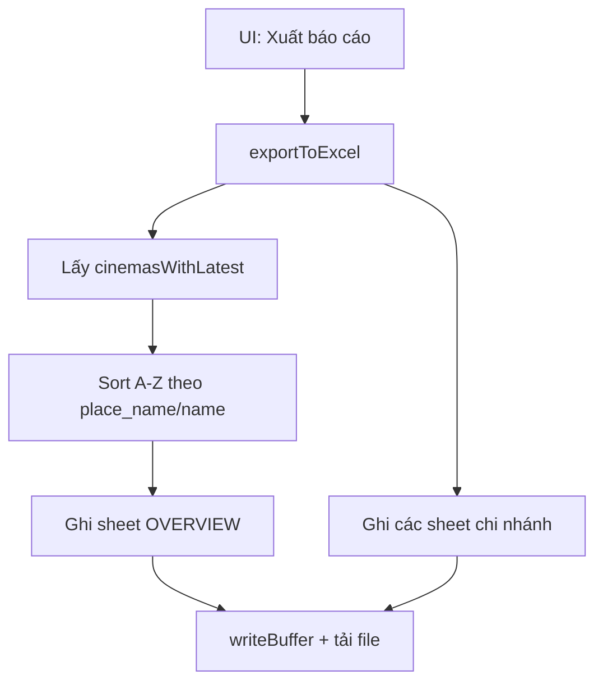

# I. Primer
## 1. TL;DR kiểu Feynman
- Hiện tại nút **Xuất báo cáo** đã dùng **ExcelJS** và đã có sheet `OVERVIEW`.
- Sheet này đang lấy đúng 3 cột anh/chị yêu cầu: `Cinema Name`, `New Google Reviews`, `Average Rating`.
- Khác biệt chính là cách hiểu cột `New Google Reviews`: theo xác nhận, sẽ **giữ như hiện tại = tổng review hiện tại (`currentTotalReviews`)**.
- Cần chỉnh để `OVERVIEW` được **sort A-Z theo tên cinema** trước khi ghi ra file.
- Các sheet chi nhánh vẫn giữ nguyên logic hiện có (không mở rộng scope).

## 2. Elaboration & Self-Explanation
- Luồng export đang nằm trong `DashboardSidebar.tsx`, hàm `exportToExcel`.
- App tạo workbook bằng ExcelJS, thêm sheet `OVERVIEW`, rồi thêm từng sheet chi nhánh.
- Dữ liệu `OVERVIEW` hiện được lấy từ `cinemasWithLatest` (đã được xử lý ở `useDashboardData.ts`).
- Việc cần làm là chuẩn hóa thứ tự dữ liệu (A-Z) trước khi add row vào `OVERVIEW`, đồng thời giữ định dạng rating `0.00` và màu theo ngưỡng như hiện tại.

## 3. Concrete Examples & Analogies
- Ví dụ cụ thể: với `LOTTE Cinema Moonlight`, row overview sẽ là:
  - `Cinema Name = LOTTE Cinema Moonlight`
  - `New Google Reviews = currentTotalReviews`
  - `Average Rating = currentAverageRating` (format `0.00`)
- Analogy đời thường: `OVERVIEW` giống “mục lục” của cuốn sổ — giúp nhìn nhanh toàn bộ rạp, còn từng sheet chi nhánh là trang chi tiết.

# II. Audit Summary (Tóm tắt kiểm tra)
- **Observation:** Trong `src/components/dashboard/layout/DashboardSidebar.tsx`, `exportToExcel` đã:
  - Tạo workbook ExcelJS.
  - Tạo sheet `OVERVIEW` với đúng 3 cột yêu cầu.
  - Đổ dữ liệu từ `cinemasWithLatest`.
  - Format cột rating và tô màu.
- **Observation:** Chưa thấy bước sort A-Z rõ ràng trước khi ghi `OVERVIEW`.
- **Inference:** Yêu cầu của anh/chị là “xem kỹ export, dùng ExcelJS, có sheet tổng hợp như mẫu” => kiến trúc đã đúng, cần tinh chỉnh behavior (ordering/đảm bảo mapping).
- **Decision:** Chỉ sửa tối thiểu luồng export hiện tại, không thay đổi API/data model.

# III. Root Cause & Counter-Hypothesis (Nguyên nhân gốc & Giả thuyết đối chứng)
- **Root Cause (High):** Không phải thiếu tính năng tổng hợp; sheet `OVERVIEW` đã tồn tại, nhưng chưa “chốt” theo kỳ vọng nghiệp vụ hiển thị (đặc biệt thứ tự A-Z và semantics cột theo mong muốn người dùng).
- **Counter-hypothesis 1:** Có thể user đang test bản cũ chưa chứa `OVERVIEW`.
  - Trạng thái: bị loại trừ một phần vì code hiện tại đã có `workbook.addWorksheet('OVERVIEW')`.
- **Counter-hypothesis 2:** User kỳ vọng `New Google Reviews` là delta thay vì total.
  - Trạng thái: đã chốt qua hỏi đáp là **giữ total hiện tại**.

# IV. Proposal (Đề xuất)
- **Option A (Recommend) — Confidence 90%**
  - Giữ ExcelJS + giữ cấu trúc sheet hiện tại.
  - Trước khi ghi `OVERVIEW`, tạo mảng đã sort A-Z theo tên cinema (`place_name` fallback `name`).
  - Mapping cột giữ nguyên:
    - `Cinema Name` = `place_name || name || 'Unknown'`
    - `New Google Reviews` = `Number(currentTotalReviews || 0)`
    - `Average Rating` = `Number(currentAverageRating || 0)`
  - Giữ style header/freeze/rating format hiện có.
- **Option B — Confidence 65%**
  - Tạo lại toàn bộ logic overview bằng hàm helper riêng để dễ tái sử dụng.
  - Tradeoff: sạch hơn nhưng phạm vi thay đổi lớn hơn, không cần thiết cho yêu cầu hiện tại.

# V. Files Impacted (Tệp bị ảnh hưởng)
- **Sửa:** `online-reputation-management-system/src/components/dashboard/layout/DashboardSidebar.tsx`
  - Vai trò hiện tại: chứa UI sidebar và hàm `exportToExcel`.
  - Thay đổi: sort dữ liệu cho sheet `OVERVIEW` theo A-Z và giữ mapping theo nghiệp vụ đã chốt.
- **Không đổi (tham chiếu):** `online-reputation-management-system/src/components/dashboard/hooks/useDashboardData.ts`
  - Vai trò hiện tại: chuẩn hóa `cinemasWithLatest` làm source cho export.
  - Thay đổi: không cần.

# VI. Execution Preview (Xem trước thực thi)
1. Đọc lại `exportToExcel` để xác định đoạn add row `OVERVIEW`.
2. Thêm bước tạo mảng `overviewRows` đã sort A-Z.
3. Dùng `overviewRows.forEach(...)` thay cho loop hiện tại.
4. Giữ nguyên các sheet chi nhánh và các style helper.
5. Static review null-safety/fallback field.

# VII. Verification Plan (Kế hoạch kiểm chứng)
- Repro thủ công tại trang chủ localhost:3000:
  1. Nhấn **Xuất báo cáo**.
  2. Mở file `.xlsx` kiểm tra có sheet `OVERVIEW`.
  3. Kiểm tra 3 cột đúng tên và đúng mapping dữ liệu.
  4. Kiểm tra thứ tự cinema A-Z.
  5. Kiểm tra `Average Rating` hiển thị `0.00` và màu rating giữ nguyên.
- Theo rule repo: **không chạy lint/unit test**.

# VIII. Todo
1. Cập nhật logic sort A-Z cho `OVERVIEW`.
2. Giữ nguyên mapping cột theo quyết định nghiệp vụ.
3. Rà soát static edge cases (name/rating null).
4. Tự review diff trước khi bàn giao.

# IX. Acceptance Criteria (Tiêu chí chấp nhận)
- File export có sheet `OVERVIEW`.
- `OVERVIEW` có đúng 3 cột: `Cinema Name`, `New Google Reviews`, `Average Rating`.
- `New Google Reviews` lấy từ `currentTotalReviews` (total hiện tại).
- Dữ liệu trong `OVERVIEW` được sắp xếp A-Z theo tên cinema.
- `Average Rating` giữ format 2 chữ số thập phân và style màu hiện có.

# X. Risk / Rollback (Rủi ro / Hoàn tác)
- Rủi ro thấp: chỉ đổi thứ tự ghi row trong overview.
- Rollback đơn giản: revert đoạn sort về loop cũ.

# XI. Out of Scope (Ngoài phạm vi)
- Không đổi semantics sang delta review theo kỳ.
- Không đổi cấu trúc các sheet chi nhánh.
- Không thay đổi API/Convex schema/data model.

# XII. Open Questions (Câu hỏi mở)
- Không còn ambiguity sau khi đã chốt 2 quyết định: giữ `currentTotalReviews` và sort A-Z.