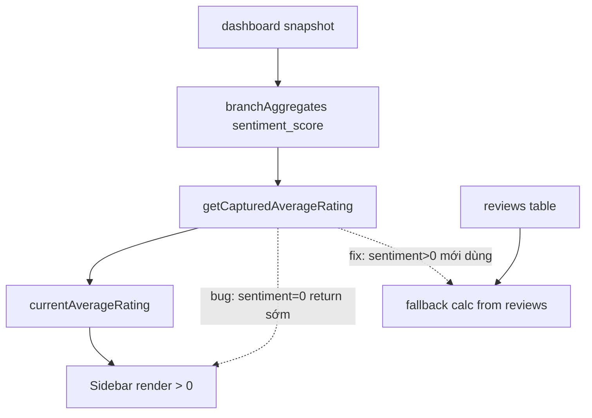

# I. Primer
## 1. TL;DR kiểu Feynman
- Anh đúng: có dữ liệu điểm ở trang chi tiết nhưng sidebar không hiện là lỗi logic.
- Root cause nằm ở hàm lấy điểm sidebar: gặp `sentiment=0` là return luôn, không fallback sang tính từ reviews.
- Vì vậy nhiều chi nhánh bị ẩn sao (do điều kiện `> 0`) dù DB vẫn có review và có điểm trung bình.
- Sửa đúng là chỉ dùng `sentiment` khi **> 0**, còn `0` thì fallback sang tính từ reviews capture.
- Sau sửa, sidebar sẽ hiện điểm giống logic trang chi tiết cho các chi nhánh có dữ liệu review.

## 2. Elaboration & Self-Explanation
Luồng hiện tại của sidebar lấy điểm trung bình qua `getCapturedAverageRating`.

Hàm này đang có nhánh:
- nếu `aggregateMap[pid].sentiment` là number thì return ngay.

Vấn đề là `branchAggregates` luôn tạo `sentiment_score` với fallback `0` khi thiếu metric row. Nên rất nhiều branch có `sentiment=0` kiểu “placeholder”, nhưng hàm vẫn coi đó là giá trị thật và return 0, làm UI không render sao (vì chỉ render khi `currentAverageRating > 0`).

Trong khi đó trang chi tiết `/[slug]` dùng `reviews.summaryByPlace` để tính `capturedAvgRating` trực tiếp từ bảng reviews, nên vẫn ra 4.1 đúng.

## 3. Concrete Examples & Analogies
- Ví dụ branch A:
  - `capturedTotalReviews = 226`
  - `branchDailyMetrics.sentimentScore` chưa có, bị fallback thành `0`
  - Sidebar hiện tại: return 0 nên ẩn sao
  - Trang chi tiết: tính từ reviews => 4.1
- Analogy: giống lấy điểm học sinh từ cột “điểm tổng kết”; nếu cột chưa nhập thì đang là 0 tạm, nhưng không được coi là điểm thật để hiển thị thay vì tính từ điểm thành phần đã có.

# II. Audit Summary (Tóm tắt kiểm tra)
- Observation
  - `useDashboardData.ts` có `getCapturedAverageRating` return `aggregateMap[pid].sentiment` ngay khi type là number.
  - `branchAggregates` ở `app/page.tsx` gán `sentiment_score: row?.sentimentScore ?? 0`.
  - `DashboardSidebar.tsx` chỉ render sao khi `currentAverageRating > 0`.
  - `PlaceDetailView.tsx` dùng `reviews.summaryByPlace` nên có điểm 4.1 đúng.
- Inference
  - Giá trị `0` placeholder từ aggregate đã chặn mất fallback sang reviews.
- Decision
  - Chỉ ưu tiên aggregate sentiment khi >0, ngược lại fallback tính từ reviews capture.

# III. Root Cause & Counter-Hypothesis (Nguyên nhân gốc & Giả thuyết đối chứng)
1. Triệu chứng: sidebar không hiện sao ở nhiều chi nhánh dù trang chi tiết có điểm.
2. Phạm vi: trang chủ sidebar, logic `currentAverageRating` trong `useDashboardData`.
3. Tái hiện: branch có `sentiment_score` fallback 0 nhưng có reviews trong DB.
4. Mốc thay đổi gần: chuyển source sang capture metrics, nhưng guard fallback chưa chặt.
5. Dữ liệu thiếu: không thiếu blocker; evidence đủ ở 3 file chính.
6. Giả thuyết thay thế: dữ liệu DB không có review; đã bị loại trừ vì trang chi tiết vẫn tính được 4.1.
7. Rủi ro nếu fix sai: hiển thị điểm sai hoặc giật giá trị nếu fallback không ổn định.
8. Pass/fail: branch có reviews phải hiện sao ở sidebar, không bị mất sao do placeholder 0.

**Root Cause Confidence (Độ tin cậy nguyên nhân gốc): High**

# IV. Proposal (Đề xuất)
- Sửa `getCapturedAverageRating` trong `useDashboardData.ts`:
  - Chỉ return `aggregateMap[pid].sentiment` khi `> 0`.
  - Nếu `<= 0` hoặc thiếu, tính trung bình từ `cinema.reviews`.
- Giữ điều kiện render sao ở sidebar như cũ (`> 0`) vì khi fallback đúng thì sẽ có giá trị.
- Không đổi schema, không đổi API.

# V. Files Impacted (Tệp bị ảnh hưởng)
- **Sửa:** `online-reputation-management-system/src/components/dashboard/hooks/useDashboardData.ts`
  - Vai trò hiện tại: dựng `currentAverageRating` cho sidebar.
  - Thay đổi: sửa điều kiện ưu tiên sentiment và fallback reviews.

- **Rà soát (không chắc cần sửa):** `online-reputation-management-system/src/components/dashboard/layout/DashboardSidebar.tsx`
  - Vai trò hiện tại: hiển thị sao khi rating > 0.
  - Thay đổi: chỉ kiểm tra lại, thường không cần chỉnh.

# VI. Execution Preview (Xem trước thực thi)
1. Chỉnh guard trong `getCapturedAverageRating`.
2. Đảm bảo fallback từ reviews chạy khi aggregate sentiment = 0 placeholder.
3. Rà static các chỗ phụ thuộc `currentAverageRating`.
4. Commit nhỏ, dễ rollback.

# VII. Verification Plan (Kế hoạch kiểm chứng)
- Theo guideline repo: không tự chạy lint/test runtime.
- Static verify:
  - Không còn return sớm khi sentiment = 0.
  - Có fallback reviews với guard chia 0.
- Runtime verify cho tester:
  - Mở `/` kiểm tra các branch đang mất sao nay hiện lại.
  - Đối chiếu branch cụ thể (vd `the-80-s-nguyen-van-linh`) giữa sidebar và detail chênh không quá làm tròn 1 chữ số.

# VIII. Todo
1. Sửa guard `sentiment` trong `getCapturedAverageRating`.
2. Giữ fallback tính từ reviews capture khi sentiment không hợp lệ.
3. Rà static sidebar/detail consistency.
4. Commit kèm file spec `.factory/docs`.

# IX. Acceptance Criteria (Tiêu chí chấp nhận)
- Sidebar hiển thị điểm sao cho các chi nhánh có reviews capture.
- Không còn tình trạng “không có sao” do `sentiment=0` placeholder.
- Điểm sidebar hợp logic với điểm trang detail (theo dữ liệu capture).

# X. Risk / Rollback (Rủi ro / Hoàn tác)
- Rủi ro: điểm sidebar có thể khác nhẹ do nguồn sidebar dùng sample reviews trong snapshot.
- Giảm thiểu: fallback dùng reviews có sẵn và làm tròn nhất quán.
- Rollback: revert commit thay đổi trong `useDashboardData.ts`.

# XI. Out of Scope (Ngoài phạm vi)
- Không productize realtime metrics sync.
- Không chỉnh crawler/parser.
- Không thay đổi schema Convex.

# XII. Open Questions (Câu hỏi mở)
- Không còn ambiguity chính; có thể triển khai ngay.