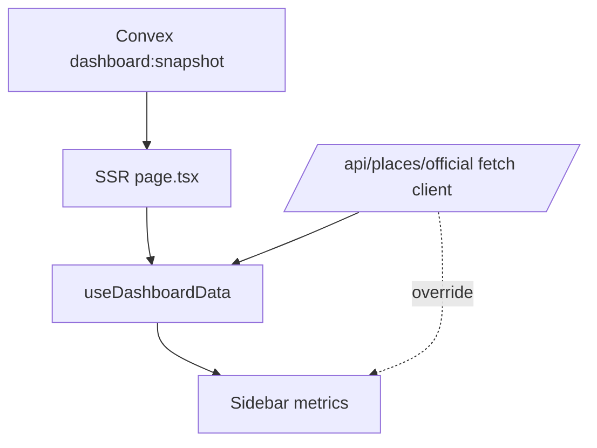

# I. Primer
## 1. TL;DR kiểu Feynman
- Sidebar đang lấy số `avgRating/totalReviews` từ 2 nguồn khác nhau nên có lúc lệch.
- Nguồn đúng theo yêu cầu là dữ liệu thật trong Convex (`dashboard:snapshot`), không override vòng 2 bằng API client.
- Em sẽ bỏ cơ chế ghi đè số liệu sidebar từ `/api/places/official` trong hook.
- Sau sửa, sidebar luôn hiển thị đúng số review và điểm trung bình đang có trong Convex tại thời điểm render.

## 2. Elaboration & Self-Explanation
Hiện trang `/` đã SSR dữ liệu từ `convexQuery('dashboard:snapshot')` ở `src/app/page.tsx`. Đây là nguồn dữ liệu thật trong Convex.

Nhưng ở client hook `useDashboardData`, code lại gọi thêm `/api/places/official` rồi dùng `officialStatsMap` để override lại `currentTotalReviews/currentAverageRating`. Việc “nạp thêm lượt 2” này dễ gây lệch thời điểm (race giữa snapshot SSR và fetch client), nên sidebar có thể hiển thị không đồng nhất.

Với yêu cầu “phải dùng dữ liệu thật Convex cho số lượng review và trung bình review”, hướng ổn định nhất là dùng **một nguồn sự thật duy nhất** cho sidebar: dữ liệu từ `dashboard:snapshot` đã truyền vào `cinemas`.

## 3. Concrete Examples & Analogies
- Ví dụ: Branch A trong snapshot SSR có `officialTotalReviews = 1200`, `officialAvgRating = 4.6`. Sau khi hydrate, fetch `/api/places/official` trả về chậm hoặc khác snapshot tạm thời (ví dụ 1198/4.5), sidebar bị “nhảy số”.
- Analogy: giống như một bảng điểm có 2 giáo viên cùng nhập điểm cho một cột; dù đều từ sổ thật, nếu thời điểm khác nhau thì màn hình sẽ nhấp nháy và gây hiểu nhầm. Cách đúng là chỉ dùng 1 người chốt điểm cho cột đó.

# II. Audit Summary (Tóm tắt kiểm tra)
- Observation:
  - `src/app/page.tsx` đã lấy dữ liệu thật từ Convex qua `dashboard:snapshot`.
  - `src/components/dashboard/hooks/useDashboardData.ts` lại fetch `/api/places/official` và override số liệu sidebar bằng `officialStatsMap`.
  - `src/app/api/places/official/route.ts` cũng đọc Convex, nhưng là request client riêng và thời điểm khác SSR snapshot.
- Inference:
  - Lệch thông tin sidebar chủ yếu do dual-source data + khác thời điểm fetch.
- Decision:
  - Chuẩn hóa sidebar về single-source từ snapshot Convex (SSR payload), bỏ override client cho `avgRating/totalReviews`.

# III. Root Cause & Counter-Hypothesis (Nguyên nhân gốc & Giả thuyết đối chứng)
- 1) Triệu chứng: Sidebar `/` có lúc hiển thị chưa đúng/không ổn định cho tổng review và điểm trung bình.
- 2) Phạm vi: `useDashboardData` + luồng dựng dữ liệu `cinemasWithLatest`.
- 3) Tái hiện: Mở trang dashboard, quan sát số liệu đổi sau khi client fetch hoàn tất.
- 4) Mốc thay đổi gần nhất: Hook thêm luồng fetch `/api/places/official` làm nguồn ghi đè.
- 5) Dữ liệu thiếu: Không thiếu blocker; các surface cần sửa đã rõ.
- 6) Giả thuyết thay thế: Có thể do dữ liệu Convex sai; nhưng cùng lúc code đang dùng 2 nguồn từ Convex ở 2 thời điểm khác nhau nên đây là nguyên nhân mạnh hơn.
- 7) Rủi ro fix sai: Nếu bỏ nhầm phần cần thiết cho sync status thì có thể mất chỉ báo trạng thái đồng bộ.
- 8) Pass/fail: Sidebar giữ ổn định và khớp số liệu từ snapshot Convex, không còn “nhảy” vì fetch client override.

**Root Cause Confidence (Độ tin cậy nguyên nhân gốc): High**
- Lý do: evidence trực tiếp trong hook về cơ chế override từ nguồn thứ hai.

# IV. Proposal (Đề xuất)
- Mục tiêu: Sidebar chỉ dùng số liệu thật từ Convex snapshot truyền vào page.
- Thay đổi chính:
  1) Trong `useDashboardData.ts`, bỏ (hoặc ngắt khỏi metrics) luồng `officialStatsMap` đang override `currentTotalReviews/currentAverageRating`.
  2) `cinemasWithLatest` lấy trực tiếp từ payload `cinemas` + `branchAggregates` cùng request snapshot, ưu tiên `officialTotalReviews/officialAvgRating` từ place snapshot.
  3) Giữ các trường không ảnh hưởng metrics nếu cần (ví dụ sync status) nhưng không được ghi đè 2 số lõi sidebar.
- Kỳ vọng: dữ liệu sidebar nhất quán, đúng source-of-truth Convex tại thời điểm render trang.

# V. Files Impacted (Tệp bị ảnh hưởng)
- **Sửa:** `online-reputation-management-system/src/components/dashboard/hooks/useDashboardData.ts`
  - Vai trò hiện tại: hợp nhất dữ liệu và tính metrics cho sidebar/global view.
  - Thay đổi: bỏ cơ chế override metrics từ fetch client; khóa metrics về snapshot Convex payload.

- **Sửa (nhẹ, nếu cần):** `online-reputation-management-system/src/app/page.tsx`
  - Vai trò hiện tại: lấy snapshot Convex và map dữ liệu đưa xuống client.
  - Thay đổi: đảm bảo map rõ field official metrics để hook dùng trực tiếp không fallback sai.

# VI. Execution Preview (Xem trước thực thi)
1. Đọc lại mapping field trong `page.tsx` để xác nhận đủ `officialTotalReviews/officialAvgRating`.
2. Chỉnh `useDashboardData.ts` để loại bỏ override client-side metrics.
3. Rà null-safety/fallback cho các branch thiếu dữ liệu.
4. Review tĩnh các view dùng `currentTotalReviews/currentAverageRating` để đảm bảo không side effect.

# VII. Verification Plan (Kế hoạch kiểm chứng)
- Theo guideline repo: không tự chạy lint/test.
- Kiểm chứng tĩnh:
  - Không còn đường ghi đè metrics từ `/api/places/official` trong sidebar pipeline.
  - `currentTotalReviews/currentAverageRating` đi từ snapshot payload duy nhất.
  - Các nhánh không có dữ liệu vẫn fallback `0` an toàn.
- Kế hoạch verify runtime cho tester:
  - Reload `/` nhiều lần, số sidebar ổn định sau hydrate.
  - Đối chiếu 1-2 branch với dữ liệu Convex thật (official reviews + avg rating).

# VIII. Todo
1. Loại bỏ override metrics từ `officialStatsMap` trong `useDashboardData`.
2. Chuẩn hóa nguồn `currentTotalReviews/currentAverageRating` từ snapshot Convex.
3. Rà static các component sidebar/global dùng 2 field này.
4. Tự review tĩnh và chuẩn bị commit.

# IX. Acceptance Criteria (Tiêu chí chấp nhận)
- Sidebar trang chủ dùng đúng dữ liệu thật Convex cho:
  - tổng số review
  - điểm trung bình review
- Không còn hiện tượng lệch/nhảy số do fetch client nguồn thứ hai.
- Không làm hỏng các chức năng khác của dashboard.

# X. Risk / Rollback (Rủi ro / Hoàn tác)
- Rủi ro: mất cập nhật “live” nếu trước đó dựa vào fetch client để làm mới.
- Giảm thiểu: vẫn giữ `router.refresh()` sau sync như hiện có để lấy snapshot mới chuẩn.
- Rollback: revert commit tại `useDashboardData.ts` (và `page.tsx` nếu có chỉnh).

# XI. Out of Scope (Ngoài phạm vi)
- Không thay đổi schema Convex.
- Không mở rộng realtime subscription cho dashboard.
- Không chỉnh logic crawler/sync backend.

# XII. Open Questions (Câu hỏi mở)
- Không còn ambiguity chính; có thể triển khai ngay theo hướng single-source Convex.