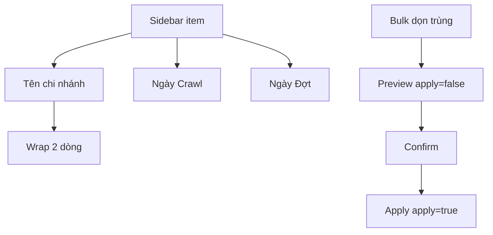

# I. Primer
## 1. TL;DR kiểu Feynman
- Sidebar desktop tăng từ `w-72` lên `w-80` đúng mức anh chọn.
- Tên chi nhánh sẽ **xuống dòng** thay vì bị cắt bằng dấu ba chấm.
- Mỗi item chi nhánh hiển thị đủ 2 mốc ngày: `Crawl` và `Đợt`.
- Thêm bulk action dọn trùng theo company, giữ bản mới nhất, xóa bản cũ.
- Bulk action chạy theo luồng preview trước rồi mới apply để an toàn.

## 2. Elaboration & Self-Explanation
Hiện tại sidebar dùng `truncate` nên tên dài bị cắt cụt và hiển thị dấu ba chấm. Anh yêu cầu rõ là không dùng kiểu đó, nên em sẽ đổi cách render text sang xuống dòng có kiểm soát để đọc được nhiều hơn mà vẫn gọn.

Phần ngày tháng sẽ thêm ngay trong sidebar item để người dùng không cần mở detail vẫn biết mốc crawl gần nhất và mốc đợt dữ liệu.

Phần dọn trùng sẽ tận dụng logic Convex có sẵn, nhưng chỉnh lại rule chọn canonical để khớp business: ưu tiên bản mới nhất theo `updatedAt`, sau đó mới tie-break bằng số review.

## 3. Concrete Examples & Analogies
- Ví dụ tên dài: `LOTTE Cinema Cần Thơ Ninh Kiều Vincom Xuân Khánh` sẽ hiển thị 2 dòng thay vì `LOTTE Cinema Cần Thơ...`.
- Ví dụ trùng company: `Lotte Cinema Bình Dương` và `LOTTE CINEMA BÌNH DƯƠNG` được gom một nhóm; bản `updatedAt` mới hơn sẽ được giữ lại.
- Analogy: giống danh bạ điện thoại, thay vì chỉ hiện tên rút gọn khó đọc, mình cho hiện 2 dòng để nhìn đủ thông tin trước khi thao tác xóa/gộp.

# II. Audit Summary (Tóm tắt kiểm tra)
- Observation:
  - Sidebar item đang dùng `truncate` trong `DashboardSidebar.tsx`.
  - Width sidebar hiện tại là `w-72`.
  - Đã có mutation xóa từng branch, chưa có bulk action ở sidebar.
  - Convex đã có action dedupe group theo name-slug.
- Inference:
  - Chỉ cần chỉnh nhỏ ở UI và canonical-sort là đáp ứng đủ yêu cầu.
- Decision:
  - Đổi truncate sang multi-line clamp/wrap.
  - Giữ flow preview/apply cho bulk dọn trùng.

# III. Root Cause & Counter-Hypothesis (Nguyên nhân gốc & Giả thuyết đối chứng)
- 1) Triệu chứng quan sát:
  - Expected: đọc được tên chi nhánh tốt hơn, có ngày đợt, xóa trùng hàng loạt.
  - Actual: tên bị cắt dấu ba chấm, thiếu ngày đợt ở sidebar, chưa có bulk action.
- 2) Phạm vi ảnh hưởng:
  - `DashboardSidebar`, `useDashboardData`, `convex/places.ts`.
- 3) Tái hiện:
  - Vào trang dashboard với danh sách chi nhánh tên dài.
- 4) Mốc thay đổi gần nhất:
  - Dedupe pipeline đã tồn tại, chỉ thiếu wiring UI và khác rule canonical.
- 5) Dữ liệu thiếu:
  - Không thiếu blocker kỹ thuật.
- 6) Giả thuyết thay thế:
  - Giữ truncate + tooltip cũng được, nhưng không khớp yêu cầu “hãy xuống dòng”.
- 7) Rủi ro nếu fix sai:
  - Có thể merge sai canonical nếu rule newest-first không áp đúng.
- 8) Tiêu chí pass/fail:
  - Không còn dấu ba chấm do truncate trên tên chi nhánh, hiển thị xuống dòng ổn định.

**Root Cause Confidence (Độ tin cậy nguyên nhân gốc): High**
- Vì dấu hiệu nằm trực tiếp trong class UI (`truncate`) và flow dedupe đã có sẵn trong code.

# IV. Proposal (Đề xuất)
- UI sidebar:
  - Đổi width `w-72` thành `w-80`.
  - Thay `truncate` bằng hiển thị xuống dòng:
    - Dùng `line-clamp-2` hoặc `whitespace-normal break-words` theo style hiện có.
    - Không dùng dấu ba chấm tự động cho tên chi nhánh.
  - Thêm 2 dòng date dưới block số liệu:
    - `Crawl: dd/MM/yyyy HH:mm` từ `lastScraped`.
    - `Đợt: dd/MM/yyyy` từ mốc snapshot/render date.
- Bulk action:
  - Nút `Dọn trùng (company)` ở sidebar.
  - Gọi `places:migrateToCanonicalSlugs` với `apply:false` để preview.
  - Hiển thị confirm rồi mới gọi `apply:true`.
- Backend canonical rule:
  - Trong `migrateDuplicateSlugGroup`, đổi thứ tự sort:
    1) `updatedAt` mới nhất
    2) `officialTotalReviews` cao hơn khi cùng thời điểm

# V. Files Impacted (Tệp bị ảnh hưởng)
- **Sửa:** `online-reputation-management-system/src/components/dashboard/layout/DashboardSidebar.tsx`
  - Vai trò hiện tại: render sidebar và item chi nhánh.
  - Thay đổi: tăng width, đổi tên chi nhánh sang xuống dòng, thêm 2 mốc ngày, thêm nút bulk action.

- **Sửa:** `online-reputation-management-system/src/components/dashboard/hooks/useDashboardData.ts`
  - Vai trò hiện tại: chuẩn bị dữ liệu cho sidebar/dashboard.
  - Thay đổi: đảm bảo có field date cần thiết cho render `Crawl` và `Đợt`.

- **Sửa:** `online-reputation-management-system/convex/places.ts`
  - Vai trò hiện tại: xử lý dedupe canonical groups.
  - Thay đổi: chỉnh canonical sort theo newest-first.

# VI. Execution Preview (Xem trước thực thi)
1. Chỉnh class UI tên chi nhánh để xuống dòng, bỏ truncate.
2. Tăng width sidebar desktop lên `w-80`.
3. Bổ sung render 2 mốc ngày trong mỗi item.
4. Thêm handler và nút bulk action preview/apply.
5. Chỉnh canonical sort trong Convex theo rule mới.
6. Tự review tĩnh null-safety và destructive flow.

# VII. Verification Plan (Kế hoạch kiểm chứng)
- Không chạy lint/test theo guideline repo.
- Kiểm tra tĩnh:
  - Tên dài hiển thị xuống dòng, không còn truncate class.
  - Date fallback khi thiếu dữ liệu.
  - Bulk action có loading guard và confirm trước apply.
  - Canonical chọn đúng bản mới nhất theo `updatedAt`.

# VIII. Todo
1. Bỏ truncate, đổi tên chi nhánh sang xuống dòng.
2. Tăng sidebar width `w-80`.
3. Thêm dòng `Crawl` và `Đợt` ở từng item.
4. Thêm bulk action dọn trùng theo company.
5. Chỉnh canonical sort newest-first trong Convex.
6. Tự review tĩnh và chuẩn bị commit.

# IX. Acceptance Criteria (Tiêu chí chấp nhận)
- Sidebar desktop rộng hơn 32px.
- Tên chi nhánh hiển thị xuống dòng, không còn bị cắt bằng dấu ba chấm.
- Mỗi item có đủ 2 dòng ngày `Crawl` và `Đợt`.
- Bulk action dọn trùng hoạt động theo company group, giữ bản mới nhất, xóa bản cũ.
- Không ảnh hưởng chức năng xóa từng branch hiện có.

# X. Risk / Rollback (Rủi ro / Hoàn tác)
- Rủi ro:
  - Nếu dữ liệu trùng tên nhưng khác thực thể thật có thể bị gộp nhầm.
- Rollback:
  - Revert commit đơn lẻ do thay đổi tập trung vào 3 file.

# XI. Out of Scope (Ngoài phạm vi)
- Không làm trang quản trị dedupe riêng.
- Không thay đổi schema Convex.
- Không thay đổi crawler pipeline ngoài nhu cầu hiển thị và bulk cleanup.

# XII. Open Questions (Câu hỏi mở)
- Không còn câu hỏi mở, đủ để triển khai ngay.