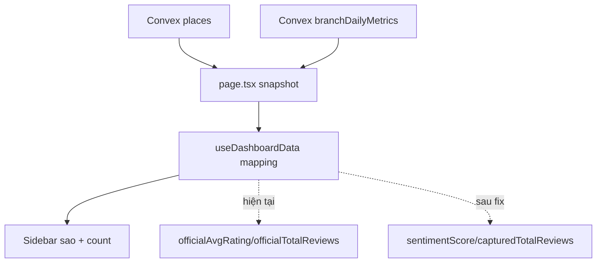

# I. Primer
## 1. TL;DR kiểu Feynman
- Lỗi hiện tại: sidebar đang lấy sao từ `officialAvgRating`, nên nhiều chi nhánh hiện 5.0 sai cảm nhận thực tế.
- Theo yêu cầu mới, sao sidebar phải lấy từ `sentimentScore` (trung bình review đã capture trong DB Convex).
- Count chính sidebar phải lấy `capturedTotalReviews` (DB), không lấy official làm số chính.
- Nếu parser official lỗi, vẫn không ảnh hưởng sao sidebar vì sao dùng `sentimentScore`.
- Sửa tập trung ở luồng map dữ liệu dashboard, không đổi schema.

## 2. Elaboration & Self-Explanation
Hiện hook `useDashboardData` đang dựng `currentAverageRating` từ `officialAvgRating`, và `currentTotalReviews` ưu tiên official. Vì vậy khi nguồn official bị parse lệch hoặc cập nhật chưa đúng, sidebar sẽ hiển thị sao cao bất thường (như 5.0 hàng loạt).

Dữ liệu Convex thật cho chất lượng review đã capture nằm ở `branchDailyMetrics.sentimentScore` và `places.capturedTotalReviews`. Hai field này mới đúng với yêu cầu anh chốt.

Nên hướng fix là đổi nguồn dữ liệu hiển thị sidebar sang:
- `currentAverageRating` => `sentimentScore`
- `currentTotalReviews` => `capturedTotalReviews`

## 3. Concrete Examples & Analogies
- Ví dụ: Chi nhánh có `officialAvgRating=5.0` nhưng `sentimentScore=4.12` từ reviews capture. Sau fix, sidebar sẽ hiện ~4.1 thay vì 5.0.
- Ví dụ count: `officialTotalReviews=128`, `capturedTotalReviews=107`, sidebar sẽ hiển thị 107 làm số chính.
- Analogy: giống KPI nội bộ phải dùng số trong kho dữ liệu công ty (DB capture) thay vì con số ngoài hệ thống có thể đang sai parser.

# II. Audit Summary (Tóm tắt kiểm tra)
- Observation
  - `useDashboardData.ts` đang set:
    - `currentAverageRating = c.officialAvgRating ?? ...`
    - `currentTotalReviews = c.officialTotalReviews ?? ...`
  - `DashboardSidebar.tsx` render sao và count trực tiếp từ `currentAverageRating/currentTotalReviews`.
  - `runMetricsAggregation` đang tính `sentimentScore` từ reviews capture và ghi vào `branchDailyMetrics`.
- Inference
  - Nguồn hiển thị sidebar đang không theo metric capture thật mà theo official snapshot.
- Decision
  - Đổi source hiển thị sidebar sang `sentimentScore` + `capturedTotalReviews`.

# III. Root Cause & Counter-Hypothesis (Nguyên nhân gốc & Giả thuyết đối chứng)
- 1) Triệu chứng quan sát được là gì?
  - Sidebar hiện nhiều 5.0 không khớp kỳ vọng dữ liệu capture.
- 2) Phạm vi ảnh hưởng?
  - Trang `/` dashboard sidebar, sorting theo rating, card tổng quan liên quan `currentAverageRating/currentTotalReviews`.
- 3) Có tái hiện ổn định không?
  - Có, vì mapping đang cố định ưu tiên official fields.
- 4) Mốc thay đổi gần nhất?
  - Luồng chuẩn hóa single-source official snapshot trước đó đã khóa `currentAverageRating/currentTotalReviews` về official.
- 5) Dữ liệu thiếu?
  - Không thiếu blocker; đủ evidence từ code path hiện tại.
- 6) Giả thuyết thay thế?
  - Có thể data crawl thật đều 5.0, nhưng không hợp lý khi nhiều chi nhánh đồng loạt; mapping source sai phù hợp hơn với triệu chứng.
- 7) Rủi ro nếu fix sai nguyên nhân?
  - Có thể hiển thị sao/count lệch với mục đích UI nếu trộn lẫn official/capture không nhất quán.
- 8) Tiêu chí pass/fail sau sửa?
  - Sao sidebar phản ánh `sentimentScore`; count chính phản ánh `capturedTotalReviews`.

**Root Cause Confidence (Độ tin cậy nguyên nhân gốc): High**
- Evidence trực tiếp từ mapping tại `useDashboardData.ts` và render tại `DashboardSidebar.tsx`.

# IV. Proposal (Đề xuất)
- Đổi quy tắc mapping trong `useDashboardData.ts`:
  - `currentAverageRating` ưu tiên `agg?.sentiment` (tức `branchDailyMetrics.sentimentScore`).
  - `currentTotalReviews` ưu tiên `c.capturedTotalReviews` / `c.captured_total_reviews`.
- Giữ field official riêng (nếu cần) để hiển thị phụ, không dùng làm số chính sidebar.
- Cập nhật label/sidebar copy để tránh hiểu nhầm:
  - Số chính: DB capture.
  - Nếu còn dòng phụ `G / DB` thì đổi thành DB-first hoặc ghi rõ nhãn.
- Fallback khi thiếu `sentimentScore`:
  - Tính từ `c.reviews` hiện có (nếu có), sau đó fallback 0.

# V. Files Impacted (Tệp bị ảnh hưởng)
- **Sửa:** `online-reputation-management-system/src/components/dashboard/hooks/useDashboardData.ts`
  - Vai trò hiện tại: dựng `currentAverageRating/currentTotalReviews` cho toàn dashboard.
  - Thay đổi: chuyển source sang `sentimentScore` + `capturedTotalReviews`.

- **Sửa:** `online-reputation-management-system/src/components/dashboard/layout/DashboardSidebar.tsx`
  - Vai trò hiện tại: render sao/count sidebar.
  - Thay đổi: đảm bảo label hiển thị đúng nghĩa DB capture là số chính.

- **Sửa nhẹ (nếu cần):** `online-reputation-management-system/src/components/dashboard/views/BranchView.tsx`
  - Vai trò hiện tại: card thông tin branch dùng `currentAverageRating`.
  - Thay đổi: rà lại wording để đúng semantic mới (điểm capture).

# VI. Execution Preview (Xem trước thực thi)
1. Đọc mapping hiện tại ở `useDashboardData.ts`.
2. Đổi source `currentAverageRating/currentTotalReviews` theo rule đã chốt.
3. Rà sidebar/branch view để text không gây hiểu sai.
4. Static review edge cases: thiếu metrics, thiếu reviews, 0 division.
5. Commit nhỏ + add file spec `.factory/docs`.

# VII. Verification Plan (Kế hoạch kiểm chứng)
- Theo guideline repo: không tự chạy lint/test runtime.
- Static verify:
  - Không còn path chính dùng `officialAvgRating` cho sao sidebar.
  - Không còn path chính dùng `officialTotalReviews` cho count sidebar.
  - Fallback an toàn khi thiếu metric.
- Runtime verify cho tester:
  - Reload `/` đối chiếu 3-5 chi nhánh: sao sidebar ~= sentimentScore trong Convex metrics.
  - Count sidebar khớp `capturedTotalReviews`.

# VIII. Todo
1. Chuyển mapping sao sidebar sang `sentimentScore`.
2. Chuyển mapping count chính sidebar sang `capturedTotalReviews`.
3. Rà label hiển thị ở sidebar/branch view cho đúng semantic.
4. Tự review tĩnh và chuẩn bị commit.

# IX. Acceptance Criteria (Tiêu chí chấp nhận)
- Sidebar không còn hiện 5.0 hàng loạt do official parse.
- Sao sidebar phản ánh trung bình review capture (`sentimentScore`).
- Count chính sidebar phản ánh tổng review đã lưu DB (`capturedTotalReviews`).
- Không phá luồng sync/dedupe hiện tại.

# X. Risk / Rollback (Rủi ro / Hoàn tác)
- Rủi ro
  - Người dùng quen nhìn official score có thể thấy số giảm.
- Giảm thiểu
  - Label rõ ràng là số capture DB.
- Rollback
  - Revert commit mapping nếu cần quay về official.

# XI. Out of Scope (Ngoài phạm vi)
- Không thay đổi crawler parser logic ở task này.
- Không đổi schema Convex.
- Không thêm realtime subscription mới.

# XII. Open Questions (Câu hỏi mở)
- Không còn ambiguity chính; đã chốt source sao/count theo lựa chọn của anh.